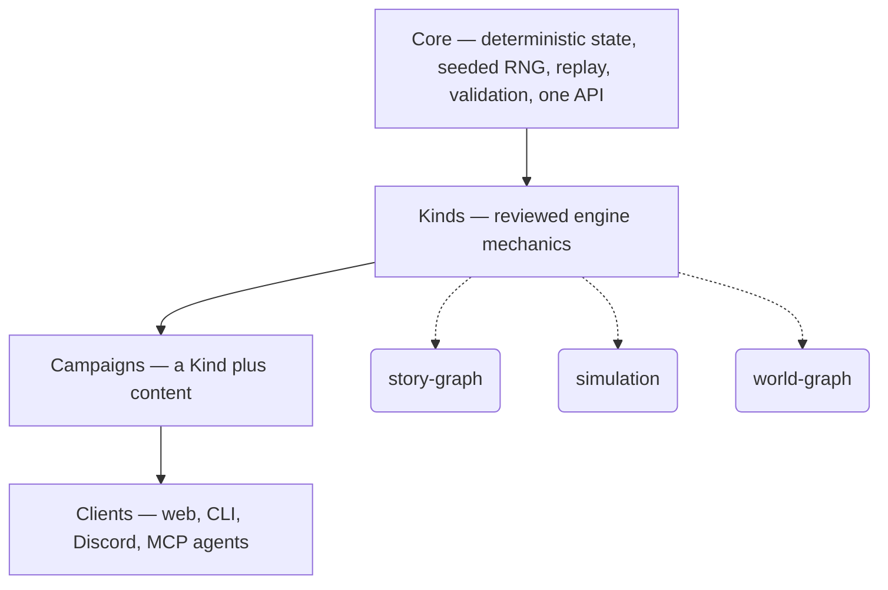

# SubZeroDev.GameEngine

**Build mechanics once. Create infinite games.**

## Quick Links

- **[Read the docs](https://game-engine.subzerodev.com/docs/)** — specs, architecture, API contracts, in reading order
- <a href="https://game-engine.subzerodev.com/roadmap/"><strong>Roadmap</strong></a> — what has shipped, what is next, and why the queue is deterministic
- **[Roadmap & milestones](https://game-engine.subzerodev.com/docs/engine/todo)** — every unit of work, done and remaining
- **[Changelog](https://game-engine.subzerodev.com/docs/engine/changelog)** — one entry per merged PR, regenerated automatically
- **[Current status](#status)** — what's built, what's next, right below
- **[Engine source](https://game-engine.subzerodev.com/docs/guide/engine-package)** — `src/engine/`: TypeScript strict, vitest, zero runtime dependencies

## Why This Exists

Game engines solved rendering.

They solved physics.

They solved animation.

They solved audio.

They solved networking.

Then we collectively decided the correct approach was to rewrite inventory systems,
dialogue systems, quest systems, AI, save systems, and progression mechanics for the
next thirty years.

Apparently that seemed reasonable.

SubZeroDev.GameEngine politely disagrees.

Instead of asking how to render another world...

it asks a different question:

**What if gameplay itself became reusable?**

---

## Origin Story

This project didn't begin with a grand vision.

It began because I missed Jones in the Fast Lane.

One evening I wondered how its mechanics actually worked. Mostly out of curiosity.

So I asked an LLM to explain them.

It happily started describing weekly budgets, needs, jobs, education, relationships,
random events...

...and then it started suggesting implementation details.

That was supposed to be the end of the conversation.

Instead I caught myself thinking:

> "Well... if I'm already writing the mechanics..."

A few minutes later that became:

> "...why make them specific to Jones?"

Then:

> "...what if the mechanics themselves were reusable?"

And then the rabbit hole opened.

Every answer created a better question.

If life simulation can be reusable... why not branching narratives?

If branching narratives can... why not management games? Why not autonomous worlds?

Why not build the deterministic substrate instead of another game?

At some point I stopped trying to write Jones in the Fast Lane.

I accidentally started writing a game engine.

I still maintain this is entirely the LLM's fault. It should have given a shorter
answer.

---

## One Engine. Genuinely Different Games.

A weekly-budget life simulation and a branching narrative adventure are not the same
shape of game.

Force one model to pretend to be the other and, sooner or later, everything catches
fire.

So this engine doesn't pretend.

It has one shared deterministic core and a growing collection of **Kinds** — think of
a Kind as a genre's rulebook: how choices and consequences work, how a weekly budget of
time and needs works, how a world's inhabitants move on their own. Reviewed engine code,
not content.

A **Campaign** is the actual game written with that rulebook — a Kind plus its data.
`story-graph` is a Kind; Bulgaria: Make-Your-Own-Adventure is a Campaign built on it.

The proof isn't marketing. It's a constraint the project imposed on itself: build two
games that share only a setting and a voice, and absolutely nothing mechanical.

- **Life in the Fast Lane** — a weekly life simulation.
- **Bulgaria: Make-Your-Own-Adventure** — a branching narrative.

Same country. Same deadpan humor. Completely different mechanics.

If the architecture survives that experiment...

it probably survives yours.

---

## The Model



The core solves difficult engineering problems exactly once:

- deterministic state
- seeded randomness
- save/load
- replay
- migrations
- localization
- validation
- content packs
- one API

Every Kind inherits those capabilities automatically. Concretely: `simulation` is the
Kind — the rulebook for weekly-budget life sims. Life in the Fast Lane is the Campaign
— the actual game written with it. Kinds define mechanics. Campaigns define worlds.
Clients simply present them.

The client gets all the credit. The core does all the work. As is tradition.

---

## Build Mechanics Once

One Kind. Many Campaigns. Many Games.

Turns out writing the same inventory system fifteen times wasn't the pinnacle of
software engineering after all.

### Story Graph

Designed for games built around choices and consequences. Perfect for:

- Adventure games
- Detective stories
- Interactive fiction
- Visual novels
- Educational branching narratives

**Flagship Campaign:** Bulgaria: Make-Your-Own-Adventure

### Simulation

Designed around deterministic time, needs, economy, and progression. Perfect for:

- Life simulations
- Career simulators
- Relationship simulators
- Business-life hybrids

**Flagship Campaign:** Life in the Fast Lane

### World Graph

Designed around autonomous inhabitants living inside navigable spaces. Perfect for:

- Resort management
- Theme parks
- Hotels
- Hospitals
- Transportation
- Living worlds

**Flagship Campaign:** Sun Trap

Future Kinds naturally follow. Online RPGs. City builders. Strategy. Survival. Economic
simulations. Not because the engine keeps growing, but because it keeps learning one
more style of simulation. None of them are planned; all of them are the shape of what's
possible once a fourth Kind is.

---

## The Engine Doesn't Know

The engine doesn't know what a dragon is.

Or a hotel.

Or a detective.

Or an unpaid intern.

It doesn't know what Bulgaria is.

Or Mars.

Or medieval Europe.

It only understands deterministic simulation.

Everything else is just someone else's remarkably specific data.

---

## Deterministic By Design

Every session can replay from nothing more than which campaign version it's running, a
seed, and an action log.

Every bug is reproducible. Not "works on my machine." That phrase has been politely
escorted off the premises.

Across versions, an unintended divergence is a regression, full stop. An intended one
still gets caught — it just gets reviewed and committed instead of quietly shipped.
Serialization is allowed to evolve either way; nothing changes what a save file means
without someone signing off on the diff.

Replay isn't a debugging feature. It's an architectural guarantee.

This isn't enforced by developer discipline. The engine simply refuses to cooperate. The
lint rules ban:

- `Math.random`
- non-bit-stable `Math.*`
- `Date.now`

Determinism is enforced. Not hoped for.

---

## AI Native

There is no "AI mode."

There is only the API.

Humans and AI submit the exact same commands.

Equality is important. Especially when they're both about to violate validation rules.

(There are tested engine scenarios now. A polished player-facing game is still later work —
consider this a promise with a test suite, not a demo.)

An AI agent doesn't get special powers.

It plays the same game everyone else does, once there's a game to play.

Read. Present. Submit a choice. That's it.

Long-term, AI becomes a content author rather than a mechanic author.

Generate quests. Generate dialogue. Generate NPCs. Generate campaigns. Generate worlds.

The engine validates everything at the boundary before it becomes reality.

Because creativity should be encouraged. Undefined behavior shouldn't.

---

## Not Another Game Engine

Unity renders. Unreal renders. Godot renders.

This engine quietly sits underneath asking, *"Yes... but what actually happens?"*

Turns out that's the interesting part.

Rendering is presentation. Simulation is authority. One changes every few years. The
other should survive decades.

---

## Why Build It?

Because writing inventory systems stopped being exciting sometime around the third one.

Because simulation should outlive presentation.

Because rendering engines deserve to stop pretending they're gameplay engines.

Because AI deserves somewhere better to put ideas than another pile of duplicated
boilerplate.

Because software should occasionally learn from its mistakes.

This one has.

---

## Philosophy

Technology changes. Rendering APIs change. JavaScript frameworks reproduce faster than
rabbits. Graphics cards become obsolete. Today's fashionable architecture becomes
tomorrow's migration guide.

Good simulation doesn't.

The rules that define how a world behaves can remain stable while everything around
them changes. That's the bet.

---

## Mission

We're not trying to build one great game. That would be far too sensible.

We're trying to stop rebuilding the same mechanics forever.

One deterministic core. Many Kinds. Infinite worlds.

Future Us will probably appreciate the effort. Present Us certainly will.

---

## Status

> This section is a coarse snapshot, kept short on purpose. The living, unit-by-unit
> breakdown — done, in progress, not started — lives in one place:
> **[TODO.md](https://game-engine.subzerodev.com/docs/engine/todo)**. Nothing here
> duplicates it, so nothing here can drift from it.

### Specifications — done

The MVP contracts are complete and every MVP-blocking decision has already been made
([OPEN-QUESTIONS.md §1](https://game-engine.subzerodev.com/docs/engine/open-questions#1-mvp-relevant-gaps--all-resolved)):
[Vision](https://game-engine.subzerodev.com/docs/engine/vision),
[Architecture](https://game-engine.subzerodev.com/docs/engine/architecture),
[Core](https://game-engine.subzerodev.com/docs/engine/core),
[Story Graph](https://game-engine.subzerodev.com/docs/engine/story-graph-kind). The remaining
work is implementation. Not philosophy.

### Code — two implemented kinds, a published package, and a playable world-graph slice (W0–W47)

The deterministic core, story-graph kind, five Bulgaria arcs, text client, MCP adapter,
replay oracle, save migration, and simulation kind are built and tested. `v0.4.0` is published
as `@the-running-dev/game-engine`; a clean consumer test installs the packed artifact rather
than trusting this checkout. The world-graph runtime-state, content, resolution, immediate-action
foundation, deterministic tick pipeline, and playable guest journey are also merged.

### Current — finish the world-graph replay guard (W49)

Preview parity across the engine, session store, text client, and MCP is delivered in
[PR #133](https://github.com/The-Running-Dev/SubZeroDev.GameEngine/pull/133). W49's canonical
scenario and validation landed in [PR #134](https://github.com/The-Running-Dev/SubZeroDev.GameEngine/pull/134);
its deterministic win/loss replay pairs and release-corpus coverage landed in
[PR #136](https://github.com/The-Running-Dev/SubZeroDev.GameEngine/pull/136). Session-parity
replays, clean-build serialization evidence, and a consumer-smoke rerun remain. Full sequencing
and done-criteria: [TODO.md](https://game-engine.subzerodev.com/docs/engine/todo).

---

## Companion Projects

**Life in the Fast Lane** — a deterministic life simulator planned for the Simulation
Kind. The flagship proving reusable mechanics can support entirely different campaigns,
once the Kind exists to prove it on. Not playable yet — nobody's is. In
[SubZeroDev.GameOfLife](https://github.com/The-Running-Dev/SubZeroDev.GameOfLife).

**Bulgaria: Make-Your-Own-Adventure** — a branching narrative planned for the Story
Graph Kind. Same setting. Different mechanics. Exactly the point, once it's built. Also
in [SubZeroDev.GameOfLife](https://github.com/The-Running-Dev/SubZeroDev.GameOfLife).

**Sun Trap** — a satirical resort-management simulation built on World Graph. Currently
design. Eventually chaos. In
[SubZeroDev.SunTrap](https://github.com/The-Running-Dev/SubZeroDev.SunTrap).

**Platform** — the future hosting layer. Deferred, because one impossible project at a
time seems sufficiently ambitious. In
[SubZeroDev.Platform](https://github.com/The-Running-Dev/SubZeroDev.Platform).

---

## Who Is This For?

Developers tired of rebuilding the same mechanics. System designers. Narrative
designers. Simulation nerds. AI-assisted workflows. Researchers. Tool builders.

And anyone who's ever stared at an existing codebase and quietly whispered, *"There has
to be a better way."*

There might be.

---

## Continue Reading

If you've made it this far, you're either intrigued or already mentally arguing with
the architecture.

Excellent — both are valid reasons to keep reading.

Start here:

1. [Vision](https://game-engine.subzerodev.com/docs/engine/vision) — why the platform exists
2. [Architecture](https://game-engine.subzerodev.com/docs/engine/architecture) — every settled decision
3. [Core](https://game-engine.subzerodev.com/docs/engine/core) — the platform as types
4. [Story Graph](https://game-engine.subzerodev.com/docs/engine/story-graph-kind)
5. [Simulation](https://game-engine.subzerodev.com/docs/engine/simulation-kind)
6. [World Graph](https://game-engine.subzerodev.com/docs/engine/world-graph-kind)
7. [Content Packs](https://game-engine.subzerodev.com/docs/engine/content-packs)
8. [MVP](https://game-engine.subzerodev.com/docs/engine/mvp)
9. [TODO](https://game-engine.subzerodev.com/docs/engine/todo)

Then decide whether the idea is brilliant...

...or complete madness.

Either way, you've understood it.

---

## Layout

| Path | What |
|---|---|
| [`docs/docs/engine/`](https://game-engine.subzerodev.com/docs/engine/vision) | The specs — `01-vision`, `02-architecture`, `04-core` (the API/types), `03-story-graph-kind`, `MVP`, `TODO`, `OPEN-QUESTIONS` |
| [`src/engine/`](https://game-engine.subzerodev.com/docs/guide/engine-package) | The implementation (TypeScript strict, vitest, determinism-guard eslint) |
| `docs/` | The specs are a Docusaurus site; `docs/docs/` is its content root |
| [`docs.ps1`](https://game-engine.subzerodev.com/docs/guide/documentation-site#previewing-locally) | Build & serve the docs site |

## Build the Docs Site

Requires Docker Desktop (base image `ghcr.io/the-running-dev/docs-template`, overlaid with
the local config).

```powershell
./docs.ps1            # build + serve at http://localhost:3000/docs/engine/vision
./docs.ps1 -Live      # + hot-reload while editing docs/
./docs.ps1 -BuildOnly # build the image only
```

## Developing the Engine

```bash
cd src/engine
npm install
npm test        # vitest
npm run lint    # determinism guard + typescript-eslint
npm run typecheck
```

Same determinism guard as above: the eslint config bans `Math.random`, the
non-bit-stable `Math.*` functions, and `Date.now` in `src/` — it's enforced at lint time,
not left to review.

---

**Documentation:** **[game-engine.subzerodev.com](https://game-engine.subzerodev.com/)** —
the site root, which publishes this README. The specs are rendered and cross-linked under
**[/docs](https://game-engine.subzerodev.com/docs/)**.
