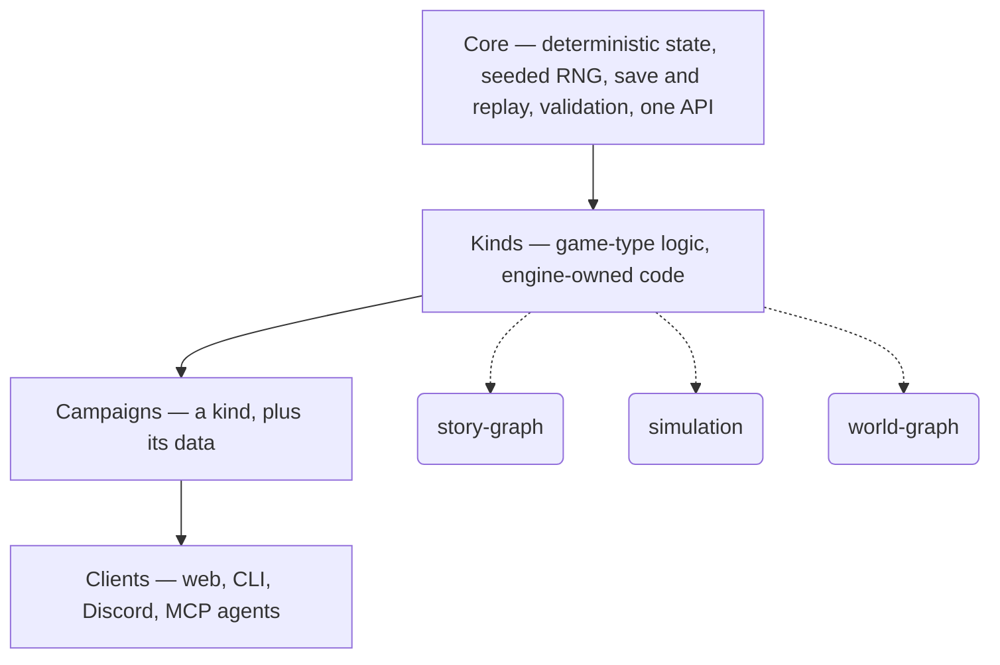

# SubZeroDev.GameEngine

**A narrative engine for entire families of games.**

## Why This Exists

Game engines solved rendering, physics, animation, audio, and networking.

Every new game still rewrites gameplay from scratch.

**SubZeroDev.GameEngine asks a different question: what if gameplay itself became
reusable?**

---

## One Engine. Genuinely Different Games.

A weekly-budget life simulation and a branching narrative adventure are not the same
shape of game. Force one model to fake the other and it explodes combinatorially.

So this engine doesn't pick one. It has a shared deterministic core, and on top of it,
**kinds** — reviewed engine code that defines how one category of game actually plays.
A **campaign** is a kind plus its data.

The sharpest proof isn't a claim, it's a constraint the project set for itself: build
two games that share only a setting and a voice — nothing mechanical — on the same
engine. **Life in the Fast Lane** (a life-simulation `kind`) and **Bulgaria:
Make-Your-Own-Adventure** (a branching-narrative `kind`) share the same Bulgarian
setting and the same deadpan tone, and nothing else. If the engine/kind/campaign split
holds, that's what it looks like.

---

## The Model



The core solves the hard engineering problems **once** — session state, seeded
randomness, save and replay, validation, localization, content packs, versioned
migration, one client/MCP API. Every kind inherits all of it for free. A kind defines
mechanics. A campaign defines a world. A client just presents.

---

## Build Mechanics Once

One kind, many campaigns, many games. Three kinds are committed:

| Kind | What it plays like | Flagship |
|---|---|---|
| `story-graph` | Branching narrative — nodes, choices, typed variables, consequences | Bulgaria: Make-Your-Own-Adventure |
| `simulation` | Weekly-tick life sim — time budget, needs, economy | Life in the Fast Lane ([SubZeroDev.GameOfLife](https://github.com/The-Running-Dev/SubZeroDev.GameOfLife)) |
| `world-graph` | A navigable world with autonomous inhabitants | Sun Trap ([SubZeroDev.SunTrap](https://github.com/The-Running-Dev/SubZeroDev.SunTrap)) |

A fourth is where this is headed, not where it is: an **online RPG** kind — named here
as direction, not yet specified, unlike the three above.

---

## Deterministic By Design

Every session replays byte-identical from a seed and its action log — that's the
determinism harness's job, and it's tested, not assumed. Across engine versions, what's
guaranteed is the *outcome*, not the bytes: an intentional change is allowed to move the
serialized format; a regression isn't, and catching that distinction is what the replay
oracle exists for. Every bug is reproducible, not "worked on my machine." The simulation
is authoritative; the client is disposable.

This isn't a best-effort convention. An eslint rule bans `Math.random`, the non-bit-stable
`Math.*` functions, and `Date.now` from ever reaching the core — determinism is
enforced, not hoped for.

---

## AI-Native

**By design, not by roadmap:** the API has no special AI path — an MCP agent and a
human client submit to the exact same store operations, so once any client exists, an
AI agent plays the identical game a human does. Nothing is playable yet (`src/engine/`
is still Phase 1, the deterministic core), so this isn't a claim about what's running
today — it's a settled architectural decision that isn't up for revision once a client
does exist. A client, human or machine, only ever does three things: read the scene,
present it, submit a choice.

**Where this is headed:** AI generating validated content instead of a human writing
boilerplate — the engine validates everything at the boundary regardless of who authored
it, which is what makes that safe to build toward. This part is deferred, not shipped.

---

## Not Another Engine

Unity, Unreal, and Godot render worlds. This engine defines how worlds *behave* — the
rules, the state, the replay — and stays out of how any of it looks.

---

## Mission

We are not building games.

We are teaching deterministic worlds how to behave.

One core. Many kinds. Infinite worlds.

---

## Status

- **Specs:** the MVP contracts are finalized — the story-graph kind
  ([`03`](https://game-engine.subzerodev.com/docs/engine/story-graph-kind#1-the-campaign)) and the core
  ([`04-core`](https://game-engine.subzerodev.com/docs/engine/core#2-the-gamestate-envelope)). See [MVP.md](https://game-engine.subzerodev.com/docs/engine/mvp#1-the-mvp-in-one-sentence).
  Every MVP-blocking gap is now decided; the register
  ([OPEN-QUESTIONS.md](https://game-engine.subzerodev.com/docs/engine/open-questions#1-mvp-relevant-gaps--all-resolved) §1) is a decision log.
- **Code:** [`src/engine/`](https://game-engine.subzerodev.com/docs/guide/engine-package) — seeded PCG32 RNG and canonical serialization,
  verified bit-identical to reference vectors; core contract types and module skeleton in place.
- **Next:** [TODO.md](https://game-engine.subzerodev.com/docs/engine/todo#core) breaks the MVP into ordered units of work
  (W0–W19), in progress.

## Companions

- **Game** — [SubZeroDev.GameOfLife](https://github.com/The-Running-Dev/SubZeroDev.GameOfLife):
  Life in the Fast Lane (`simulation`) and Bulgaria: Make-Your-Own-Adventure
  (`story-graph`) — the two games proving the engine/kind/campaign split.
- **Game** — [SubZeroDev.SunTrap](https://github.com/The-Running-Dev/SubZeroDev.SunTrap):
  Sun Trap, a satirical resort-management sim on the `world-graph` kind. Design only, no
  code yet.
- **Hosting / NEaaS** — [SubZeroDev.Platform](https://github.com/The-Running-Dev/SubZeroDev.Platform):
  the deferred hosting / SaaS layer. Not part of v1.

## Where to Go Next

- **Evaluating the architecture?** Start at
  [Vision](https://game-engine.subzerodev.com/docs/engine/vision#1-what-this-is), then
  [Architecture](https://game-engine.subzerodev.com/docs/engine/architecture#1-the-three-layers) for every
  settled decision and its rationale.
- **Want to see determinism is real, not just written?**
  [`src/engine/`](https://game-engine.subzerodev.com/docs/guide/engine-package) — the seeded RNG and
  canonical serialization are tested against reference vectors today.
- **Curious what playing one of these looks like?** Read about the flagship games in
  [SubZeroDev.GameOfLife](https://github.com/The-Running-Dev/SubZeroDev.GameOfLife).
- **Want to get involved?**
  [TODO.md](https://game-engine.subzerodev.com/docs/engine/todo#core) is the actual next unit of work, and
  [OPEN-QUESTIONS.md](https://game-engine.subzerodev.com/docs/engine/open-questions) is every unresolved
  decision — open an issue or start a discussion on what's there.

## Layout

| Path | What |
|---|---|
| [`docs/docs/engine/`](https://game-engine.subzerodev.com/docs/engine/vision) | The specs — `01-vision`, `02-architecture`, `04-core` (the API/types), `03-story-graph-kind`, `MVP`, `TODO`, `OPEN-QUESTIONS` |
| [`src/engine/`](https://game-engine.subzerodev.com/docs/guide/engine-package) | The implementation (TypeScript strict, vitest, determinism-guard eslint) |
| `docs/` | The specs are a Docusaurus site; `docs/docs/` is its content root |
| [`docs.ps1`](https://game-engine.subzerodev.com/docs/guide/documentation-site#previewing-locally) | Build & serve the docs site |

## Build the Docs Site

Requires Docker Desktop (base image `ghcr.io/the-running-dev/docs-template`, overlaid with
the local config).

```powershell
./docs.ps1            # build + serve at http://localhost:3000/docs/engine/vision
./docs.ps1 -Live      # + hot-reload while editing docs/
./docs.ps1 -BuildOnly # build the image only
```

## Developing the Engine

```bash
cd src/engine
npm install
npm test        # vitest
npm run lint    # determinism guard + typescript-eslint
npm run typecheck
```

Same determinism guard as above: the eslint config bans `Math.random`, the
non-bit-stable `Math.*` functions, and `Date.now` in `src/` — it's enforced at lint time,
not left to review.

---

**Documentation:** **[game-engine.subzerodev.com](https://game-engine.subzerodev.com/)** —
the site root, which publishes this README. The specs are rendered and cross-linked under
**[/docs](https://game-engine.subzerodev.com/docs/)**.
