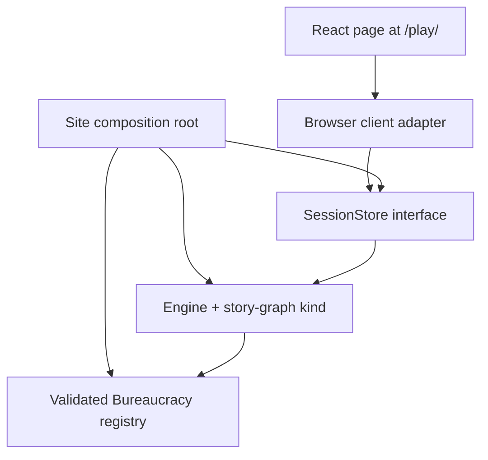

# Design

> Canonical agent-kit design for SubZeroDev.GameEngine. The marked blocks below are the single
> source for the generated design-oriented pages under `docs/docs/engine/`.

## Data model

Owned by [Architecture](#architecture), with detailed cross-cutting models in
[Observability](#observability--logging-and-tracing), [Replay](#replay--the-regression-oracle),
[Session Capture](#session-capture--turning-a-played-session-into-a-fixture), and
[Content Packs](#content-packs--resolution-and-identity).

## Module boundaries

Owned by [Architecture](#architecture), [Extensibility](#extensibility--ports-and-seams),
[Clients](#clients--the-contract), and
[Playable Web Demo](#playable-web-demo--browser-client-and-static-delivery), and
[Game Interface](#game-interface--absurd-adventure-stage-and-dashboard).

## Control flow

Owned by [Architecture](#architecture), with operational paths specified by the linked
cross-cutting design blocks below.

## Failure modes

Owned by the boundary-specific sections in Observability, Extensibility, Replay, Session
Capture, Clients, Playable Web Demo, and Content Packs. Exact error vocabulary belongs to
`20-contract.md`.

## Concurrency and ordering

Owned by Architecture and the relevant cross-cutting design blocks. Kind-specific ordering
belongs to `20-contract.md`.

## Alternatives considered

Recorded in the decision callouts throughout Architecture and the cross-cutting design blocks.

## Open questions

The canonical decision and open-item register is `90-decisions.md`; unresolved behavior is not
filled in here.

<!-- human-doc:start path="engine/02-architecture.md" -->
---
---

# Architecture

**Document status:** Revision 1 — architecture settled; content model written (§4 →
[`03-story-graph-kind.md`](03-story-graph-kind.md))

**Project stage:** Design

> **Scope of this document**
>
> Every settled architectural decision, with the reasoning. This is the contract the
> content model and the API are built against.
>
> - Why the platform exists: [`01-vision.md`](01-vision.md)
> - **These decisions turned into buildable types:** [`04-core.md`](04-core.md)
>   (the Kind interface, the `GameState` envelope, the API, session store, projection,
>   validation, MCP schemas)
> - The flagship kind's content types: [`03-story-graph-kind.md`](03-story-graph-kind.md)
> - The engine specification this one was **derived from**:
>   `games/04-engine-specification.md` — provenance rather than authority; see
>   [`04-core.md`](04-core.md), *Reused, not re-derived*

This document reuses, by design, large parts of the Life in the Fast Lane engine
specification. Where it says "carried over from the simulation kind," the mechanism is
already specified there and is not re-derived here — it is core every kind shares.

---

## 1. The Three Layers

```text
          ┌─────────────────────────────────────────────┐
Clients   │ web · mobile · CLI · Discord · chat · MCP    │  presentation only
          └───────────────────────┬─────────────────────┘
                                  │  one API, one MCP surface
          ┌───────────────────────▼─────────────────────┐
Kinds     │ story-graph  │  simulation   │  world-graph   │  engine-owned logic
          │ (nodes,      │  (weekly tick,│  (space, ticks,│
          │  choices)    │   needs)      │   agents)      │
          └───────────────────────┬─────────────────────┘
                                  │
          ┌───────────────────────▼─────────────────────┐
Core      │ session state · seeded RNG · projection ·    │  game-agnostic core
          │ conditions · save/migration · registry · API │
          └─────────────────────────────────────────────┘
```

- **Clients** present state and submit choices. No game logic, ever.
- **Kinds** are game-logic modules written as reviewed engine code. Each defines how
  one category of game plays: what a "turn" is, what state it needs, how it advances.
- **The core** is everything neither client-specific nor kind-specific.

A **campaign** is a *kind identifier plus data conforming to that kind's schema.*
Publishing a new campaign of an existing kind requires no engine change and is what AI
authoring produces. A new *kind* is an engine feature, added deliberately.

> **Decision (N2, campaign-definition, kind-boundary).** The source specification's
> "engine = story engine, campaign = story nodes" could not host a simulation. Making
> the engine a *core* and a game a *kind + data* is what lets one platform run
> both a branching story and a weekly-tick life sim behind one API. The alternative —
> a single universal rules DSL expressive enough for both — means building a
> programming language, which is where narrative engines die. The other alternative —
> downloadable code kinds — puts arbitrary code inside a hosted deterministic engine,
> a security and reproducibility hazard. Engine-owned kinds draw the clean line:
> **kind = code (engine-owned), campaign = data (author-owned).**

---

## 1a. Is It a Kind? The Test

§1 says a new kind is "an engine feature, added deliberately" but does not say how to tell
one from a campaign. That question has now been asked three times — for `simulation`, for
`world-graph`, and implicitly every time a plugin mechanism is proposed — and
answered each time from memory. It is the **first** question any new game raises, so it is
written down here as a procedure.

**The test:**

> A kind exists only when its `advance` **cannot be expressed as validated data over an
> existing kind.**

Ask in order; stop at the first yes:

1. **Can an existing kind's `advance` run it with different campaign data?** → It is a
   **campaign**. This is the common case and the one §4a calls the volume play.
2. **Can it run with different data plus content types that kind already interprets?** →
   Still a **campaign**, possibly one that extends that kind's content schema.
3. **Does it need new code inside `advance`, such that putting that code behind a
   data-driven switch would amount to building a programming language?** → It is a **kind**.

### Three things that never qualify

| Not a reason | Why |
|---|---|
| **Richer or larger state** | `kindState` is `unknown` to the core ([`04-core.md`](04-core.md) §2). The core does not read it, so its size and shape cost the core nothing. If state richness qualified, any campaign with more variables would be a new kind |
| **A different turn *quantum*** | `end_week` and `advance_ticks n` differ by a parameter, not a model. Both are *mutate pending configuration, then resolve a block of simulated time* |
| **A different setting, theme, or locale** | That is precisely what a campaign and a culture pack are for (§4a) |

### What it costs, so the test is worth applying

A kind is a `KindId` widening, a full `Kind` implementation (04 §3), its own reason codes,
event namespace, validator, projection and `outcome` — and because kinds are engine-owned
(N2), **every new kind is an engine release.** A campaign is none of that.

### Worked applications

| Candidate | Verdict | By which step |
|---|---|---|
| Bulgaria adventure | Campaign | 1 — story-graph's `advance` runs it as data |
| Life in the Fast Lane | Kind (`simulation`) | 3 — a weekly resolution pipeline over needs, jobs and events is not expressible as story-graph data |
| Bulgaria culture pack | Campaign | 1 — same kind, replaced strings and campaigns (§4a) |
| Resort management | Kind (`world-graph`) | 3 — A\* pathfinding and guest utility scoring are code; a data-driven switch over them is the DSL N2 rejected ([`12-world-graph-kind.md`](12-world-graph-kind.md) §2) |
| Mountain hotel, theme park, festival ground | **Campaign** | 1 — `world-graph`'s `advance` runs all of them as data. This is the row that pays for the test |

> **Why the last row matters most.** The resort draft proposed a kind by listing spatial
> maps, hundreds of agents, queues and pathfinding — all *state*, which step 1's table
> disqualifies. It reached the right answer for a reason that would also have licensed a
> kind per resort theme. The test separates the two: one new kind, then every hotel, park
> and nightclub after it is data.

---

## 2. Session Model

The engine core is a **pure function**, identical in discipline to the simulation
kind's §11.3:

```text
advance(state, action) → new state
```

It never mutates caller state and holds no session itself. **Sessions live in a thin
store above the engine**, keyed by id: the store holds the serialized state blob, hands
it to the engine on each call, and persists what comes back.

```text
client ──{ sessionId, choice }──▶ session store ──{ state, action }──▶ engine (pure)
client ◀──── scene + visible state ──── session store ◀──── new state ─────┘
```

> **Decision (N3).** The source specification's "Create/Resume Session" language
> implies server-held sessions; the simulation kind's engine is a pure function. Both
> are satisfied by keeping the **core pure** and making sessions a **store concern**.
> The client never holds authoritative state (it holds a `sessionId`), which preserves
> "the engine owns the truth." A stateless variant — the client carries the state blob
> and passes it back each call — was rejected: it hands authoritative state to the
> client and makes resume-on-another-device and AI clients awkward. A stateful engine
> object was rejected for the reasons already litigated in the simulation kind's §11.3
> (loses replay, comparison, testability).

**Consequence for the API.** Every operation takes a `sessionId`. The engine's purity
means a session is fully reconstructable from `{ campaignId, campaignVersion, seed,
action log }` — the determinism harness (§8) depends on this.

---

## 3. State and Variables

### 3.1 Two State Shapes, by Kind

- The **simulation kind** carries structured, fully-typed state (`ActorState`,
  `WorldState`, …) — already specified.
- The **story-graph kind** carries a **typed variable schema declared by the
  campaign**, plus the shared subsystems in §6.

### 3.2 Story-Graph Variables Are Fully Typed

Every variable a story-graph campaign uses is declared up front with a name, a type,
and an initial value. A consequence that writes an undeclared or mistyped variable is
a **load-time error**. Reading an undeclared variable is a load-time error.

> **Decision (N6).** A loose variable bag (the Twine/Ink default) reintroduces exactly
> the bug the simulation kind removed in its §10.4: a typo creates a silent ghost
> variable, and nothing can check that a consequence references a real one. A
> middle option — declared-but-untyped variables, catching typos without type
> checking — was on the table and rejected in favour of **full typing**. The value is
> load-time rejection of an entire class of content bug, at the cost of authors
> declaring variables before use.

```typescript
// illustrative — full types land in 03-story-graph-kind.md
interface VariableSchema {
  [name: string]: {
    type: "bool" | "int" | "enum";   // `string` was dropped — 03 §2
    initial: boolean | number | string;
    values?: string[];        // for enum
    visible?: boolean;        // surfaced as a player stat — see §6.2
  };
}
```

Consequences mutate variables through **typed operations** (`set`, `increment`,
`decrement` on ints; `set` on bool/enum), never through arbitrary string paths. This
is the audit-record discipline from the simulation kind's §10.4, carried over.

---

## 4. The Story-Graph Kind: One Content Type

The story-graph kind has a **single content type — the node.** A node is a scene:
display text plus a set of choices. A choice may be gated by requirements and carries
consequences, one of which is the transition to the next node.

> **Decision (N7).** The source specification listed *story nodes*, *events*, and
> *random events* as three separate kinds of content and never distinguished them.
> They collapse into one:
> - A **random event** is a node whose transition is a **seeded random pick** from a
>   weighted set — the only place randomness enters the story-graph kind.
> - An **event** not reached by a player choice is a node entered by a consequence's
>   `goto`.
>
> Condition-triggered *interrupt* events (the simulation kind's model, where something
> fires regardless of the current node) were deliberately **not** included in v1. They
> drag in the deferred-response / pending-interrupt machinery the simulation kind
> needed, which is heavy for a flagship. The door is left open to add them as a later
> kind feature if a campaign proves it needs them.

The full node / choice / requirement / consequence / ending types are specified in
[`03-story-graph-kind.md`](03-story-graph-kind.md). They reuse the simulation kind's
`Condition` tree (§13.1 there) for requirements verbatim.

---

## 4a. Content Packs and Culture Packs

A campaign is data within a kind (§1). Some of that data is the game's *setting* — its
jobs, places, events, characters, prices, and the language and voice it speaks in. A
**content pack** is a bundle of that setting data. A **culture pack** is a content pack
that reskins and relocalizes a campaign wholesale: same mechanics, different world.

This is the customization the project set out to support — *expand or reskin the
environment without touching the engine* — and the machinery already exists in the
simulation kind:

- **Content registry + pack manifest** (`games/04-engine-specification.md` §4.1–4.2) — a game loads a resolved set of content packs; the engine never reads files or recompiles.
- **Localization as string tables** (`games/04-engine-specification.md` §2.4) — every player-facing string is a key; a language is a string-table swap.
- **Swappable narrator voice** (`games/02-narrative-voice.md`) — the voice lives entirely in the string table, so a culture pack changes tone by changing content, not code.

So **Jones-in-Bulgaria is a simulation-kind culture pack**: Life in the Fast Lane's
mechanics unchanged, with Bulgarian jobs, bureaucratic events, inheritance disputes,
prices, and a Bulgarian-inflected narrator swapped in. No engine change, no new kind —
exactly the "culture pack for the game" the project envisioned.

> **Why this matters to the platform.** Culture packs are the volume play: one kind,
> many settings. The simulation kind can host Jones-in-Bulgaria, Jones-in-Corporate,
> Jones-in-Startup — each a content pack, none an engine change. This is also what a
> hosted service ([`neaas-platform-vision.md`](https://github.com/The-Running-Dev/SubZeroDev.Platform)) would sell:
> creators author packs, the engine runs them.
>
> A culture pack is distinct from a **new kind** (engine code, §1) and from a
> **story-graph campaign** (different kind, different game). The two games in
> `games/` show the split: the Bulgaria culture pack
> belongs to Life in the Fast Lane (simulation), the
> Bulgaria adventure is a separate story-graph game.
> They share only the source scenes (`bulgaria.md`).

Content and culture packs are validated identically to any other content (§9): the
engine does not care whether a pack was hand-authored, AI-authored, or community-
submitted — it validates the data against the kind's schema either way.

---

## 5. Determinism and Randomness

Each kind **declares its own determinism contract**; the core provides the
machinery.

- The **story-graph kind** is trivially deterministic — a choice leads to a fixed node
  — *except* at random-transition nodes, which draw from the core's **seeded
  PRNG** (PCG32 with named substreams, carried over from the simulation kind's §3).
- The **simulation kind** uses the full seeded apparatus already specified.

> **Decision (N5).** The source specification listed "deterministic engine" and
> "random events" together without reconciling them. The reconciliation: randomness is
> *core-provided and seeded*, and *each kind decides how much of it to use.* A
> story graph with no random-transition nodes needs no RNG at all and replays
> identically from its choice log; one with random transitions replays identically
> from seed + choice log. Either way, determinism is a testable property, not a claim.

`Math.random` and non-bit-stable transcendental math are banned in all resolution
paths, per the simulation kind's §2.1. This is core law, not per-kind.

---

## 6. Shared Subsystems in the Story-Graph Kind

The source specification listed achievements, statistics, relationships and time in
its engine responsibilities, save format, or API, but modeled none of them. All four
are **in scope for the story-graph kind v1** (N12), specified as follows.

### 6.1 Achievements

Ported from the simulation kind's achievement model. A campaign declares achievements
as **conditions over its variables**; the core evaluates them and unlocks each
exactly once. The Bulgarian ending "It Builds Character" is one such achievement.

Whether achievements are game-scoped or persist across a player profile follows the
simulation kind's resolution (profile-scoped, written outside authoritative game
state so they never affect determinism).

### 6.2 Player Statistics

**Not a separate system.** A statistic is a campaign variable marked `visible: true`
in the schema (§3.2). The v1 UI's "Player Stats" panel renders exactly those. This is
the cheapest possible way to honour the requirement — one flag on the variable
schema, no new machinery.

### 6.3 Relationships

A story-graph campaign that wants relationships declares them as **typed variables**
(e.g. an int per NPC), the same as any other state. The engine does not impose the
simulation kind's four-dimensional relationship model on story-graph campaigns —
that model is available in the simulation kind for games that need it, but for a
branching narrative a single tracked number per character is usually enough, and the
typed-variable mechanism already covers it. No dedicated relationship type is added to
the story-graph kind.

> **⚑ Judgement call.** N12 put relationships in scope, but the source content uses
> them only as flavour, never mechanically. Rather than port the simulation kind's
> heavy `RelationshipState`, relationships are expressed through the variable schema
> that already exists. If a story-graph campaign later needs affinity/trust/respect
> as distinct axes, that is a handful of declared int variables, not an engine change.

### 6.4 Time

Story-graph time is a **turn counter**, not a clock. The kind increments a
built-in `turn` value on each node transition, readable in requirements and
consequences like any variable. (It is kind-owned rather than core-owned because a
"turn" means something different per kind — a node transition here, a week in the
simulation kind — and because it lives inside the opaque `kindState`;
[`03-story-graph-kind.md`](03-story-graph-kind.md) §8.1.) The clock references in the Bulgarian content
("08:03", "opened at 08:00") are **scene text, not mechanics** — a campaign that wants
a mechanical clock declares an int variable and advances it in consequences.

> **⚑ Judgement call.** N12 put time in scope. The lightest honest model is a monotonic
> turn counter the core maintains; anything richer (an in-fiction clock, a
> calendar) is campaign-authored on top of a variable. The simulation kind's weekly
> calendar is a *kind* feature and does not belong in the story-graph core.

---

## 7. Projection and Hidden State

Carried over wholesale from the simulation kind's §6. Clients receive a **projection**
of state, not the state itself — variables marked hidden (event cooldowns, unrevealed
flags, achievement progress, the seed) never appear in what a client or AI agent can
read. The visible-stat marker (§6.2) is the story-graph kind's use of this boundary:
`visible: true` variables are in the projection, everything else is not.

> **Decision (N11).** The source specification stored "flags" and "variables" but never
> said which are visible. Without an enforced projection, hidden narrative state (a
> secret the player hasn't uncovered, a flag tracking a future twist) leaks to any
> client that renders what it's given. The simulation kind already solved this with a
> typed projection; the story-graph kind uses the same machinery.

---

## 8. Save, Versioning, and Migration

Carried over from the simulation kind's §16, with one story-graph-specific hazard made
explicit.

A save contains everything needed to reproduce the session: campaign id, **campaign
version**, seed, variable state, the shared subsystems, the visible/hidden split, and
the action log.

> **Decision (N9).** The source specification stored "campaign version" in the save but
> never noticed the problem it implies: **a republished campaign can orphan existing
> saves.** If a node a save is sitting on is deleted or renamed in a new campaign
> version, the save points at nothing. This is the simulation kind's migration problem
> in narrative clothing, and it gets the same answer: a save records the campaign
> version it was made under; loading it against a *different* version runs migration,
> which must map old node ids forward or fail loudly rather than silently stranding the
> player. A migrated save is marked not-replay-compatible, exactly as in the simulation
> kind's §16.2.

**Determinism harness.** A story-graph campaign plus a seed plus a choice log
reproduces a session byte-for-byte — the golden-master + property-test harness from the
simulation kind's §18.4 applies unchanged. This is the concrete meaning of
"deterministic" for this kind.

---

## 9. AI Authoring Boundary

The source specification's AI-authoring section said "the engine always validates the
final result" without saying what that means. The kind-boundary decision makes it
precise:

**AI authors campaigns (data), never kinds (code).** An AI expands scenes, generates
choices, drafts NPCs and dialogue, rewrites tone, translates — all producing content
that conforms to a kind's schema. The engine then **validates that content against the
schema** exactly as it validates hand-authored content: tiered validation, carried
over from the simulation kind's §4.3.

- **Tier 1 (load-time, hard fail):** every node id referenced by a choice or `goto`
  exists; every variable read or written is declared; every requirement and consequence
  path resolves; no duplicate ids; string/localization keys present.
- **Tier 2 (load-time, warning):** unreachable nodes ("dead branches" — the source
  specification's "detect dead branches" is exactly this), cycles where a cycle is
  unexpected.
- **Tier 3 (simulation-time):** unwinnable campaigns, choices no reachable state can
  satisfy — found by running the campaign, not by reading it.

> **Decision (N10).** "The engine validates" is not a safety property until you say
> what validation *is*. It is schema conformance plus reachability, tiered by what is
> statically decidable — the same discipline the simulation kind arrived at. AI never
> routes around it, because AI output is data and all data is validated identically,
> whatever produced it.

---

## 10. The API and MCP Surface

One API serves every client and every kind. The source specification's operation list,
made concrete and session-keyed (§2):

| Operation | Notes |
|---|---|
| `listCampaigns` | Available campaigns, each tagged with its kind |
| `createSession` | `{ campaignId, seed? }` → `sessionId` |
| `resumeSession` | `{ sessionId }` → current scene + visible state |
| `getScene` | Current node's text and available (requirement-filtered) choices |
| `getView` | The **projection** (§7), never raw state |
| `submitAction` | `{ sessionId, actionId }` → new scene + visible state; for this kind an `actionId` *is* a choice id |
| `saveGame` / `loadGame` | Serialize / restore, version-stamped (§8) |

The names are the `SessionStore` surface as typed in [`04-core.md`](04-core.md) §7 —
kind-agnostic on purpose, since the same operations serve the simulation kind.

The **MCP server exposes these same operations as tools** (`start_game`,
`continue_game`, `choose`, `get_scene`, `get_state`, `save_game`, `load_game`,
`list_campaigns`). There is no AI-specific game path: an MCP agent and a browser both
call `submitAction`, both receive a projection, both play the identical game.

> **Decision.** The source specification already had this right — MCP as a first-class
> client, no special AI version. Making it *literally the same operations* rather than
> a parallel tool set is what guarantees it stays true. The kind is invisible at this
> surface: a client calls `getScene` whether the underlying campaign is a story graph
> or a simulation; each kind renders its current situation into the same scene shape.

---

## 11. What Is Settled, What Is Next

**Settled (this document):** the three-layer model; kinds as engine code; campaigns as
data; the pure-core / server-session split; typed variables; the single-node-type
story-graph model; determinism and seeded RNG; the four shared subsystems; projection;
save/versioning/migration; the AI-authoring boundary; the unified API/MCP surface.

**Delivered — [`03-story-graph-kind.md`](03-story-graph-kind.md)** (the concrete content
types: Node, Choice, Requirement reusing the simulation kind's `Condition` tree,
Consequence, Ending, VariableSchema, AchievementDefinition, and the seeded
random-transition node) **and [`04-core.md`](04-core.md)** (those decisions as platform
types). With both, the Bulgaria make-your-own-adventure can be authored as real,
validated content rather than mood text — a minimal slice of it is the MVP
([`MVP.md`](MVP.md)). The separate Bulgaria culture pack, which belongs to
Life in the Fast Lane, needs no new deliverable — it
is a content pack over the existing simulation kind (§4a).

**Next — build it.** The ordered task list is [`TODO.md`](TODO.md); what is still
unsettled is [`OPEN-QUESTIONS.md`](OPEN-QUESTIONS.md).

**Deferred — [`neaas-platform-vision.md`](https://github.com/The-Running-Dev/SubZeroDev.Platform):** hosting,
accounts, billing, cloud sync, analytics, multiplayer, white-label.

---

## 12. Relationship to Life in the Fast Lane

Life in the Fast Lane, specified in full under `games/`, is
**the flagship campaign of the `simulation` kind.** Its engine specification (`games/
04-engine-specification.md`) is, in this platform's terms, *the simulation kind plus
its core contributions.* Much of what this document calls "the core" was
first designed there: the projection boundary, the condition DSL, seeded RNG
substreams, tiered content validation, the determinism harness, reason codes,
localization, save/migration.

> **Project split.** This repo (**SubZeroDev.GameEngine**) is the **Game Engine** —
> both its **source** (`src/engine/`, described at
> [Engine Package](/docs/guide/engine-package)) and its **specs** (a Docusaurus site under
> `docs/docs/engine/`). The **games** (Life in the Fast Lane, the Bulgaria adventure) live
> in [SubZeroDev.GameOfLife](https://github.com/The-Running-Dev/SubZeroDev.GameOfLife), and
> Sun Trap — the `world-graph` game — in
> [SubZeroDev.SunTrap](https://github.com/The-Running-Dev/SubZeroDev.SunTrap); the
> **hosting / NEaaS** layer in
> [SubZeroDev.Platform](https://github.com/The-Running-Dev/SubZeroDev.Platform). References
> to `games/…` throughout these docs point to SubZeroDev.GameOfLife specifically.
<!-- human-doc:end -->

<!-- human-doc:start path="engine/05-observability.md" -->
---
sidebar_label: Observability
---

# Observability — Logging and Tracing

**Document status:** Revision 1 — new contract, MVP scope

**Reading order:** after [`04-core.md`](04-core.md), which owns the types this extends.
The `GameState` envelope (04 §2), `KindContext` (04 §3.1), the session store (04 §7) and
the determinism harness (04 §14) are all assumed.

> **Scope of this document**
>
> How the engine reports **what it is doing** — the operational event channel, the rules
> that keep it from breaking determinism, the sinks it writes to, and where tracing
> attaches.
>
> It does **not** cover `StateChange` or `OutcomeMessage` ([`04-core.md`](04-core.md)
> §12). Those are domain records shown to players and authors; §1 below draws the line
> and explains why it matters.

---

## 1. Two Channels, Deliberately Separate

The engine already had a way of saying what happened before this document existed. Adding
a second one is only safe if the split is stated outright, because the two look alike and
the cost of conflating them is a core that quietly depends on its own logs.

| | Domain records | Operational events |
|---|---|---|
| Types | `StateChange`, `OutcomeMessage` (04 §12) | `EngineEvent` (§3) |
| Audience | Players and content authors | Developers and operators |
| Delivery | Returned in `AdvanceResult` | Emitted to a sink (§4) |
| Localized | Yes — `LocKey` into the string tables | **Never** — keys and ids only (§3.2) |
| Part of the result | Yes | **No** — see §2 |
| May be dropped | No | **Yes, always, with no behavioural difference** |

> **Why not extend `StateChange` instead.** It is the obvious move and it is wrong.
> `StateChange` is an audit record emitted by typed reducers (04 §12) — it carries a
> `visible` flag because a client may show it, and a `reason: ReasonCode` because the
> player is owed an explanation. Operational events answer a different question, for a
> different reader, at a volume no player should ever see. Merging them would put
> debug-level detail behind a `visible: false` flag inside the returned result, which
> means it is inside the value the session store persists and the projection filters —
> exactly the coupling §2 exists to prevent.

**The duplication rule.** An operational event must not carry information the envelope,
`AdvanceResult`, or the action log already own. It may carry *references* to them —
`gameId`, `seq`, a `ReasonCode`, a node id — but a log record is never the place a fact
first appears. If something matters to the game, it belongs in state or in the result; if
it only matters to whoever is debugging, it belongs here.

---

## 2. The Determinism Rule

There is exactly one invariant, and everything else in this document follows from it:

> **Removing every event changes nothing.** For any game, replaying `{seed, actionLog}`
> with a sink that records and with a sink that discards must produce byte-identical
> `serialize()` output, an identical `AdvanceResult`, and an identical action log.

This is the property that lets the core log at all. It is enforced three ways.

**`emit` returns `void`.** There is no channel back. A kind cannot branch on whether a
sink is attached, what it did with an event, or whether it succeeded, because none of
those facts are expressible in the type. This is deliberate and load-bearing — a return
value here would make logging an input to the simulation.

**No clock, no randomness, no allocation of identity.** The core never stamps a
timestamp, never draws a trace id, never calls `Date.now`. The determinism guard in
`src/engine/eslint.config.js` ([Engine Package](/docs/guide/engine-package)) already bans
the first and third; this document adds no
exception, and every field that conventionally needs a clock or an RNG is supplied at the
boundary instead (§6). This follows the line 04 §2 already drew for the envelope and 04
§7 drew for the session record — observability does not get a special case.

**The harness asserts it.** The determinism harness (04 §14) gains a sink-independence
check: every golden fixture runs twice, once with `nullEmitter` and once with
`recordingEmitter`, and the two `serialize()` outputs must be identical bytes (§12).

> **On `advance` being "pure".** 04 §3 documents `advance` as pure — *same
> `(state, action, params, ctx)` → same result*. Emitting is a side effect, and pretending
> otherwise would be dishonest. The precise claim is narrower and still strong: `advance`
> is pure **with respect to its return value and to state**. It has one write-only side
> channel whose observable effect on the game is nil by construction (`void` return) and
> by test (§12). That is the same bargain the RNG handle strikes in 04 §3.1 — a handle is
> supplied, used, and discarded, and the state carries nothing of it.

---

## 3. The Event

```typescript
type Severity = "trace" | "debug" | "info" | "warn" | "error";

type EventName = string;         // dotted, namespaced, stable; additive, never renamed

type EventScope = "game" | "system";

interface EngineEventBase {
  readonly name: EventName;      // "core.action.rejected" — §3.1
  readonly severity: Severity;   // fixed per name, not per call site — §7
  readonly ordinal: number;      // 0-based, monotonic within this resolution — §5
  readonly reason?: ReasonCode;  // when the event corresponds to a rejection or outcome
  readonly data?: EventData;     // structured detail — §3.2
}

/** Emitted while resolving a specific game. */
interface GameEvent extends EngineEventBase {
  readonly scope: "game";
  readonly gameId: string;       // from the envelope (04 §2)
  readonly seq: number;          // the action sequence this resolution belongs to
  readonly kindId?: KindId;      // set on kind-emitted events (§9)
}

/** Emitted where no game exists, or where the input claiming to be one is untrusted. */
interface SystemEvent extends EngineEventBase {
  readonly scope: "system";
}

type EngineEvent = GameEvent | SystemEvent;

type EventData = Readonly<Record<string, string | number | boolean>>;
```

Every field is derivable from state and the resolution in progress. Nothing here requires
a clock, an RNG draw, or ambient process state, which is what makes the whole record
reproducible (§5).

> **Why the scope split rather than optional `gameId`.** Two of the core events in §8
> genuinely have no game to name. `core.validation.completed` runs at registry
> construction, before any game exists; `core.deserialize.rejected` fires on an envelope
> the engine has just refused to trust, so reading a `gameId` out of it would be
> propagating exactly the field it declined to accept. Making `gameId` merely optional
> would leave both cases legal *and* undistinguished, so a consumer could not tell "no
> game" from "forgot to set it". A discriminated union makes each case say which it is,
> and makes `event.scope === "game"` the guard that gives a consumer `gameId` and `seq`.

### 3.1 Naming and Namespaces

Event names are dotted, lowercase, and namespaced by owner. The namespace rule mirrors the
reserved `core.reason.*` discipline in 04 §12, and exists for the same reason — so a name
cannot collide and a reader always knows who emitted it.

| Prefix | Owner | Example |
|---|---|---|
| `core.*` | The core. **Reserved** — a kind may not emit into it | `core.action.rejected` |
| `kind.<kindId>.*` | That kind, and only that kind | `kind.story-graph.settle.step` |
| `session.*` | The session store, above the pure engine (04 §7) | `session.resume.miss` |
| `client.*` | Clients and the MCP adapter (04 §13) | `client.mcp.tool.called` |

Names are **additive and never renamed**, on the same reasoning as reason codes (04 §12):
dashboards, alerts, and saved queries reference them, and a rename silently breaks every
consumer. A name that turns out wrong is superseded by a new one and the old one retired
in a documented step, never repointed.

### 3.2 What `data` May Carry

`data` values are primitives — `string | number | boolean`. Three rules govern content:

- **Ids and keys, never rendered prose.** An event referencing a message carries its
  `LocKey`, not the resolved string. Logs stay locale-independent and a log line cannot
  drift from what the player actually saw.
- **No player-authored text.** Nothing typed by a player and nothing interpolated from
  campaign narrative. This keeps the stream safe to ship to a hosted operator without a
  redaction pass — a property that is far cheaper to preserve than to retrofit.
- **No secrets from the projection boundary.** Hidden variables (04 §9) may appear in
  `trace`/`debug` events, which is the point of them, but a sink carrying those must never
  be wired to a client-visible surface. §10 makes that a sink-selection rule rather than a
  per-event judgement call.

---

## 4. The Emitter

```typescript
interface Emitter {
  /** Record one event. Never throws. Returns nothing, by design (§2). */
  emit(event: EngineEvent): void;
}

/** The default. Discards everything; the engine behaves identically with it. */
declare const nullEmitter: Emitter;
```

**Where it comes from.** The engine is constructed with one, defaulting to `nullEmitter`
so observability is opt-in and an embedder that wants none pays nothing:

```typescript
function createEngine(
  registry: ContentRegistry,
  kinds: KindRegistry,
  emitter?: Emitter,          // defaults to nullEmitter
): Engine;
```

**How a kind reaches it.** `KindContext` (04 §3.1) gains one field:

```typescript
interface KindContext {
  readonly registry: ContentRegistry;
  readonly campaign: Campaign;
  readonly rng: RngHandle;              // §8 — per-resolution, discarded after
  readonly seq: number;
  readonly emit: ResolutionEmitter;     // this document — per-resolution, discarded after
}

interface ResolutionEmitter {
  /** `gameId`, `seq` and `ordinal` are supplied by the core; the caller gives the rest. */
  emit(
    name: EventName,
    severity: Severity,
    detail?: { reason?: ReasonCode; data?: EventData },
  ): void;
}
```

> **Why a per-resolution handle rather than the raw `Emitter`.** It is the same shape as
> `ctx.rng`, and for the same reasons. The core derives a handle for *this* resolution,
> the kind uses it, and it is discarded when `advance` returns — nothing is written back.
> The handle owns the `ordinal` counter (§5), which is what keeps ordinals per-resolution
> and therefore reproducible; a shared counter would number events by how many games
> happened to run before this one, which is exactly the kind of ambient state that makes a
> stream non-reproducible. It also means a kind cannot forge `gameId` or `seq`, so
> correlation cannot be corrupted by a kind's bug.

---

## 5. Correlation Without a Clock

Tracing conventionally identifies work with random ids and orders it with timestamps. The
core can do neither. It does not need to: the envelope already carries a unique
deterministic key.

**`(gameId, seq, ordinal)` orders every event of an *accepted* resolution.** `gameId` is
unique per game (04 §2), `seq` is the action sequence, and `ordinal` is monotonic within one
resolution (§4).

Two limits on that, both real, both consequences of things 04 already decided:

- **A rejected action does not advance `seq`.** 04 §3 is explicit that a rejected action
  leaves state unchanged and appends nothing to the action log, so `seq` — which is the
  log's length — is the same on the next attempt. Two rejected submissions at the same
  position therefore produce the *same* triple. The core cannot fix this without a counter
  that is not derivable from `{seed, actionLog}`, which would be ambient state of exactly
  the kind §2 forbids. The boundary disambiguates instead, with `attempt` (§6).
- **`gameId` is runtime identity, not replay input.** `NewGameConfig` carries a seed, not a
  game id, so a replay of the same fixture is a *different game* and its events carry a
  different `gameId`. That is correct behaviour, not a defect — but it means `gameId` must
  be normalized out of any stream comparison (§12).

With those two stated, the property that remains is still the valuable one:

> **The replayable event stream is deterministic.** The same `{seed, actionLog}` produces
> the same sequence of `EngineEvent`s — same names, same order, same ordinals, same data —
> modulo `gameId`. Rejected attempts are not part of it, because they are not in the action
> log and so are not replayed at all.

Which makes the log a first-class debugging instrument rather than a best-effort one:

- A divergence between two runs can be found by **diffing their event streams**, which
  points at the resolution and the emission site, instead of bisecting `serialize()` output
  that only says *that* the bytes differ.
- An event stream can be **golden-filed** alongside the state golden files (04 §14, §12
  below), so an unintended behavioural change is caught at the step that caused it.
- Support can ask for a stream and reason about it without needing the player's machine.

---

## 6. The Boundary — Stamping and Tracing

Everything a real operator needs and the core cannot produce is added exactly once, at the
session store (04 §7), which is already the layer that does I/O and already owns wall-clock
timestamps for its records (04 §7, §2).

```typescript
interface EmittedRecord {
  readonly event: EngineEvent;   // verbatim, unmodified
  readonly emittedAt: string;    // ISO-8601, from the host clock — never from the core
  readonly traceId: string;      // per session-store command
  readonly spanId: string;       // per unit of work within it
  readonly attempt: number;      // per-session submission counter — disambiguates §5
  readonly sessionId?: string;   // the store's key; absent for pure-engine-only use
  readonly experiments?: Readonly<Record<string, string>>;  // resolved once per session
}
```

`attempt` is what closes the rejected-action collision in §5. The store counts submissions
per session, including rejected ones, so `(gameId, attempt, ordinal)` is unique on a live
stream even where `(gameId, seq, ordinal)` repeats. It lives here rather than on
`EngineEvent` precisely because it is *not* derivable from `{seed, actionLog}` — putting it
in the core would be the ambient state §2 forbids, and would make the replayable stream
depend on how many invalid submissions a player happened to make.

`experiments` lives here for the identical reason, one layer further out. It is the same
assignment map `applyExperimentGates` resolved for this session
([`11-content-packs.md`](11-content-packs.md) §5a), narrowed to the entries with a real
assignment — `null` ("not enrolled," 06 §5.5) never reaches this map, so its presence here
already means something — attached here so an event can be attributed to a variant without
the core ever knowing one exists. Unlike `traceId`/`spanId`/`attempt`, which are
per-*command*, this is per-*session*: resolved once at session creation and stamped
unchanged onto every event that session emits, the same lifetime `sessionId` already has.

### 6.1 How Per-Command Context Reaches an Event

`createEngine` takes one long-lived `Emitter` (§4), but every record above needs values
that change per command — and two commands may be in flight at once. Ambient
"current span" state would misattribute events between concurrent sessions, so the
contract does not use any.

**The store decorates, per command.** For each command it wraps its base emitter in a
short-lived one that closes over that command's `traceId`, `spanId`, `attempt` and
`sessionId`, and hands *that* to the engine call:

```typescript
interface Engine {
  // …existing members (04 §4)…
  /** The same engine, with every event stamped for one command. */
  withEmitter(emitter: Emitter): Engine;
}
```

The decorator is created and discarded inside one command, so nothing is shared between
concurrent commands and no mutable context outlives the call. This is the same
per-resolution-handle discipline `ctx.rng` and `ctx.emit` already follow (§4), applied one
layer out — the engine itself stays free of ambient state, and correctness does not depend
on an async-context mechanism the runtime may or may not provide.

The store opens one span per command (`submitAction`, `createSession`, `resumeSession`,
`saveGame`, `loadGame`), and core events emitted during that command become events within
that span. The mapping is mechanical:

| Engine concept | Tracing concept |
|---|---|
| One session-store command | One span |
| `gameId` | Span attribute |
| `seq` | Span attribute |
| `(gameId, seq, ordinal)` | Ordering key within the span |
| `EngineEvent.name` | Event name |
| `severity` | Log severity |
| `ReasonCode` | Status / error attribute on rejection |

**In the MVP:** the boundary stamps records, opens spans as a plain nesting of ids, and
writes through a sink (§10). **Deferred** (§13): an OpenTelemetry exporter, sampling, and
propagation of an inbound trace context from a hosted caller. The shape above is chosen so
that adding an exporter is an adapter, not a redesign.

---

## 7. Severity and Volume

Severity is fixed per event **name**, not chosen per call site, so a given name always
means the same thing to an alert.

| Level | For | Expected volume |
|---|---|---|
| `trace` | Step-by-step interior: each settle step, each requirement evaluated | Very high — off outside development |
| `debug` | One record per meaningful decision: a transition taken, a consequence applied | High |
| `info` | Lifecycle: game created, action accepted, game ended, save written | One or a few per action |
| `warn` | Recoverable and worth noticing: Tier 2 validation warning at load, profile read degraded to "no achievements" (04 §7.1) | Rare |
| `error` | The engine could not do what was asked: settle guard tripped, deserialize rejected an envelope | Should be zero |

> **A rejected player action is not an `error`.** Submitting an unavailable choice is
> ordinary play, answered by a `ReasonCode` (04 §12) and surfaced to the player. It emits
> `core.action.rejected` at `info`. Reserving `error` for engine faults is what keeps
> "errors should be zero" a usable operational statement.

---

## 8. Core Events

The normative starter set. Additive: more may be added, none renamed (§3.1).

| Name | Severity | When | Key `data` |
|---|---|---|---|
| `core.game.created` | `info` | `createGame` returns | `campaignId`, `campaignVersion`, `kindId` |
| `core.action.accepted` | `info` | An action advanced the game | `actionId` |
| `core.action.rejected` | `info` | An action was refused; state unchanged | `actionId` **only if it resolved** (below); `reason` set |
| `core.game.ended` | `info` | `status` became `"ended"` | — |
| `core.rng.stream.derived` | `trace` | A stream was derived from `(seed, streamId)` (04 §8) | `streamId` |
| `core.serialize.completed` | `debug` | Canonical serialization ran | `bytes` |
| `core.deserialize.rejected` | `error` | A malformed envelope was refused (04 §10.2) | `reason` set |
| `core.validation.completed` | `info` | Tiered validation ran (04 §11) | `tier`, `errors`, `warnings` |
| `core.migration.applied` | `warn` | A save was migrated; `replayCompatible: false` (04 §10.2) | `fromVersion`, `toVersion` |

> **An unresolved `actionId` is never logged.** `submitAction` takes an arbitrary string
> (04 §7), and an id matching nothing is ordinary play rather than an error — a hidden
> choice returns `unknown_action` deliberately (03 §8.3). So the rejected-action event
> carries `actionId` **only when it resolved to an action the campaign declares**; when it
> did not, the field is omitted and `reason` alone carries the meaning.
>
> Without that rule the no-player-text guarantee in §3.2 is not a guarantee: any caller
> could write arbitrary text into a hosted operator's logs by submitting it as an action id,
> and the claim that the stream ships without a redaction pass would be false. Omitting the
> field costs nothing diagnostically — `unknown_action` plus the resolution's `seq` already
> says what happened and where.

Note `core.game.created` and `core.action.accepted` carry no seed. A seed makes a game
reproducible by anyone holding the log, and the stream is not the place that decision gets
made — forensics attaches it deliberately instead (§11).

`core.validation.completed` and `core.deserialize.rejected` are `scope: "system"` (§3) —
the first runs before any game exists, the second on an envelope the engine has just
refused to trust. Every other event in the table is `scope: "game"`.

---

## 9. Kind Events

A kind emits under `kind.<kindId>.*` and nowhere else (§3.1). It declares its event names
the way it declares reason codes (04 §3, `Kind.reasonCodes`):

```typescript
interface Kind<KState> {
  // …existing members (04 §3)…
  readonly eventNames: readonly EventName[];   // names this kind may emit
}
```

**Engine construction** rejects a kind declaring a name outside its own namespace — the
same point at which kinds are registered and a missing kind is a construction error rather
than a runtime surprise (04 §4). Emitting an undeclared name fails in development builds.

Note the check lives at *engine* construction, not *registry* construction (04 §10.1),
which is where reason-code strings are validated. The two are different moments and the
difference is not cosmetic: reason codes need the content registry because they are
validated against the string tables a campaign supplies, whereas event names are validated
against the kind alone and need no content at all. Unlike reason codes, event names need
**no localized message** — they are never player-facing (§1), so the "validation fails if a
code has no string" rule in 04 §12 does not extend here.

The `story-graph` kind's set — settle steps, requirement evaluation, random transitions,
achievement unlocks — is specified in
[`03-story-graph-kind.md`](03-story-graph-kind.md) §8.4, beside the turn semantics it
describes. That placement is deliberate: the events are only meaningful next to the loop
that emits them, and splitting them from it is precisely the 03 ↔ 04 drift this project
keeps catching.

---

## 10. Sinks

A sink is an `Emitter` implementation. Three ship with the MVP:

| Sink | Purpose | Notes |
|---|---|---|
| `nullEmitter` | The default | Discards. The engine must behave identically with it — §2 |
| `recordingEmitter` | Tests and the harness | Keeps events in memory in emission order |
| `jsonlEmitter` | Development, and the text client | One JSON object per line, at the boundary, stamped per §6 |

**The sink contract:**

- **It must not throw — and the core defends anyway.** A conforming sink catches its own
  errors. The core additionally isolates every `emit` call, so a sink that throws is
  swallowed and the game continues unaffected.

  > **Both halves are required, and an earlier draft of this document had only the first.**
  > It said implementations catch their own errors and the core deliberately does *not*
  > wrap `emit`, on the reasoning that wrapping would imply throwing is expected. That is
  > a tidy principle and it is wrong here, because it contradicts §2. If a faulty sink can
  > abort a resolution, then attaching a sink can change the outcome of a game — which is
  > precisely what "removing every event changes nothing" denies. The invariant is worth
  > more than the principle, so the core catches. "Must not throw" remains a conformance
  > requirement on sinks; the core's `try` is defence in depth, not permission.

  What the core does with a swallowed error is deliberately narrow: it is discarded. It
  cannot be logged through the emitter that just failed, and routing it anywhere else would
  reintroduce the coupling this whole section avoids.
- **It must not call back into the engine.** No sink may invoke a store command or read
  game state; that is a re-entrancy hazard and, in a hosted context, a loop.
- **It must not be assumed synchronous or ordered across resolutions.** Within a
  resolution, ordinals order events (§5). Across them, a buffering sink may reorder.
- **Choosing a sink is a privacy decision.** Any sink at `trace` or `debug` may see hidden
  state (§3.2), so a sink wired to a client-visible or third-party surface must filter to
  `info` and above. This is a wiring rule, checked where the sink is constructed, rather
  than a judgement made per event.

---

## 11. Incident Forensics — A Bug Report Is a Fixture

The engine already has the property most systems build an incident pipeline to
approximate: `{seed, actionLog}` is the complete replay input (04 §2). So reproducing a
reported session needs no new machinery, and the report format is one the test suite
already runs:

```typescript
// 04 §14 — unchanged, and this is the point
interface PlaythroughFixture { name: string; config: NewGameConfig; actionLog: LoggedAction[]; }
```

**An incident report is a `PlaythroughFixture` plus the event stream that came with it.**
Attach the fixture and the run reproduces exactly; attach the stream and the emission site
is visible without rerunning anything. A confirmed bug is then committed as a golden
fixture (04 §14) with no translation step — the report *is* the regression test.

> **Why the seed is attached deliberately rather than logged.** §8 keeps the seed out of
> routine events. Anyone holding a seed and a log can replay a player's exact session, so
> the decision to capture it belongs to an explicit forensics path with its own handling,
> not to every `info` line in an operator's stream.

---

## 12. Validation and Tests

What the suite must show, beyond the per-unit criteria in [`TODO.md`](TODO.md):

- **Sink independence** — every golden fixture (04 §14) replays under `nullEmitter` and
  under `recordingEmitter`; `serialize()` output is byte-identical. This is §2 made
  executable, and it is the check that would catch a kind branching on emission.
- **Stream reproducibility** — the same fixture replayed twice under `recordingEmitter`
  produces the identical event sequence: same names, same order, same `data`, same
  ordinals. **`gameId` is normalized out of the comparison**, because a replay is a new
  game and legitimately carries a new id (§5); a golden stream that pinned it would fail on
  every run and teach the suite to be ignored.
- **Uniqueness holds where it is claimed** — across the events of one accepted resolution,
  and across accepted resolutions, `(gameId, seq, ordinal)` does not repeat. A test submits
  the *same invalid action twice* and asserts the triple **does** repeat, and that
  `attempt` (§6) is what distinguishes them — pinning the limitation rather than leaving it
  to be rediscovered as a deduplication bug.
- **System-scope events carry no game identity** — `core.validation.completed` and
  `core.deserialize.rejected` are `scope: "system"` and have no `gameId` or `seq` to
  fabricate (§3).
- **Namespace enforcement** — a kind emitting outside `kind.<kindId>.*`, or emitting a
  name absent from its `eventNames`, fails.
- **No clock, no randomness** — the determinism guard already bans `Date.now` and
  `Math.random` under `src/`; a test asserts no `EngineEvent` field is populated from
  either, by constructing events under a frozen environment.
- **A throwing sink does not break a game** — an emitter that throws on every call is
  installed, and a fixture still completes with byte-identical output. This test is only
  meaningful because the core isolates `emit` (§10); it is the executable form of that
  decision.
- **An unresolved action id never reaches the stream** — submitting an action id that
  matches nothing produces `core.action.rejected` with no `actionId` in `data` (§8).

---

## 13. What Is Deferred

Named here so the omissions are decisions rather than gaps:

- **OpenTelemetry export, sampling, and inbound trace-context propagation.** §6 fixes the
  shape so these arrive as an adapter. They belong with the hosting layer
  ([SubZeroDev.Platform](https://github.com/The-Running-Dev/SubZeroDev.Platform)), which is
  itself deferred (MVP §4).
- **Metrics as a separate channel.** Counters and histograms are derivable from the event
  stream for now. A dedicated metrics API is worth adding when there is an operator asking
  for one, not before.
- **Per-campaign or per-kind log-level configuration.** One global level, set at
  construction, until a second one is genuinely needed.
- **Author-facing presentation of `kind.story-graph.*` events.** The events exist in the
  MVP and the diagnostic value is real, but surfacing them in an authoring tool is content
  tooling ([`TODO.md`](TODO.md), *Content Tooling*), not engine work.
<!-- human-doc:end -->

<!-- human-doc:start path="engine/06-extensibility.md" -->
---
sidebar_label: Extensibility
---

# Extensibility — Ports and Seams

**Document status:** Revision 1 — new contract, MVP scope

**Reading order:** after [`04-core.md`](04-core.md), whose types this organises, and
alongside [`05-observability.md`](05-observability.md), whose `Emitter` is the worked
example every port here follows.

> **Scope of this document**
>
> Where the engine can be extended, by whom, and the single rule that decides. It names
> the **ports** a host may supply, the one place they are supplied, and what is
> deliberately not open.
>
> It does **not** reopen [`02-architecture.md`](02-architecture.md) §1 decision **N2**.
> Kinds remain engine-owned code; §7 says what that does and does not permit.

---

## 1. What This Is, and What It Is Not

**This is not a plugin system.** There is no manifest, no loader, no dynamic discovery, no
marketplace. Adding an extension means writing an implementation and passing it in at
construction — a compile-time decision, reviewed like any other code.

That is the honest scope, and it is chosen rather than settled for. A general plugin
system solves a problem this platform does not yet have, and the shape it tends to grow
into — a rules language expressive enough for arbitrary third-party behaviour — is the one
architecture §1 explicitly identifies as "where narrative engines die."

**What it is:** a stated set of **ports** — interfaces the engine depends on and a host
supplies — so that swapping persistence, observability, or identity is a documented
one-line change rather than an archaeology exercise.

> **Why this document exists at all, given nothing is currently blocked.** Three seams
> already existed before it, and they were supplied three different ways: a registry
> (`KindRegistry`, `ContentRegistry`), a constructor parameter (`Emitter`, 05 §4), and
> "implement the interface and wire it yourself" (`SessionStore`, `ProfileStore`, 04 §7).
> Adding a fourth meant picking one of three conventions arbitrarily. That inconsistency
> is what makes an engine feel closed — not the absence of a loader.

---

## 2. The Rule

One rule decides every question in this document:

> **A host may supply anything that cannot change `serialize()` output.**

Everything else follows. The rule is not a guideline: it is checkable by the determinism
harness already specified in 04 §14 and 05 §12, because "cannot change `serialize()`
output" is exactly what those fixtures assert.

Its consequence is the useful part:

**The determinism boundary is the trust boundary.** They are the same line. Code that
cannot affect replay also cannot affect the outcome of a game, so it needs no sandbox, no
capability system, and no review beyond ordinary engineering. Code that *can* affect replay
needs all three — which is why it is not open (§7).

That equivalence is what makes this document short. There is no risk gradient to manage,
no partial trust to model. A seam is on one side of the line or the other.

---

## 3. The Seam Map

| Seam | Side | Open to a host? | Contract |
|---|---|---|---|
| `Kind` | **Inside** — is the game logic | **No** — engine-owned (§7) | 04 §3 |
| `Condition` operators | **Inside** — evaluated during resolution | **No** — frozen set | 04 §18 |
| `IdSource` | Outside — values enter state but are opaque to it | **Yes** | §5.1 |
| `SessionStore` | Outside — holds serialized blobs | **Yes** | §5.2 |
| `ProfileStore` | Outside — durable, beside the session store | **Yes** | §5.2 |
| `Emitter` | Outside — write-only, returns `void` | **Yes** | 05 §4 |
| `Clock` | Outside — boundary only, never reaches the core | **Yes** | §5.4 |
| `ExperimentSource` | Outside — resolves a variant used to select packs and tag events; never reaches the core | **Yes** | §5.5 |
| Clients | Above everything — presentation only | **Yes**, no registration needed | 02 §1 |
| Campaigns, content packs | Data, validated in tiers | **Yes**, already the content path | 04 §10.1 |

Two entries are worth reading twice.

**`IdSource` is inside-looking but outside the line.** A `gameId` is written into the
envelope and therefore into `serialize()` output, which looks like a violation. It is not:
the engine never *interprets* the value, never branches on it, and never derives anything
from it. Replay determinism is a property of a fixture holding its inputs fixed, and
`gameId` is an input like `seed`. §5.1 makes that explicit rather than leaving it to be
inferred.

**`Clock` never crosses into the core at all.** The core has no clock and the eslint guard
enforces it (04 §2). The port exists so the *boundary* — the session store, stamping
records (05 §6) — has a seam a test can freeze, not so the engine gains a way to ask the
time.

---

## 4. The Composition Root

Every port is supplied in exactly one place, in exactly one shape.

```typescript
interface EngineHost {
  readonly kinds: KindRegistry;          // 04 §4 — engine-owned, not host-extensible (§7)
  readonly registry: ContentRegistry;    // 04 §10.1
  readonly ids?: IdSource;               // §5.1 — defaults to a random source
  readonly emitter?: Emitter;            // 05 §4 — defaults to nullEmitter
}

function createEngine(host: EngineHost): Engine;
```

Stores are composed one layer out, because they sit above the pure engine (04 §1):

```typescript
interface SessionHost {
  readonly engine: Engine;
  readonly sessions: SessionStore;       // §5.2
  readonly profiles?: ProfileStore;      // §5.2 — omitted → anonymous-only (04 §7.1)
  readonly clock?: Clock;                // §5.4 — defaults to the system clock
  readonly experiments?: ExperimentSource; // §5.5 — defaults to "no experiments running"
}

function createSessionLayer(host: SessionHost): SessionStore;
```

**Three rules make this uniform, and they are the whole convention:**

- **Every port is an interface, supplied by value.** Never a subclass, never a mutated
  global, never a module the engine imports by name. The dependency arrow keeps pointing
  inward (04 §1.1).
- **Every optional port has a default that works.** An embedder who supplies nothing gets a
  functioning engine. Optionality is what keeps the surface honest: a port nobody can
  usefully default is probably not a port.
- **A port is supplied once, at construction, and never swapped afterwards.** Replacing a
  store mid-session is not a supported operation, and permitting it would make every
  invariant in 04 conditional on when it was asked.

> **Why two roots rather than one.** The split mirrors 04 §1's two layers exactly. The pure
> engine must be constructible with no I/O at all — that is what makes the determinism
> harness able to run it (04 §14) — so anything doing I/O has to be composable *around* it
> rather than *into* it. One combined root would let a store be handed to the pure engine,
> which is the coupling the two-layer split exists to prevent.

---

## 5. The Port Catalogue

### 5.1 `IdSource` — the one that was missing

```typescript
interface IdSource {
  /** A new game id. Opaque to the engine: never parsed, compared, or derived from. */
  newGameId(): string;
  /** A new seed, when NewGameConfig omits one (04 §7). */
  newSeed(): string;
}
```

**This port closes a real gap rather than anticipating one.** `gameId` was declared on the
envelope (04 §2) and consumed by `createGame` (04 §4), but no document said where the value
came from; `seed` was only "store-generated", with no named mechanism. Those are the
**only two non-deterministic value sources in the engine**, and neither was a seam.

Three things follow from naming it:

- **`createGame` becomes testable.** With a counting `IdSource`, a fixture produces the
  same envelope every run — including `gameId` — which is what lets a golden file cover
  game creation instead of starting one action later.
- **The observability stream comparison gets simpler.** 05 §5 has to normalize `gameId`
  out of a golden event stream precisely because it is unpredictable. Under a fixed
  `IdSource` it is predictable, and the normalization becomes a convenience rather than a
  requirement.
- **A host that needs ids to mean something can have that.** ULIDs for sortability, a
  namespaced id for a multi-tenant deployment. The engine does not care, and the rule in §2
  is why it can afford not to.

The default is a random source. **It is the one place in the platform where randomness is
correct** — a fresh game genuinely should not be predictable — and it lives outside the
pure engine, so the determinism guard's ban on `Math.random` under `src/core/` stands
unqualified.

### 5.2 `SessionStore` and `ProfileStore`

Both are already defined (04 §7, §7.1). This document changes nothing about their shape; it
states that they are **ports** — the in-memory implementations the MVP ships are a default,
not the contract.

A host may supply Postgres, Redis, SQLite, or a file. The obligations are the ones 04
already implies, collected here so an implementer has them in one place:

- **Persist the canonical serialization, not live objects** (04 §7). A store that keeps
  object graphs will drift from what `deserialize` accepts.
- **Never write host metadata into `GameState`.** Timestamps, owner ids, and tenancy live
  on the store's own record (04 §2, §7).
- **A failed profile write must not roll back a game action** (04 §7.1). The game is the
  system of record; the profile is a projection of it.
- **A missing or corrupt profile degrades to "no achievements"**, never to a broken game
  (04 §7.1, 03 §7).

### 5.3 `Emitter`

Specified in full at [`05-observability.md`](05-observability.md) §4 and §10. It is listed
here because it is the **precedent** every other port follows: an interface, supplied at
construction, defaulted to a no-op, returning `void` so nothing about the host can reach
the game.

An OpenTelemetry exporter is an `Emitter` at the boundary — which is why 05 §13 can defer
it as an adapter rather than a redesign.

### 5.4 `Clock`

```typescript
interface Clock {
  /** ISO-8601 now. Boundary only — the core never receives this port. */
  now(): string;
}
```

Used by the session store for record timestamps and by the observability boundary for
`emittedAt` (05 §6). It exists so those can be frozen in a test, and so the single place
the platform reads a clock is a named one.

**It is deliberately absent from `EngineHost`.** Handing a clock to the pure engine would
make `Date.now` reachable from inside the determinism boundary through a supported API —
undoing by convenience what the eslint guard enforces by rule.

### 5.5 `ExperimentSource` {#experimentsource}

```typescript
interface ExperimentSource {
  /** A stable variant for one experiment, or `null` if `bucketKey` is not enrolled.
   *  Boundary only — the core never receives this port, and its result never enters
   *  `GameState`. */
  resolve(experimentId: string, bucketKey: string): string | null;
}
```

Resolves an A/B or feature-flag assignment, at session-creation time, for whichever content
pack selection and event tagging need it (11 §5a, 05 §6). It follows `Clock`'s shape exactly
— boundary-only, optional, `SessionHost`-scoped — for the same reason: a variant that could
reach the pure engine and be branched on inside `advance` would reopen the universal-DSL
pressure architecture N2 already rejected once (§7).

**Nothing about a kind's behaviour is gated through this port.** A kind cannot see which
variant a game is in, cannot ask, and has no field to ask through. What varies is *which
content the kind is handed* — §2's line, unmoved: a host may supply anything that cannot
change `serialize()` output, and a resolved variant only ever changes which packs get
selected before `resolvePacks` runs, at a stage the pure engine never observes.

**`bucketKey` is `profileId` when the session is profiled, else the session's `seed`.** The
session layer computes this once — the fallback rule the design calls for — before calling
`resolve`, rather than handing every `ExperimentSource` a raw `profileId | null` and asking
each implementation to reimplement the same fallback; that would be exactly the kind of
incidental divergence §2's boundary rule exists to prevent. It is also what keeps anonymous
sessions from collapsing onto one shared assignment: each has its own `seed` (04 §7),
generated before pack selection runs, so each anonymous session still buckets
deterministically — just not *stably across* sessions the way a `profileId` does.
`profileId` itself is the same value `CreateSessionConfig` already carries (04 §7.1) and
that `GameState` is barred from ever holding — folding it into `bucketKey` crosses no new
line, because only the *result* of `resolve` continues past the call, exactly as
`IdSource`'s randomness never crosses in, only its output does (§3).

**`null` means "not enrolled," and it is a different value from any legal variant.**
`ExperimentGate.variant` (11 §2) is an unconstrained string, so a *fixed-string* default —
always returning `"control"`, say — risks colliding with whatever string a gate happens to
use, silently enabling a pack no experiment actually assigned. Returning `null` instead is
structurally incapable of that: `assignments[gate.experimentId] === gate.variant` (11 §5a)
can never be true when the left side is `null`, so "no experiments running" — the default,
when `experiments` is omitted — is a guarantee, not a coincidence of which string was
picked.

**Where the registry a variant selects actually lands.** `createEngine` binds one
`ContentRegistry` at construction and never swaps it (§4), so a host running experiments
does not resolve packs once, globally — it resolves once **per distinct assignment
combination**, via `applyExperimentGates` + `resolvePacks` (11 §5a), and builds one `Engine`
per resulting registry, keyed by the `ResolutionId` that resolution already produces (11
§6). Routing a given `createSession` call to the right pre-built `Engine`, having already
resolved that session's assignments, is host-side composition above this seam — the same
way wiring a request to `createSession` at all is — and this document does not constrain it
further.

**A real implementation's only obligation:** be a pure function of its two arguments. Two
calls with the same `(experimentId, bucketKey)` must return the same variant, or pack
selection stops being reproducible from the assignment alone — the property 11 §6's
identity mechanism depends on. The bucketing algorithm itself — hash choice, rollout
percentage, sticky-session semantics beyond what `bucketKey` already gives for free — is a
host decision this document does not constrain, the same way `SessionStore`'s storage
backend is not constrained (§5.2).

---

## 6. Adding a Port

The checklist, so a future seam does not invent a fourth convention:

1. **Establish which side of §2's line it is on.** If a host implementation could change
   `serialize()` output, it is not a port. Stop.
2. **Define it as an interface** in the `composition` module (04 §1.1), not beside its
   first consumer.
3. **Give it a default that works**, and make the field optional.
4. **Add it to the relevant root** — `EngineHost` if the pure engine needs it,
   `SessionHost` if only the boundary does.
5. **State the implementer's obligations**, as §5.2 does. An interface without them is a
   shape, not a contract.
6. **Add a determinism assertion**: a fixture replays byte-identically under the default
   implementation and under a deliberately different one. This is the executable form of
   step 1, and it is what catches a port that turned out to be inside the line.

---

## 7. Kinds Stay Engine-Owned

A new **kind** — a new category of game — is an engine feature. It is written in this
repository, under `kinds/`, reviewed and compiled in, exactly as `simulation` will be
alongside `story-graph`. That is not a restriction on what the platform can host; it is a
statement about who writes it.

Architecture §1 decision **N2** settled this, and nothing here disturbs it:

> downloadable code kinds put arbitrary code inside a hosted deterministic engine, a
> security and reproducibility hazard. Engine-owned kinds draw the clean line: **kind =
> code (engine-owned), campaign = data (author-owned).**

The reasoning is §2's rule read from the other end. A kind's `advance` *is* the game
logic — it is as far inside the determinism boundary as code can be. Third-party code
there could call a clock, draw unseeded randomness, or diverge across engine versions, and
byte-identical replay would stop being a property the platform can assert.

**What this permits, and what it does not:**

| Want | Path | Needs |
|---|---|---|
| A new game of an existing kind | A campaign — data | Nothing new |
| A new *type* of game | A kind, in-tree | Ordinary engine work |
| Different storage, logging, ids | A port (§5) | Nothing new |
| A stranger's kind, unreviewed | — | Reopening N2 (§9) |

Only the last is blocked, and it is blocked deliberately.

---

## 8. Keeping the Door Open, Cheaply

Third-party extension is **not** decided against forever — N2 rejected one *mechanism*
(downloadable code kinds) for stated reasons, and a different mechanism with a real sandbox
is a decision that can be revisited. The conventions above are chosen so that revisiting it
later costs no rework:

- **Interfaces, not inheritance**, so an implementation can be replaced by one that
  forwards across a sandbox boundary without changing a caller.
- **All host code outside the determinism boundary**, so the trust boundary is already
  drawn in the right place. Opening up later means sandboxing exactly *one* seam — kinds —
  rather than auditing every seam at once.
- **Ports are versioned with the contracts that own them** (04 §10.2's `formatVersion`
  discipline), so an out-of-tree implementation can state what it was built against.

That is the whole insurance policy, and it is close to free. What is deliberately *not*
being built now is the sandbox, the manifest, the loader, and the capability model — none
of which has a consumer, and all of which are cheaper to design against a real requirement
than against an imagined one.

---

## 9. What Is Deferred

Named so the omissions are decisions rather than gaps:

- **Third-party kinds, and the sandbox they require.** A WASM host with a deterministic
  ABI — no clock, no ambient float nondeterminism, fuel-metered — is the shape that could
  satisfy §2's rule. It reopens N2 and changes the platform's security model, so it belongs
  in [`OPEN-QUESTIONS.md`](OPEN-QUESTIONS.md) with its cost stated, not in a spec.
- **Dynamic loading and manifests.** Compile-time composition is sufficient for
  first-party extension and has no discovery problem to solve.
- **A localization source port.** String tables come from the content registry (04 §10.1)
  today. Worth a port when a host needs strings from somewhere else; not before.
- **Capability declaration and per-port permissions.** Meaningful only once code is
  supplied by someone who is not trusted, which is the first item.
<!-- human-doc:end -->

<!-- human-doc:start path="engine/07-replay.md" -->
---
sidebar_label: Replay
---

# Replay — The Regression Oracle

**Document status:** Revision 1 — new contract, post-MVP

**Reading order:** after [`04-core.md`](04-core.md) §14, which this extends. The
determinism harness answers *is the engine deterministic*; this answers *did a change alter
a game that already exists*.

> **Scope of this document**
>
> Replaying committed game data across **engine versions**, and comparing what came out.
> It defines the `Outcome` — what "the same game" means when the bytes are allowed to
> differ — the corpus, the runner, and how an intended change is distinguished from a
> regression.
>
> It does **not** cover capturing sessions from a running deployment. That is the second
> half of the idea and is deferred to §9, because it shares the runner and almost nothing
> else.

---

## 1. Why the Existing Harness Is Not This

The determinism harness ([`04-core.md`](04-core.md) §14) already replays
`{config, actionLog}` and asserts a byte-identical `serialize()`. It is the right tool for
the question it answers:

| Question | Tool | Compares |
|---|---|---|
| Is the engine deterministic? | Determinism harness (04 §14) | This build against **itself** |
| Did this change alter an existing game? | **This document** | This build against a **previous** build |

The distinction matters because the harness is *blind by design* to the thing a regression
oracle must catch. A change that alters every game identically — a new consequence
ordering, a corrected requirement evaluation — is perfectly deterministic. The harness
runs green. Every existing game now plays differently, and nothing said so.

Golden files narrow that gap and do not close it: a golden `serialize()` blob fails on any
change to the *serialization*, which is frequently intended, and so it cannot distinguish
"the format moved" from "the game changed."

---

## 2. Fixtures Are Inputs, Not State

The load-bearing property, and the reason this is tractable at all:

```typescript
interface ReplayFixture {
  readonly name: string;
  readonly config: NewGameConfig;         // campaignId, seed (04 §5)
  readonly campaignVersion: string;       // pinned here, not in NewGameConfig — below
  readonly capturedUnder: string;         // the engine version that recorded the outcome
  readonly submissions: readonly Submission[];   // every attempt, accepted or not — §2.1
}

interface Submission {
  readonly actionId: string;
  readonly params?: Readonly<Record<string, string | number | boolean>>;
}
```

Every value is an **id or a primitive**, and ids are *stable once published* — a rename is a
migration ([`04-core.md`](04-core.md) §17). Nothing here is engine internals.

> **Why this is not `PlaythroughFixture` (04 §14).** Two fields that document needs and the
> determinism harness does not.
>
> `NewGameConfig` carries `campaignId`, `seed` and `audience` — **no `campaignVersion`**. The
> determinism harness does not need one: it runs against whatever the registry currently
> holds, and compares a build against itself in the same process. A cross-version oracle
> does need one, because "the same game" is only meaningful against a pinned content
> version, and because `unrunnable` (§6) has to be able to say *which* version went missing.
>
> `capturedUnder` exists for the same reason: a divergence report is not actionable without
> naming both engine versions that disagree. Neither field belongs on `NewGameConfig`, which
> is a *runtime* input — pinning them on the fixture keeps the core contract unchanged.
>
> **`capturedUnder` is `src/engine/package.json`'s own version** (W20 — Engine Versioning and
> Release Tags), read at the point a fixture is captured or regenerated. A fixture is always
> written with the version that recorded its outcome, never left blank or backfilled later.

### 2.1 Submissions, Not the Action Log

**A fixture records every submitted action, including rejected ones. The action log does
not.**

04 §4 is explicit that a rejected action leaves state unchanged and appends nothing to
`actionLog` — `seq` is the log's length, so the next attempt reuses it. That rule is correct
for replay determinism and it makes `actionLog` **unusable as a submission history**: the
rejections are simply not in it.

Reusing it here would have been self-defeating. §3 promises one `Decision` per submitted
action and §6 continues past a rejection specifically to see whether a later action
recovered — neither of which is possible from data that excludes rejections. So the fixture
carries its own `submissions` list, and `Decision[]` is exactly parallel to it.

The relationship to 04 §14 is then clean: filtering `submissions` to the accepted ones
reconstructs an `actionLog`, so a `ReplayFixture` can always produce a `PlaythroughFixture`,
but not the reverse.

Contrast the save path, which carries state and therefore carries the whole versioning
problem — `saveFormatVersion`, `serializationVersion`, `replayCompatible` (04 §10.2). A
migrated save is explicitly **not** replay-compatible, because its action log can no longer
be guaranteed to regenerate it.

> **So cross-version replay largely sidesteps migration.** A fixture from an older engine
> is still a valid *input* to a newer one, because the newer engine still knows what a
> campaign id and an action id are. This is the opposite of the save story and it is worth
> stating plainly, since the two are easily conflated: **replay old inputs, never old
> state.**
>
> The exception is real but narrow: a fixture whose campaign no longer exists, or whose
> `campaignVersion` has been withdrawn, cannot run at all. §6 treats that as a distinct
> result rather than a failure.

---

## 3. What "The Same Outcome" Means

Bytes cannot be the comparison, since serialization is allowed to change. So the oracle
compares an **`Outcome`** — a deliberately small projection built only from vocabulary the
platform has already promised to keep stable.

```typescript
interface Outcome {
  readonly finalStatus: GameStatus;          // active | ended | abandoned (04 §2)
  readonly acceptedActions: number;          // how far the log got before diverging
  readonly decisions: readonly Decision[];   // one per SUBMISSION, in order — §2.1
  readonly achievements: readonly string[];  // unlocked ids, sorted — §3.2
  readonly terminal?: unknown;               // the kind's terminal identity — §3.3
}

interface Decision {
  readonly index: number;                    // 0-based position in submissions — §3.1
  readonly seq: number | null;               // the accepted log position, null if rejected
  readonly actionId: string;
  readonly accepted: boolean;
  readonly reason?: ReasonCode;              // set iff rejected (04 §12)
}
```

**Every field is stable across versions by an existing decree, not by hope:**

- `GameStatus` is a closed three-value union (04 §2).
- **`ReasonCode`s are additive and never renamed** (04 §12) — saves and replay logs
  reference them, so a rename already breaks old data and is already forbidden. That makes
  them the ideal cross-version vocabulary: the platform guarantees their meaning survives
  exactly as long as this oracle needs it to.
- Achievement ids are stable published ids (04 §17), read as §3.2 describes.
- `acceptedActions` is a count of log entries.

### 3.1 `index`, Because `seq` Is Not Unique

A rejected action does not advance `seq` (04 §4), so two rejected submissions at the same
position share one. `seq` therefore cannot identify a submission, and a divergence reported
at a `seq` would be ambiguous exactly where rejections cluster — which is where this oracle
is most useful.

`index` is the 0-based position in `submissions` and is unique by construction. `seq` is
retained as `number | null` because it is still the useful cross-reference into the action
log and into the observability stream (05 §5), and `null` states outright that a rejected
submission has no log position rather than leaving a repeated number to be misread.

### 3.2 Where Achievements Come From

`unlockedAchievements` lives in `kindState`, which is `unknown` to the core (04 §2), so a
pure-engine runner **cannot read it**. The profile store can — it is keyed
`campaignId + achievementId` (04 §7.1) and is kind-agnostic — but only if there is a profile
at all, and an anonymous session has none.

**So the runner needs a `ProfileStore` alongside the engine — but not the full `SessionStore`
a real client uses.** `finalStatus` and `terminal` (§3.3) both need the raw `GameState` itself
(`state.status`, `state.kindState`), and `SessionStore`'s client-facing surface
(`createInMemorySessionStore`, `src/engine/src/core/session/store.ts`) never returns one — a
client holds a `sessionId` and receives only a `Scene`/`PlayerView` projection (04 §7, 09 §1),
by design. The runner is not a client, so it is built the same way
`core/determinism/harness.ts`'s `runFixture` is: directly against `Engine`, driving
`createGame`/`submitAction` itself and reading `GameState` off the result.

Achievements still go through the exact tested path `createInMemorySessionStore` uses
internally, not a second reimplementation: `session/store.ts` exports `upsertAchievements`
for this reason, and the runner calls it with a fixed `profileId` after every accepted
submission, then reads the unlocked set from the `ProfileStore` once, after the last one.

> **Not `createSessionLayer`/`SessionHost` (06 §4) either.** That composition root is
> specified but unbuilt — W7 built `createInMemorySessionStore` directly against
> `session/types.ts` instead, and nothing in this document needs the unbuilt generality. See
> [`OPEN-QUESTIONS.md`](OPEN-QUESTIONS.md) §2 for the open item and its "revisit when."

### 3.3 `terminal` — Terminal Identity, and Only That

`finalStatus` records *that* a game ended. It cannot record *which* ending, because
`endingId` lives in `kindState`. Without it, a change that routes the last action to a
different ending — same decisions, same counts, same status — compares **equal**, and the
oracle reports `match` on exactly the kind of regression it exists to catch.

So, to solve *this* problem, `Kind` gains one member, mirroring `project` (04 §9) — `version`
and `migrateState` are a separate, later addition (W31, save migration), unrelated to the
replay oracle this section is about. **Built** — `04-core.md` §3 already carries it, and
every real kind assembly implements it:

```typescript
interface Kind<KState> {
  // …existing members (04 §3)…
  /** A minimal, cross-version-stable terminal identity. Ids only — never values. */
  outcome(state: KState): unknown;
}
```

**The constraint is what keeps it from becoming a false-positive generator.** A kind returns
*published ids* — `story-graph` returns `{ endingId }` (03 §8.5) — and never variable values, counts,
or anything a content rebalance legitimately changes. §3.4 stays the rule; `outcome` is the
narrow exception for terminal identity, not a door back to state comparison.

This was deferred in the first draft and the deferral was wrong: it traded a real, silent
miss for the avoidance of a hypothetical one.

**Nothing here is kind-specific**, which is the point — the oracle works for `story-graph`
and `simulation` alike with no *additional* `Kind` member beyond `outcome` and no per-kind
maintenance.

> **What `decisions` catches, and why it is the valuable field.** It records, for every
> action a player actually submitted, whether the engine took it and why not if it did
> not. That is the direct expression of *does this game still play the same way*: a choice
> that used to be available and is now gated flips one `accepted` from true to false, and
> names the `ReasonCode` that did it. A final-state comparison would report only that the
> game ended somewhere different, several turns later, with no indication of where it
> diverged.

### 3.4 What Is Deliberately Not in `Outcome`

- **Variable values.** Kind-specific, and they change for legitimate reasons — a rebalance
  is not a regression. Including them would make the oracle cry wolf on every content edit.
  This is the rule `terminal` (§3.3) is the single narrow exception to.
- **The event stream** ([`05-observability.md`](05-observability.md) §5). It is
  golden-fileable and it is a fine debugging aid, but event names are explicitly additive
  and retirable (05 §3.1), so the stream is *designed* to change. Comparing it would report
  intended additions as regressions.
- **`serialize()` bytes.** The whole reason this document exists (§1).

---

## 4. The Corpus

A committed set of fixtures, each with its recorded `Outcome`:

```text
fixtures/replay/
  bureaucracy-happy-path.fixture.json
  bureaucracy-happy-path.outcome.json     ← the oracle, reviewed like code
  bureaucracy-gate-blocked.fixture.json
  bureaucracy-gate-blocked.outcome.json
```

The outcome file is the artifact under review. A change to it is a **statement that the
game changed**, and it should read that way in a diff.

**Where fixtures come from**, in priority order:

1. **Confirmed bugs.** 05 §11 already establishes that a bug report *is* a
   `PlaythroughFixture`. Every fixed bug should leave one behind — the case that broke is
   the case most worth watching.
2. **Definition-of-Done paths.** Each MVP §5 playable box is a fixture: the arc completed,
   the loop traversed, the gate reached, the achievement unlocked.
3. **Deliberate edge cases.** A rejected action, an unknown action, a start that settles
   straight to an ending (04 §11, Tier 2 `no_reachable_choice`).

**A fixture records `capturedUnder` and `campaignVersion` (§2).** Not to migrate anything —
§2 explains why that is unnecessary — but so a divergence report can name which engine
versions disagree, and so `unrunnable` can distinguish a withdrawn campaign from a missing
version of one.

> **Plain JSON files, not vitest snapshots — a deliberate divergence from `04-core.md` §14.**
> The determinism harness's golden files are `toMatchSnapshot()`, and that choice was right
> there: a golden `serialize()` blob has no reviewable content of its own, so letting the
> tooling manage it costs nothing. An `Outcome` diff is the opposite — it is the artifact a
> human reads to decide *intended change* versus *regression* (§7), and `vitest -u` rewrites
> every snapshot in the suite in one keystroke. That is exactly the rubber-stamp failure mode
> §7 exists to prevent: regenerating must be a deliberate, reviewed, **single-fixture**
> operation, never a sweep. Plain committed JSON, regenerated one file at a time by a named
> script or manual edit, keeps that true structurally rather than by discipline.

---

## 5. Prerequisite: A Controllable `IdSource` {#prerequisite-a-controllable-idsource}

Cross-version replay requires `createGame` to be reproducible, and until
[`06-extensibility.md`](06-extensibility.md) §5.1 named the `IdSource` port it was not:
`gameId` came from nowhere specified and `seed` was "store-generated".

The runner supplies a **counting `IdSource`**, so `gameId` is fixed and any seed the
fixture omits is derived rather than random. Without it the oracle would have to exclude
game identity from comparison and could not replay creation at all — it would have to start
one action in, which is exactly where several interesting divergences live.

**Already built, as a test-local helper.** `createCountingIds()` exists in
`src/engine/src/mcp/server.test.ts`, with independent counters for `newGameId`/`newSeed` (fixed
in PR #72, addressing a review finding on PR #71). It is promoted to shared test support — so
the runner and every corpus test import one definition rather than each defining its own — as
part of building the corpus (§4).

---

## 6. The Runner and Its Verdicts

```typescript
type ReplayVerdict =
  | { kind: "match" }
  | { kind: "diverged"; at: number; capturedUnder: string;
      expected: Outcome; actual: Outcome }
  | { kind: "unrunnable"; reason: "campaign_withdrawn" | "campaign_version_missing" };
```

The runner resolves the fixture's `campaignVersion` in the registry, builds an `Engine` with
a counting `IdSource` and pairs it with an in-memory `ProfileStore` (§3.2), creates a game
from `config`, submits each `Submission` in order, builds an `Outcome`, and compares.

`at` is the **`index`** of the first differing `Decision`, not a `seq` — §3.1 explains why
`seq` cannot serve. `capturedUnder` comes from the fixture, so a divergence report names both
engine versions that disagree rather than only the one running.

**Three verdicts, deliberately, rather than pass/fail:**

- `match` — the game plays as recorded.
- `diverged` — it does not, and `at` is the `index` of the first differing `Decision` (§3.1),
  so the report points at the submission that changed rather than at the end of the game.
- `unrunnable` — the fixture's content is gone (§2). **Not a failure**, because a withdrawn
  campaign is a legitimate content decision, and reporting it as a regression would train
  the team to ignore the suite. It is reported and counted separately.

**A rejected action does not stop the replay.** The runner submits every logged action and
records each `Decision`, because the interesting signal is often that a *later* action
recovered or did not. Stopping at the first rejection would discard it.

---

## 7. Intended Change Versus Regression

The oracle cannot tell them apart, and should not try. It reports a divergence; a human
decides which it is.

The workflow makes the decision explicit and reviewable:

1. The suite reports a divergence with its `at` and both outcomes.
2. Either the change was unintended — fix the engine — or it was intended, and the
   committed `.outcome.json` is regenerated **in the same commit as the change that caused
   it**.
3. That regeneration is never automatic. A command that silently rewrites every outcome
   file turns the oracle into a rubber stamp, which is the failure mode this whole document
   exists to avoid.

> **The diff is the deliverable.** An outcome file changing from `accepted: true` to
> `accepted: false, reason: "requirement_unmet"` at `seq: 4` is a reviewable sentence: *the
> fourth choice in this arc is now gated.* That is the artifact worth having, and it is why
> `Outcome` is small — a large one produces diffs nobody reads.

---

## 8. Where This Runs

Not on every commit. The corpus grows without bound and most changes cannot affect it.

- **On changes to `src/engine/src/core/` or `src/engine/src/kinds/`** — the code that can
  alter a game ([Engine Package](/docs/guide/engine-package)).
- **On every release tag**, against the previous tag's corpus, which is the comparison the
  oracle is actually for. This needs a real versioning and tagging scheme first — W20, since
  today `src/engine/package.json` is `0.0.0` and the repository has no git tags at all.
- **Never as a merge gate on documentation-only changes**, which is most of this
  repository's traffic today.

**`.github/workflows/ci.yml` has no path filters yet** — it runs the full `engine` job (typecheck,
lint, test) on every `pull_request` and every `push` to `main`, documentation-only changes
included. Restricting it to `src/engine/src/core/` and `src/engine/src/kinds/` paths, and adding
the release-tag comparison job, is W23's job — this document specifies the trigger, not the
workflow YAML.

---

## 9. Deferred

- **Session capture from a deployment** — the second half of the original idea, now
  specified separately in [`08-session-capture.md`](08-session-capture.md). It produces
  exactly the `ReplayFixture` above and needs no new format; what it needed was a privacy
  contract, which is why it is its own document and is gated on the hosting layer rather
  than on anything here.
- **Widening `Kind.outcome` beyond terminal identity** — the member exists (§3.3) and is
  deliberately confined to published ids. Letting a kind contribute counts or values would
  make the oracle sensitive to content rebalancing, which §3.4 exists to prevent. Revisit
  only against a divergence that terminal identity provably missed.
- **Bisecting a divergence across versions** — given a `diverged` verdict, finding the
  commit that caused it. Ordinary `git bisect` over the replay command covers this without
  new engine work.
- **Cross-*kind* replay** — meaningless: a fixture names a campaign, and a campaign names
  exactly one kind (02 §1).
<!-- human-doc:end -->

<!-- human-doc:start path="engine/08-session-capture.md" -->
---
sidebar_label: Session Capture
---

# Session Capture — Turning a Played Session Into a Fixture

**Document status:** Revision 1 — new contract, post-MVP, gated on the hosting layer

**Reading order:** after [`07-replay.md`](07-replay.md), which defines the fixture this
produces and the oracle that consumes it. [`05-observability.md`](05-observability.md) §3.2
sets the privacy rule this extends.

> **Scope of this document**
>
> How a session played on a real deployment becomes a `ReplayFixture` — what is taken, what
> is refused, when it may be taken at all, and how long it lives.
>
> It is **mostly a privacy contract**, not a mechanical one. The mechanics are already
> settled by 07; nothing new is needed to *replay* a captured session. What needs deciding
> is what may be captured from a person and kept.

---

## 1. Why This Is Separate From Replay

07 §9 deferred this deliberately, and the reason holds: the two share a runner and almost
nothing else.

| | Replay oracle (07) | Session capture (here) |
|---|---|---|
| Input | Fixtures **you wrote** | Sessions **someone played** |
| Risk | A false positive wastes an afternoon | A mistake exposes a person's behaviour |
| Blocked by | Nothing — it is engineering | Consent, retention, jurisdiction |
| Needed when | The second engine version exists | A deployment has real players |

**It is gated on the hosting layer, which MVP §4 defers entirely.** There is nothing to
capture from a local text client that the developer did not type themselves. Specifying it
now is worth doing because the *shape* of what may be taken constrains the session store and
the observability boundary, and both are being built — but nothing here is MVP work.

---

## 2. What Is Captured

**A `ReplayFixture` (07 §2), and nothing else.** Capture invents no format:

```typescript
interface ReplayFixture {          // 07 §2, unchanged
  readonly name: string;
  readonly config: NewGameConfig;         // campaignId, seed
  readonly campaignVersion: string;
  readonly capturedUnder: string;         // engine version
  readonly submissions: readonly Submission[];
}
```

That it needs no new type is the strongest argument for this design. A captured session is
byte-for-byte the same artefact the test suite already runs, so a support case reproduces
with no translation step and can be promoted into the corpus without conversion (§7).

---

## 3. What Is Refused

Three rules, and the second is the one that makes the first honest.

**3.1 No identity.** `profileId`, `sessionId`, account identifiers, addresses, and host
metadata are never written into a fixture. They live on the session store's own record
(04 §7) and stay there. A fixture names a *campaign* and a *seed*, never a person.

**3.2 Only declared params.** `ActionParams` is
`Readonly<Record<string, string | number | boolean>>` (04 §7) — **arbitrary caller-supplied
keys and values.** Capturing them verbatim would put whatever a client chose to send into a
stored artefact, which is exactly the hole
[`05-observability.md`](05-observability.md) §8 closed for `actionId`.

> **So capture keeps only the parameters the kind declares**, dropping every other key. The
> `story-graph` kind declares none and rejects a non-empty `params` with `unexpected_params`
> (03 §8.2), so for the MVP kind this reduces to *params are never captured at all*. The rule
> is written for the kinds that will declare them.
>
> An `actionId` that resolved to no declared action is likewise dropped, for the same reason
> and by the same rule as 05 §8 — an unmatched id is caller-supplied text.

**3.3 No timing.** No wall-clock, no durations, no inter-action intervals. They are not
replay inputs (04 §2 keeps clocks out of `GameState` entirely), and timing is behavioural
data with no compensating value here.

---

## 4. The Seed Is the Sharp Edge

A fixture must carry its seed — `{seed, submissions}` is the whole replay input, and without
it nothing reproduces. But a seed plus a submission list reproduces **one specific person's
session exactly**, which is precisely what makes it useful and precisely what makes it
sensitive.

There is no clever way out of this, and the document does not pretend otherwise:

- A fixture is **personal data** while it is a capture, and must be handled as such —
  access-controlled, retained under §6, deleted on request.
- It stops being personal data only when it is **de-identified by review** at promotion
  (§7), which for a story-graph fixture is usually automatic: campaign id, seed, and a list
  of choice ids carry nothing about who made them once identity (§3.1) is absent.
- A fixture is never attached to a public issue, a shared log stream, or anything an
  operator can read casually. That is a wiring rule, like the sink-selection rule in
  05 §10.

---

## 5. When a Capture May Be Taken

Two triggers, both narrow:

| Trigger | Who | Bound |
|---|---|---|
| **On an engine fault** | Automatic | Only on `error`-severity events (05 §7) — a settle guard trip, a rejected envelope. Not on ordinary rejected actions, which are normal play |
| **On explicit report** | The player, or an operator acting on their report | One session, named |

**Never as background collection.** Capturing every session because it might be useful is
what turns a debugging tool into surveillance, and the oracle does not need volume — 07 §4
wants a small corpus of *meaningful* fixtures, not a large one.

---

## 6. Retention

- **Bounded by default.** A capture that has not been promoted (§7) within its retention
  window is deleted, and the window is short — measured in days, not indefinitely "until
  someone looks."
- **Deletion on request removes captures too.** A capture is derived from a person's play,
  so a deletion request must reach it. Because captures carry no `profileId` (§3.1), the
  *store* must maintain the capture-to-account mapping outside the fixture — which is the
  hosting layer's job and is named as such in §8.
- **Deleting a capture never deletes a promoted fixture** — see §7 for why that asymmetry is
  deliberate and what it costs.

---

## 7. Promotion Is a One-Way Door

07 §4 says a confirmed bug becomes a committed golden fixture. **Committing to git is
permanent**, and this is the moment that matters most:

> **Promotion is a reviewed, human step. A capture is never promoted automatically.**

At promotion the reviewer confirms identity is absent (§3.1), undeclared params are absent
(§3.2), and the fixture is renamed to describe the *bug* rather than the session. What is
committed is then a test artefact, not a record of a person.

The asymmetry with §6 is deliberate and worth stating: retention deletion cannot reach a
promoted fixture, because it is in the history of a public repository. That is exactly why
promotion is gated on review rather than convenience — the moment before commit is the last
one at which the decision is reversible.

---

## 8. What the Hosting Layer Owns

Named so the boundary is not assumed:

- **Lawful basis and consent** for capturing play, and how it is presented.
- **The capture-to-account mapping** that makes §6 deletion possible without putting
  identity in the fixture.
- **Jurisdictional retention limits**, where they are shorter than the default.
- **Access control** on stored captures.

None of that is engine work. The engine's obligation is to make a fixture that is *safe to
keep* — which is what §3 is for — and to make sure nothing in the replay path needs anything
more.

---

## 9. Deferred

- **Capture of `simulation`-kind sessions with declared params.** The §3.2 rule is written
  for it; the kind does not exist yet, and its parameter set will need its own review, since
  a declared parameter is not automatically a safe one.
- **Automatic de-identification checks at promotion.** §7 is a human step. A lint that
  refuses a fixture containing an undeclared key would make it harder to get wrong, and is
  worth adding once there is a corpus to run it against.
- **Capture from clients other than the hosted one.** A self-hosting operator running their
  own deployment has their own obligations; this document does not attempt to specify them.
<!-- human-doc:end -->

<!-- human-doc:start path="engine/09-clients.md" -->
---
sidebar_label: Clients
---

# Clients — The Contract

**Document status:** Revision 2 — browser-demo obligations added after the MVP

**Reading order:** after [`04-core.md`](04-core.md) §7 (the session store, which is the only
surface a client touches) and §13 (the MCP tools). This makes operational a rule the other
documents assert four times and never define.

> **Scope of this document**
>
> What a client may do, what it must not, and how that is *verified* rather than asserted.
> Defines the **API coverage checklist** that `MVP.md` §5 and `TODO.md` W16 both require and
> neither specifies.
>
> It covers the text client and the MCP server, which are the MVP's two, and the public
> browser demo specified in [`13-playable-web-demo.md`](13-playable-web-demo.md). Mobile and
> Discord remain deferred and inherit this contract unchanged when they arrive.

---

## 1. The Rule, Made Testable

*"Clients present state and submit choices. No game logic, ever"* (architecture §1) is
repeated in `01-vision`, `04-core` §1 and §13 — and nowhere is it said what counts as game
logic. Stated as a testable invariant:

> **Two different clients, given the same campaign, seed, `IdSource` and action sequence,
> must produce byte-identical `serialize()` output.** A client contributes nothing to the
> game but the order of the actions it submits.

> **The `IdSource` belongs in that list, and leaving it out made the test impossible.**
> `gameId` is a serialized envelope field (04 §2) drawn from the `IdSource` port, whose
> default is deliberately random (06 §5.1) — so two independently created sessions differ in
> their first field no matter how identically they play. The test fixes a **counting
> `IdSource`** for both runs, the same way the replay oracle does (07 §5). Normalizing
> `gameId` out afterwards would work too and is worse: it weakens the assertion to hide a
> setup detail.

That is not a new test. `MVP.md` §5 already requires the identical arc to complete through
the text client and through MCP; this states *why* that box is the load-bearing one — it is
the client contract's proof, not a convenience check.

The corollary is the useful working rule: **a client is a projection of the session store,
never a participant.** If removing the client and driving the store directly would change
the game, the client is doing something it should not.

---

## 2. The Only Surface

A client calls `SessionStore` ([`04-core.md`](04-core.md) §7) and nothing else. It does not
import the pure engine, a kind, the registry, or the projection machinery — the dependency
arrow in 04 §1.1 points downward and clients are above everything.

| Operation | Kind | Returns |
|---|---|---|
| `listCampaigns()` | Query | `CampaignSummary[]` |
| `getScene(sessionId)` | Query | `Scene` |
| `getView(sessionId)` | Query | `PlayerView` |
| `getStrings(sessionId)` | Query | `StringTable` |
| `createSession(config)` | Command | `SessionHandle` |
| `resumeSession(sessionId)` | Command | `Scene` |
| `submitAction(sessionId, actionId, params?)` | Command | `SessionActionResult` |
| `previewAction(sessionId, actionId, params?)` | Query | `SessionActionResult` |
| `saveGame(sessionId)` | Command | `SaveHandle` |
| `loadGame(saveId)` | Command | `SessionHandle` |

Three of those are recent corrections that this contract forced, and each was a hole a
client would have fallen into:

- **`getStrings` exists because every client-facing type carries `LocKey`s.** A client
  restricted to this surface had no way to resolve `labelKey`, `titleKey` or an
  `OutcomeMessage` — the contract as first written could not be implemented (04 §7).
- **`submitAction` returns `SessionActionResult`, not `ActionResult`.** The latter's success
  value is the *envelope* — seed, action log, opaque `kindState` — so returning it would put
  raw state past the projection boundary and make §6 a convention rather than a guarantee.
- **`createSession` takes `CreateSessionConfig`.** It previously took `NewGameConfig`, which
  has no `profileId`, so no client could start the profiled session MVP §5 requires.

---

## 3. What a Client May and May Not Do

| May | May not |
|---|---|
| Render `Scene` text and the action list the engine returned | **Decide which actions are available** — `availableActions` already did |
| Show a disabled action with the reason the engine supplied | **Evaluate a `Condition`**, or any requirement, itself |
| Resolve a `LocKey` against the string table for display | **String-match English** to infer meaning (04 §12) |
| Format numbers and dates for the player's locale | **Compute a consequence**, clamp a variable, or advance a turn |
| Keep the latest `Scene`/`PlayerView` to render | **Reason over accumulated state** to predict or pre-empt the engine |
| Show an error's localized message | **Retry a rejected action automatically**, or reinterpret a `ReasonCode` |
| Offer save/load through the store | **Persist game state itself**, in any form |

> **The sharpest line is the second row.** A client that hides an action because it believes
> the requirement is unmet has reimplemented the requirement — and will disagree with the
> engine the moment either changes. `availableActions` returns what is available *and* what
> is shown-but-disabled with its `requirementFailKey` (03 §4, §9); rendering that faithfully
> is the whole job.
>
> Note this also means a client never sees a `showWhen`-hidden choice at all, and must not
> try to discover one: submitting an unknown id returns `unknown_action`, deliberately
> indistinguishable from a hidden one (03 §8.3).

**On caching.** Holding the last `Scene` to redraw is presentation. Accumulating state to
decide anything is logic. The test is §1's: if the cache changed what got submitted, it was
logic.

---

## 4. The API Coverage Checklist

`MVP.md` §5 requires *"No game logic lives in either client — verified by the API coverage
checklist."* This is that checklist.

**Every public `SessionStore` operation must be exercised by an automated test driving the
real client**, not by inspection and not by a unit test of the store. One row per operation,
one column per MVP client:

| # | Operation | Text client (W16) | MCP tool (W17) | Simulation kind (W50) | Browser demo (W61) |
|---|---|---|---|---|---|
| 1 | `listCampaigns` | ☑ | `list_campaigns` ☑ | ☑ | ☑ |
| 2 | `createSession` | ☑ | `start_game` ☑ | ☑ | ☑ |
| 3 | `resumeSession` | ☑ | `continue_game` ☑ | ☑ | ☑ |
| 4 | `getScene` | ☑ | `get_scene` ☑ | ☑ | ☑ |
| 5 | `getView` | ☑ | `get_state` ☑ | ☑ | ☑ |
| 6 | `getStrings` | ☑ | `get_strings` ☑ | ☑ | ☑ |
| 7 | `submitAction` | ☑ | `choose` ☑ | ☑ | ☑ |
| 8 | `previewAction` | ☑ | `preview_action` ☑ | ☑ | ☑ |
| 9 | `saveGame` | ☑ | `save_game` ☑ | ☑ | ☑ |
| 10 | `loadGame` | ☑ | `load_game` ☑ | ☑ | ☑ |

**The "Simulation kind" column is not a third client** — it is the same two clients
(text, MCP), driven a second time against a kind whose actions carry declared `params`
(`plan.add`'s `actionType`), the first kind for which that distinction is real
(`story-graph` rejects any `params` — 03 §8.2). It exists to prove the checklist generalizes
past the one kind (`story-graph`) every other row above was proven against, not to add an
eleventh operation.

**Evidence**, one test per box, both driving the real client rather than the store directly:

| # | Text client (`clients/text/client.test.ts`) | MCP tool (`mcp/server.test.ts`) |
|---|---|---|
| 1 | `"1. listCampaigns — returns the real campaign, unresolved titleKey (no session yet)"` | `"list_campaigns — returns the real campaign summary"` |
| 2 | `"2. createSession — starts the Bureaucracy arc; text renders the real Municipality scene"` | `"start_game — args { campaignId, seed?, profileId? }, returns { sessionId, scene }"` |
| 3 | `"3. resumeSession — returns the current scene unchanged, no side effect"` | `"continue_game — returns the current scene unchanged, no side effect"` |
| 4 | `"4. getScene — matches what createSession returned for the same session"` | `"get_scene — matches what start_game returned for the same session"` |
| 5 | `"5. getView — value carries the real StoryGraphView; text is the opaque JSON rendering"` | `"get_state — returns the real StoryGraphView through PlayerView"` |
| 6 | `"6. getStrings — resolves the same table the store returns; a known key is present"` | `"get_strings — resolves LocKeys through the registry"` |
| 7 | `"7. submitAction — success renders the new scene; a gated choice renders unavailable with its real reason"` | `"choose — submitAction under the MCP name; carries the new Scene, never the envelope"` |
| 8 | `"8. previewAction — renders the prospective scene without changing the session"` | `"preview_action — returns the prospective scene without committing it"` |
| 9 | `"9. saveGame — produces a save id; text confirms it"` | `"save_game — narrows the store's SaveHandle to { saveId } only"` |
| 10 | `"10. loadGame — a fresh session from the save renders the same scene the save point was at"` | `"load_game — a fresh session from the save renders the same scene the save point was at"` |

The text-client suite numbers its `it` blocks 1–10 to match this table's rows directly; the MCP
suite's own top-level `describe` names itself after this section (`"McpTools — the API coverage
checklist (09-clients.md §4)"`). Neither test drives `SessionStore` directly — both go through
the real client, which is what this checklist requires.

**Simulation-kind evidence** (W50), same ten rows, `"sim.N."`-numbered `it` blocks in the same
two files, under `describe("… simulation kind (09-clients.md §4, W50)")`:

| # | Text client | MCP tool |
|---|---|---|
| 1 | `"sim.1. listCampaigns — includes the Stable Life campaign"` | `"sim.1. list_campaigns — includes the Stable Life campaign summary"` |
| 2 | `"sim.2. createSession — starts Stable Life; text renders the real status scene"` | `"sim.2. start_game — returns { sessionId, scene } for Stable Life"` |
| 3 | `"sim.3. resumeSession — returns the current scene unchanged, no side effect"` | `"sim.3. continue_game — returns the current scene unchanged, no side effect"` |
| 4 | `"sim.4. getScene — matches what createSession returned"` | `"sim.4. get_scene — matches what start_game returned for the same session"` |
| 5 | `"sim.5. getView — carries the real SimulationView; a declared field renders in the opaque JSON"` | `"sim.5. get_state — returns the real SimulationView through PlayerView"` |
| 6 | `"sim.6. getStrings — resolves the same table the store returns; the scene template key is present"` | `"sim.6. get_strings — resolves LocKeys through the registry"` |
| 7 | `"sim.7. submitAction — plan.add carries its declared actionType param through to the new scene"` | `"sim.7. choose — plan.add's declared actionType param reaches the kind through the MCP name"` |
| 8 | `"sim.8. previewAction — renders the prospective result without changing the session"` | `"sim.8. preview_action — returns the prospective result without committing it"` |
| 9 | `"sim.9. saveGame — produces a save id"` | `"sim.9. save_game — narrows the store's SaveHandle to { saveId } only"` |
| 10 | `"sim.10. loadGame — a fresh session from the save renders the same scene the save point was at"` | `"sim.10. load_game — a fresh session from the save renders the same scene the save point was at"` |

`campaigns/stable-life.client-parity.test.ts` additionally exercises 09 §1's own invariant —
same seed, same counting `IdSource`, played to the committed win through the text client and
through MCP independently — asserting identical `Scene`/`PlayerView` at every step, plus a
client-free replay of the identical action log reaching the identical, golden-filed
`serialize()` output on repeat.

**Browser-demo evidence** lives in `site/src/play/browser-client.test.ts`. Its ten numbered
`it` blocks drive the real browser adapter against Bureaucracy, one per operation; they do not
call the store directly from a component test. The same file then drives the full committed
path through that adapter and the text client with the same seed and counting `IdSource`,
asserting identical `Scene`/`PlayerView` steps and byte-identical final `serialize()` output.
The demo may present save/load as same-page checkpoints, but that limitation does not weaken
the adapter proof.

**The mapping is one-to-one, and that is the point.** Every store operation has exactly one
MCP tool, and there is no tool that is not an operation. That is what *"no AI-specific path"*
(04 §13) means concretely — checkable by counting, not by reading intent.

> **An earlier draft of this section said "eight operations, and there is no ninth", and
> called a ninth row a defect. That was wrong**, and the localization hole proved it: a
> client had no way to resolve a `LocKey`, and the only correct fix was a ninth operation.
>
> The rule it was reaching for survives, restated properly: **a client never works around a
> missing operation.** If a client needs something the store does not offer, the answer is a
> new operation in 04 §7 *and* a new row here — never client-side logic. A row added here
> without one there is the signal that logic has leaked upward. It is the asymmetry that is
> the defect, not the count.

The checklist is satisfied when every box is ticked **and** §1's invariant test passes: the
same arc, same seed, same choices, through both clients, serializing identically.

---

## 5. Reason Codes and Messages

Clients never interpret a `ReasonCode`; they look up its string. The core ships default
English for every base code under the reserved `core.reason.*` namespace, and registry
construction rejects any attempt to override it (04 §12), so a client can rely on a message
existing for every code it may receive.

- **Display** the resolved `OutcomeMessage`/`ValidationError` message, looked up in the
  `StringTable` from `getStrings` (§2).
- **Do not branch** on a code to change game behaviour. Branching on it to choose an *icon*
  or a *colour* is presentation and is fine; branching on it to decide whether to resubmit is
  logic and is not.
- **An unknown code must render, not crash.** Codes are additive (04 §12), so a client will
  eventually meet one it was not built against. Fall back to the raw code — visibly ugly,
  never fatal.

---

## 6. Projection Is Not Optional

A client receives `PlayerView` (04 §9) and never `GameState`. It has no route to hidden
variables, `visitedCounts`, or the action log — the projection exists precisely so that
"the client cannot leak what the player should not see" is structural rather than a matter
of client discipline.

This is why §2's surface has no operation returning raw state — deliberately, and why
`submitAction` returns `SessionActionResult` rather than the engine's `ActionResult`, whose
success value *is* the envelope. A client that finds it needs raw state is asking the wrong
question.

---

## 7. MCP Is a Sibling, Not a Special Case

The full statement of this — the tool table and the "agent is a player" guarantee —
moved to
[`SubZeroDev.Platform`](https://github.com/The-Running-Dev/SubZeroDev.Platform)'s
[`mcp-tool-contract.md`](https://github.com/The-Running-Dev/SubZeroDev.Platform/blob/main/docs/docs/mcp-tool-contract.md),
alongside `04-core.md` §13. Everything else in this document applies to the MCP server
unchanged: it is a client like the text client, a thin adapter over the same store,
holding no game logic (architecture §10).

---

## 8. The Text Client's Additional Job

The text client is the MVP's **proving instrument** (MVP §3), which gives it one obligation
no other client has: it must drive **every** operation in §4, because it is the thing that
demonstrates the API is complete.

A web client may reasonably use eight of the ten — one that autosaves on every action need
never call `saveGame` or `loadGame` explicitly. The text client using eight would mean two
operations ship unproven.

---

## 9. Deferred

- **Mobile and Discord clients** (MVP §4). They inherit this contract unchanged; the
  checklist gains a column each. The first web client is no longer deferred: its deliberately
  narrow public-demo shape is [`13-playable-web-demo.md`](13-playable-web-demo.md).
- **Client-side localization beyond string lookup.** The MVP ships English only (04 §10.1);
  pluralization and locale-aware formatting are a client concern to specify when a second
  locale exists.
- **Streaming or partial scene delivery.** The store returns whole `Scene`s. Worth revisiting
  only if a client proves a whole scene is too much, which no MVP client does.
<!-- human-doc:end -->

<!-- human-doc:start path="engine/13-playable-web-demo.md" -->
---
sidebar_label: Playable Web Demo
---

# Playable Web Demo — Browser Client and Static Delivery

**Document status:** Revision 1 — agreed W61 build target

**Reading order:** after [`09-clients.md`](09-clients.md). That document owns what every
client may do; this one owns the first public browser client's product boundary, composition,
and delivery.

> **Scope of this document**
>
> A publicly shareable, browser-playable proof at `/play/`. It turns the already-complete
> Bureaucracy MVP into something a visitor can play without cloning the repository, while
> preserving the rule that clients present state and never calculate game results.
>
> This is an **engine demo**, not the claim that Life in the Fast Lane or Sun Trap is a
> finished game. The distinction remains visible in the page copy.

---

## 1. Outcome and Boundary

The first public demo is one complete vertical path:

> A visitor opens `/play/`, starts the Bulgaria Bureaucracy campaign, sees the current scene
> and every shown choice, reaches an ending, sees the achievement and final state, and can
> start again — with no install, account, backend, or game logic in React.

The Bureaucracy arc is the deliberate first campaign. It is the MVP fixture, already proves
gated choices, a loop, seeded randomness, an achievement, save/load, and an ending, and has
the strongest replay and client-parity evidence in the repository. Shipping five campaign
pickers or a world-graph inspector before this one path is usable would widen presentation
without proving another engine boundary.

The page demonstrates the engine's existing capabilities. It does not add mechanics, change
campaign outcomes, rewrite authored strings, or introduce a web-specific game path.

## 2. Player Flow

The route has five visible states:

1. **Ready** — campaign title, a short accurate explanation, and one `Start` action.
2. **Playing** — scene body, actions, visible state, achievements, and checkpoint controls.
3. **Previewing** — an explicitly labelled prospective result from `previewAction`; nothing
   is committed until the visitor chooses the original action.
4. **Ended** — ending text, outcome messages, achievements, and `Play again`.
5. **Failed** — a recoverable message and retry/restart where possible; an unsupported-browser
   failure is named before a session starts.

Shown-but-unavailable choices remain visible and disabled with their engine-supplied reason.
A `showWhen`-hidden choice is absent and the page never tries to discover it. Once a session
exists, all campaign, scene, action, reason, achievement, and outcome text resolves through its
string table. Before `Start`, the site composition root resolves the one configured campaign's
title from its validated registry into the demo's frozen startup configuration; it passes a
plain string, never a `LocKey`, to the page. `Start` remains the only operation that creates a
session. A raw `LocKey` is a visible defect, not a fallback presentation.

The state panel is a projection, not a debug dump. It may render fields already present in
`PlayerView` with human labels, but it never requests or displays `GameState`, the seed,
action log, hidden variables, or opaque kind state.

## 3. Composition and Dependency Direction

The browser demo has two layers with different permissions:



- **The site composition root** may assemble the engine, kind, validated campaign registry,
  host defaults, and session store. It also creates one frozen `BrowserDemoConfig` containing
  the selected public `campaignId` and its already-resolved ready title. It imports supported
  engine entry-point symbols rather than private modules.
- **The browser client adapter and React components** receive `SessionStore` as their only
  game-facing dependency, plus that declarative startup configuration. They do not import the
  engine, a kind, a campaign, validation, projection, or persistence helpers. The adapter uses
  the configured id only to form `CreateSessionConfig` when the visitor selects `Start`; it
  never reads or resolves registry content itself.
- **Components render adapter DTOs.** They do not grow a parallel interpretation of
  `ReasonCode`, `Condition`, or action parameters.

The committed Bureaucracy campaign builder becomes a supported package export because the
composition root needs content to construct the demo without a deep import. That exposes
existing content; it does not move content into the client.

## 4. Browser Portability Is an Engine Property

The package describes itself as platform-independent, but its current public runtime graph
contains Node-only boundaries: package-version discovery reads `node:fs`, save checksums use
`node:crypto`, and the observability guard reads an unprotected `process.env`. The CLI hides
that mismatch because it runs in Node.js; a real browser bundle exposes it.

W61 closes the mismatch at the shared implementation rather than creating a reduced browser
fork:

- The **same public entry point** used by Node.js is bundleable for a standards-based browser.
- Its production runtime graph contains no `node:` import and no unguarded Node.js global.
- `ENGINE_VERSION` remains owned by package metadata and is made available without runtime
  filesystem I/O; it is not duplicated by hand in site code.
- Save-envelope checksums remain SHA-256 over the exact canonical bytes §10.2 specifies.
  Browser support may make checksum calculation asynchronous inside `saveGame`/`loadGame` —
  both store operations are already promises — but it must not change the envelope, hex
  digest, `Engine.serialize`, or pure `advance` path.
- Use platform standards available in both Node.js 24 and supported browsers. Do not add a
  second checksum algorithm or a browser-only save format.

Support is capability-based: ES2022 modules, `crypto.randomUUID`, `TextEncoder`, and Web
Crypto SHA-256. The static page detects a missing required capability before composition and
renders an actionable unsupported-browser message instead of failing during play.

A browser production-bundle smoke test is the gate. Merely typechecking DOM declarations in
Node.js does not prove that no Node-only module reached the bundle.

## 5. Checkpoints and Lifetime

W61 exposes the existing `saveGame` and `loadGame` operations as **same-page checkpoints**.
They demonstrate the save envelope and let a visitor explore a branch and return without
restarting.

They are deliberately not durable across a page reload. The current session store is
in-memory, the client contract forbids a client from persisting authoritative game state,
and no browser storage port exists. React must not write a raw state or save envelope into
`localStorage` to make the demo appear more complete than the architecture is.

The page states this plainly near the checkpoint controls: refreshing starts a new demo.
Durable local saves require a host-owned persistence adapter or a new store port and therefore
their own contract and slice. Accounts, cloud sync, and cross-device resume remain in the
deferred hosting layer.

## 6. Route, Visual System, and Delivery

`/play/` is a real static route with its own `play/index.html`, entry module, title,
description, canonical URL, and social metadata. GitHub Pages has no SPA fallback; a route
that works only after visiting `/` is not shipped.

The page joins the existing standalone site rather than Docusaurus:

- reuse the shared `SiteHeader`, `SiteFooter`, colors, type, focus treatment, and content
  measure;
- add `Play` to the public-site header and a clear landing-page call to action;
- keep the game surface quieter than the narrative landing page — one scene, one action list,
  one optional state panel;
- use CSS decoration only. Campaign art, animation, audio, and a new design system are not
  prerequisites for proving play;
- extend the existing multi-page build and protected merge so `/`, `/roadmap/`, `/play/`,
  and `/docs/` coexist in one artifact.

The static deployment performs no runtime network request. Engine code and Bureaucracy content
are bundled at build time. A network outage after the page loads cannot change an outcome.

## 7. Client Proof and Tests

The browser column added to `09-clients.md` §4 is complete only when all ten operations,
including `previewAction`, are driven through the real browser adapter in automated tests. The
visible `previewAction` control is optional engine-demonstration UI; its adapter coverage is
not optional. `saveGame`/`loadGame` power the same-page checkpoint.

The load-bearing parity test uses the Bureaucracy campaign, the same seed, the same counting
`IdSource`, and the same committed choices through the browser adapter and text client. At
each step their `Scene` and `PlayerView` agree, and the final `serialize()` output is
byte-identical. Normalizing away `gameId` or hidden fields is not permitted.

Additional acceptance:

- a production browser bundle contains no Node.js built-in or unresolved Node global;
- a direct static request to `/play/` succeeds and the combined deployment artifact retains
  `/docs/` unchanged;
- the full Bureaucracy loop, gated choice, random transition, ending, achievement, preview,
  checkpoint and restore each have a named test;
- no player-facing raw localization key renders in ready, playing, rejected, or ended states;
- the existing text client, MCP, replay corpus, save-envelope fixtures, and canonical
  serialization remain byte-identical.

## 8. Accessibility and Responsive Behaviour

- One H1; scene titles and panels follow a coherent heading hierarchy.
- Every action is a native button. Disabled choices remain keyboard-discoverable through
  adjacent reason text rather than relying on a tooltip.
- Submission results and scene changes are announced through a restrained live region;
  focus moves to the new scene heading after a committed action and nowhere after a preview.
- Status, availability, success, and failure never rely on colour alone.
- The action list and state panel have no horizontal overflow at 320 px, 390 px, 768 px, and
  1280 px. Long authored text and localization keys wrap safely.
- Loading and submission prevent duplicate input without automatically retrying an action.
- Reduced motion is complete and immediate; no animation is required to understand a state
  change.

## 9. Failure Behaviour

- Registry or campaign build failure prevents the demo from starting and renders one
  non-player-data error boundary. It does not silently remove invalid content.
- A rejected action displays the localized engine message and leaves the current scene
  authoritative.
- A sink failure remains invisible to play, exactly as the engine contract requires.
- An unexpected adapter exception preserves a restart path and may log technical detail to
  the browser console; it never renders raw save data or hidden state.
- Deployment failure leaves the existing landing page, roadmap, and documentation artifact
  unchanged; the protected merge remains the release boundary.

## 10. Explicit Non-Goals

- The other four Bulgaria arcs, Stable Life, or the world-graph MVP in the first public route.
- Durable browser storage, accounts, profiles across reloads, cloud sync, or a backend.
- New mechanics, campaign rewrites, balance changes, or a connected five-arc metagame.
- Visual-novel art, bespoke illustration, audio, animation, or controller support.
- Analytics, telemetry, session capture, cookies, or user identity.
- Offline installation, a service worker, or a progressive web app.
- A generic embeddable web-client package. W61 builds one honest client against the existing
  contract; reuse is earned only after a second consumer exists.

## 11. Decision Summary

| Decision | Choice |
|---|---|
| First public campaign | Bulgaria Bureaucracy only |
| Route | Real static `/play/` entry in the existing React site |
| Authority | `SessionStore`; React receives projections only |
| Runtime | Engine executes locally in the browser; no backend |
| Browser compatibility | One shared public engine surface, no Node.js fork |
| Saves | Same-page checkpoints; refresh intentionally resets |
| Demonstration feature | Explicit non-committing action preview |
| Styling | Existing site system, responsive and keyboard-first |
| Delivery | Existing GitHub Pages artifact beside `/`, `/roadmap/`, and `/docs/` |
| Expansion | More campaigns and durable persistence require later slices |
<!-- human-doc:end -->

<!-- human-doc:start path="engine/14-game-interface.md" -->
---
---

# Game Interface — Absurd Adventure Stage and Dashboard

**Document status:** Revision 1 — agreed W63 design target

**Reading order:** after [`13-playable-web-demo.md`](13-playable-web-demo.md). That document
owns the browser boundary and delivery model; this one owns how the established multi-campaign
play surface should look, move, and communicate.

> **Scope of this document**
>
> Turn `/play/` from a well-styled form into an unmistakable game interface. The visual target
> combines the theatrical scene framing and tactile choice language of a 1990s graphic
> adventure with the busy, satirical status-board energy of a life-simulation board game.
> The result is original work: no copied art, logos, fonts, interface layouts, characters,
> screenshots, sounds, or trade dress from the reference games.

---

## 1. Outcome and Boundary

The finished page should read in this order, before the visitor has read a word:

1. **This is a game.** A framed scene, physical-looking controls, and a visible player status
   area replace the current document-and-buttons silhouette.
2. **This game is knowingly ridiculous.** Bureaucratic stamps, celestial filing tabs,
   suspicious meters, over-labelled panels, and small reactive jokes make the interface part
   of the comic voice.
3. **The story is still the authority.** Decoration frames the authored scene and choices; it
   never rewrites them, changes availability, predicts results, or calculates state.

W63 is a presentation slice over the existing `BrowserClient` and `SessionStore`. It changes
no campaign outcome, action id, projection, persistence format, replay fixture, engine type, or
client-parity rule. React may derive presentation state from the DTO it already receives — for
example, whether a scene ended or whether a visible stat increased — but it may not infer a
game rule or expose hidden state.

## 2. The Two Reference Qualities

The references contribute qualities, not assets or a layout to clone.

| Reference quality | Translation for this project |
|---|---|
| Graphic-adventure stage | One dominant illustrated scene frame, a strong lower action deck, chapter-card transitions, and controls that feel handled rather than submitted |
| Life-simulation board | Chunky status modules, playful meters, visible progress, comic labels, and the sense that several improbable systems are being tracked at once |
| Shared 1990s tactility | Painted texture, bevels, shadows, imperfect edges, saturated accents, and immediate button feedback |
| SubZeroDev voice | Deadpan microcopy, administrative absurdity, cosmic escalation, and jokes delivered as evidence rather than decoration pasted everywhere |

The page must not become pixel-art cosplay. It should feel like a modern browser game that
remembers when interfaces had props, scenery, and nerve.

## 3. Visual Grammar

### 3.1 The stage

The active game sits inside a responsive **cabinet** with four layers:

- a top marquee for campaign title, chapter/scene status, save condition, and the route back
  to the story shelf;
- a dominant scene viewport containing the authored text over an original atmospheric
  backdrop or campaign-colour field;
- a lower action deck containing the available choices as large verb-like controls;
- a side or bottom status console containing only the current `PlayerView` projection.

The cabinet is asymmetric and slightly over-engineered on purpose. Panels may overlap by a
few pixels, labels may resemble stamped metal or paper tabs, and one or two decorative gauges
may be comically specific. The reading order and click targets remain conventional.

### 3.2 Colour and material

The base palette is midnight blue-black, aged parchment, oxidized brass, dusty teal, warning
red, and one campaign accent. Materials are suggested with CSS gradients, restrained noise,
borders, and original raster art; they are never photo-realistic. Text always sits on a
controlled solid or near-solid surface rather than directly on a noisy image.

Campaign theming is presentation metadata owned by the site composition root: an accent,
backdrop id, emblem id, and optional short eyebrow. It is not campaign data and cannot affect
resolution. An unknown campaign receives the complete default cabinet, never an unstyled page.

### 3.3 Type and iconography

- Display type may be condensed, hand-painted, or poster-like, but body and choice text use a
  highly readable face.
- Uppercase is reserved for small labels, stamps, and marquee text; authored prose is never
  transformed to uppercase.
- Icons are original, decorative, and paired with text. No essential action is icon-only.
- Numbers in meters use tabular figures so the console does not jump as state changes.

### 3.4 Absurdity budget

The joke density is controlled. Each visible state gets one **hero absurdity** and at most two
minor ones:

- shelf: a filing-cabinet catalogue with an implausibly official featured-story seal;
- playing: a reactive status prop such as an “Administrative Threat Level” lamp;
- saving: a stamp or pneumatic-tube flourish whose honest status text still says what happened;
- ended: a wildly over-formal outcome placard and a clear next action.

Jokes never replace campaign text, error text, disabled reasons, button labels, or accessible
names. If every surface shouts, the interface has failed.

## 4. Story Shelf

The catalogue becomes a **case-board / archive shelf**, not a grid of generic cards.

- Each campaign is a dossier with original emblem, duration, short description, and status.
- The featured campaign receives scale and position, not a flashing badge or forced modal.
- Selecting a dossier opens a compact briefing panel before `Start`; keyboard focus follows
  the same order as the visual shelf.
- Content notices are integrated into the briefing as plainly worded information. They are
  never dressed as a joke and never concealed behind hover.
- Returning from play restores the visitor's shelf position and selected dossier.

The shelf remains data-driven from the existing browser catalogue. Visual metadata is a
closed site-owned mapping keyed by campaign id; adding a campaign without a mapping is safe.

## 5. Playing Layout

### 5.1 Scene viewport

The scene text is the focal point. It occupies a broad, quiet plate inside the more exuberant
cabinet, supports long prose without internal scrolling at ordinary desktop sizes, and grows
naturally on small screens. Decorative background art is dimmed or masked behind it.

The viewport may display presentation-only context already known to the client — campaign
title, current turn, and ended state — but never raw node ids, localization keys, seed,
action log, or opaque kind state.

### 5.2 Action deck

Choices become large physical-looking controls arranged as a deliberate deck, not HTML form
rows. Their full authored labels remain visible. Hover, focus, pressed, busy, unavailable,
and rejected states are visually distinct:

- hover lifts or illuminates;
- keyboard focus uses a high-contrast outline outside the control;
- pressed visibly depresses before the committed transition;
- busy locks the whole deck against double submission and announces the operation;
- unavailable remains legible with its adjacent reason;
- rejected returns to rest without pretending the scene advanced.

The action deck may use numbered keyboard hints when they are real shortcuts. It must not
reorder actions for visual balance.

### 5.3 Status console

Visible stats become gauges, counters, inventory-like chips, or labelled readouts selected by
value type. The console is a rendering of `PlayerView`, not a second state model. Every gauge
also prints its value; every change is understandable without colour or animation.

Empty state is intentional: campaigns with no visible stats get a campaign-flavoured prop and
a short truthful label, not a fabricated score. The console collapses below the action deck on
narrow screens and never precedes the scene in reading order.

## 6. Transitions, Motion, and Sound

Motion makes state changes feel theatrical while remaining brief:

- starting a campaign closes the briefing like a dossier and reveals the cabinet;
- a committed action uses one 180–300 ms scene transition, then focuses the new scene heading;
- changed visible stats receive one restrained pulse or mechanical tick;
- saving uses one stamp/tube flourish only after success;
- an ending receives a chapter-card reveal without delaying access to its actions.

Reduced motion removes transforms, parallax, wipes, flicker, and staged delays completely.
No interaction waits for an animation to finish before the authoritative state is usable.

Audio is not required by W63. If added later, it is opt-in, muted by default until the visitor
interacts, independently controllable, and never the only signal for feedback.

## 7. Original Asset System

All campaign art is either original project art or CSS-native decoration. Raster assets are
PNG or JPG, with explicit dimensions and responsive crops. Every meaningful image has useful
alternative text; atmospheric backdrops use empty alternative text.

The first asset set is deliberately small:

- one default cabinet backdrop;
- one emblem and one backdrop treatment per campaign shown on the shelf;
- a reusable family of stamps, tabs, gauges, lamps, and frames;
- one ending placard treatment.

Assets load locally from the static build. The page makes no runtime image, font, analytics,
or content request. A failed decorative image load leaves a complete, readable CSS cabinet.

## 8. Responsive and Accessible Behaviour

The same hierarchy adapts rather than merely shrinking:

| Width | Composition |
|---|---|
| 1280 px and above | Scene and status console side by side; action deck spans beneath the scene |
| 768–1279 px | Narrower console beside the scene or directly below when prose needs the width |
| 390–767 px | Single column: marquee, scene, actions, status; decoration simplifies |
| 320–389 px | Same order, smaller cabinet trim, full-width controls, no clipped labels or horizontal scrolling |

The route remains keyboard-complete. Native buttons stay native. Focus is never trapped in the
cabinet or shelf briefing. The content notice, if modal, receives correct dialog labelling,
initial focus, escape behavior, and focus restoration. Contrast meets WCAG AA for text and
essential controls in every campaign theme. Forced-colours mode retains borders, labels, and
focus. At 200% zoom the game remains playable without two-dimensional scrolling.

## 9. Performance and Failure Behaviour

- The initial `/play/` route remains useful before decorative art finishes loading.
- Responsive images avoid downloading desktop backdrops at phone sizes.
- No single decorative asset exceeds 500 KB and the initial W63 art budget is 1.5 MB compressed.
- Animation uses opacity and transform where practical; no permanent timer runs while idle.
- A rendering failure preserves `Restart` and `Return to stories` without exposing technical
  state. Persistence warnings remain visible and playable exactly as the browser contract says.
- The production build still emits a direct static `/play/` route and makes no runtime network
  request for engine or campaign content.

## 10. Proof

W63 is accepted by behavior and rendered evidence, not a subjective “looks game-like” claim:

- component tests cover shelf selection, briefing/content notice, every action-control state,
  empty and populated consoles, save feedback, ending actions, and focus restoration;
- browser tests complete one Bureaucracy run and both Lucifer roles through the redesigned UI;
- visual snapshots cover ready, playing, unavailable choice, saving warning, and ended states
  at 320 px, 390 px, 768 px, and 1280 px;
- automated accessibility checks plus a keyboard-only pass cover shelf, play, and ending;
- reduced motion, forced colours, 200% zoom, long authored text, and missing decorative assets
  each have a named check;
- browser/text-client parity and serialized outcomes remain byte-identical, demonstrating that
  the cabinet changed presentation only.

## 11. Explicit Non-Goals

- New campaigns, story nodes, endings, mechanics, projections, reason codes, or engine APIs.
- A separate visual language per kind; W63 designs the current story shelf and story-graph play
  surface, while leaving extension seams for later simulation and world-graph interfaces.
- Copying or tracing any reference-game asset, screen, character, logo, font, music, or sound.
- A canvas/WebGL rewrite, drag-and-drop verb parser, inventory puzzle system, or point-and-click
  navigation model.
- Mandatory audio, voice acting, cut-scenes, procedural art, or a downloadable asset pack.
- Sacrificing authored prose, mobile layout, accessibility, or load time for ornament.

## 12. Decision Summary

| Decision | Choice |
|---|---|
| Core metaphor | Absurd adventure cabinet: scene stage + action deck + status console |
| Reference use | Qualities and era, never copied assets or trade dress |
| Authority | Existing `BrowserClient` DTOs and `SessionStore`; presentation only |
| Humour | One hero absurdity plus at most two minor jokes per visible state |
| Campaign themes | Closed, site-owned presentation metadata with a complete default |
| Assets | Original local PNG/JPG plus CSS-native frames and controls |
| Motion | Brief state punctuation; immediate and complete reduced-motion mode |
| Responsive order | Scene before actions before projected status at narrow widths |
| Proof | Interaction, accessibility, visual snapshots, and unchanged parity bytes |

<!-- human-doc:end -->

<!-- human-doc:start path="engine/11-content-packs.md" -->
---
sidebar_label: Content Packs
---

# Content Packs — Resolution and Identity

**Document status:** Revision 1 — new contract, post-MVP

**Reading order:** after [`04-core.md`](04-core.md) §10.1, whose `ContentRegistry` this
extends, and [`02-architecture.md`](02-architecture.md) §4a, which promises the capability
this specifies.

> **Scope of this document**
>
> How a set of content packs resolves into the single frozen `ContentRegistry` the engine
> runs against — merge, override, dependency — and the identity that keeps a game
> reproducible when its content came from several packs.
>
> It does **not** specify authoring. `04-core` §10.1 already does: `AuthoredText`,
> per-kind source types, the pure builder, and the rule that parsing and files live outside
> the engine.

---

## 1. The Gap This Closes

`02-architecture` §4a states that content packs are the platform's customization story and
"the volume play": one kind, many settings, no engine change. It is the capability the
project set out to support.

**`04-core` §10.1 does not model it.** The registry is `campaigns` and `strings` — no pack,
no manifest, no ordering, no dependency. The mechanism §4a points to lives in
`games/04-engine-specification.md` §4.1–4.2, one of the genuinely-still-upstream references
(04, *Reused, not re-derived*).

So the architecture promises something the contract cannot express. This document is the
contract, and it changes `ContentRegistry` in exactly one way — §4.

---

## 2. What a Pack Is

```typescript
interface ContentPack {
  readonly id: string;                       // stable published id (04 §17)
  readonly version: string;
  readonly kindId: KindId;                   // a pack targets exactly one kind
  readonly dependsOn: readonly PackRef[];    // §5
  readonly experimentGate?: ExperimentGate;  // §5a — absent means always included
  readonly campaigns: readonly BuiltCampaign[];   // 04 §10.1 — already the built form
  readonly strings: ReadonlyMap<LocKey, string>;
}

interface PackRef { readonly id: string; readonly version: string; }
interface ExperimentGate { readonly experimentId: string; readonly variant: string; }
```

A pack carries **built** campaigns, not source. Authoring happens first and produces
`BuiltCampaign` (04 §10.1); a pack is a distribution unit of the result. That keeps the
authoring boundary exactly where it is and means pack resolution never parses anything.

**A culture pack is not a distinct type.** 02 §4a calls out culture packs — a wholesale
reskin and relocalization — as the motivating case, but structurally it is a content pack
whose contribution is mostly `strings`. Giving it its own type would add a concept the
resolver would then have to special-case for no gain.

---

## 3. Resolution

Packs resolve to a registry by a **pure, ordered fold**:

```typescript
function resolvePacks(packs: readonly ContentPack[]): ResolvedRegistry;
```

The order is the caller's, and it is significant — later packs override earlier ones. Three
rules govern what "override" means, and they are deliberately different per collection:

| Collection | Rule on collision |
|---|---|
| `campaigns` | **Whole-campaign replace**, keyed by `campaign.id`. Never a field-level merge |
| `strings` | **Per-key replace.** This is what makes a culture pack work |
| `dependsOn` | Not merged — resolved before the fold (§5) |

> **Why campaigns replace wholesale and strings replace per key.** They are the two halves
> of §4a's promise and they need opposite rules. A culture pack must be able to restyle
> *one line* without restating a campaign, so strings merge finely. But a campaign is a
> validated graph — nodes referencing nodes, requirements referencing variables (03 §11) —
> and a field-level merge across packs can produce a campaign neither pack validated, whose
> dangling reference appears only at play. Wholesale replacement means what runs is always
> something a pack author validated as a unit.

**Resolution is pure and total.** It performs no I/O, and it either produces a registry or
fails with a list of conflicts — never a partial one. The result is validated (04 §11) and
frozen exactly as a single-campaign registry is today; the engine cannot tell how many packs
it came from, which is the point.

---

## 4. The One Change to `ContentRegistry`

```typescript
interface ContentRegistry {
  readonly campaigns: ReadonlyMap<string, Campaign>;
  readonly strings: ReadonlyMap<LocKey, string>;
  readonly resolution: ResolutionId;          // NEW — §6
}

type ResolutionId = string;
```

Nothing else. The engine still sees campaigns and strings; `resolution` exists so a game can
say what content it ran against (§6), and is otherwise inert.

---

## 5. Dependencies

`dependsOn` names packs a pack requires, by id **and version**. Resolution:

1. **Topologically sorts** the requested set with its transitive dependencies.
2. **Fails on a cycle** — packs are content, and a content cycle has no meaningful fold.
3. **Fails on a version conflict** — two packs requiring incompatible versions of a third is
   an error, not something to resolve by picking one.

> **No version-range solving.** `PackRef` is an exact `{id, version}`. Ranges invite a
> solver, a solver invites backtracking, and a backtracking resolver is a source of
> non-determinism in the one place this platform can least afford it: which content a game
> ran against. If two packs genuinely need different versions of a third, that is a content
> decision for a human, made once, not an algorithm's job to paper over at load.

---

## 5a. Experiment Gates

A/B testing and feature flags are **not** a new mechanism — they are one more reason a pack
might not be in the set `resolvePacks` sees. §4a's promise was "one kind, many settings, no
engine change"; a flag is a setting like any other, resolved by the same pipeline.

```typescript
function applyExperimentGates(
  packs: readonly ContentPack[],
  assignments: Readonly<Record<string, string | null>>,
): readonly ContentPack[];
```

A pack whose `experimentGate` is absent is always included. A pack whose gate is present is
included only when `assignments[gate.experimentId] === gate.variant` — never true when the
assignment is `null` ("not enrolled") or the key is simply missing, which is what makes "no
`ExperimentSource` supplied" (06 §5.5) safe by construction rather than by luck of which
default string was picked. `assignments` is resolved once per session, before this call,
from [`ExperimentSource.resolve`](06-extensibility.md#experimentsource) — one call per
distinct `experimentId` referenced across the candidate packs, keyed by the session's
`bucketKey` (`profileId`, else `seed` — 06 §5.5).

**This runs *before* `resolvePacks`, not inside it.** `resolvePacks` stays exactly as pure
and total as §3 already states — it never learns that gates exist, because the pack array it
receives has already had the excluded packs removed. Nothing about its signature, its fold,
or its purity changes.

**Gate filtering happens before dependency resolution (§5), not after.** A pack excluded by
its gate is simply absent from the set §5's checks run against. The consequence is a rule
that falls out of the *existing* Tier 1 check rather than adding a new one, and it is not
limited to the ungated case: **a pack's `dependsOn` may only name a pack that is present in
every variant assignment where the pack itself is** — in practice, an ungated pack (always
present) or a pack gated on the exact same `{experimentId, variant}` (co-selected by
construction, since one lookup decides both together). Depending on a pack gated by a
*different* experiment, or a different variant of the same one, is legal to author but not
safe: some assignment can select the dependent while excluding the dependency, and "a
`dependsOn` names a pack present in the set" (§7) then fails at session creation rather than
at authoring time. A pack meant to be available in every variant of an experiment cannot
depend on a pack that is not.

**What this does not specify.** Rollout percentages, sticky-session semantics beyond what
`bucketKey` already gives, statistical validity, and measuring an experiment's outcome are
none of them here — they are `ExperimentSource`'s implementation (06 §5.5) or a hosting
concern (§8), the same way *which* packs exist at all is never this document's business.

---

## 6. Identity, and Why Determinism Needs It

This is the part that is not obvious, and it is the reason this document is a contract
rather than a convention.

`GameState` records `campaignId` and `campaignVersion` (04 §2). Under packs, **that is no
longer enough to identify what was played.** A culture pack can replace a string a node
displays, or replace a whole campaign, while `campaignId` and `campaignVersion` stay
identical. Two players on the same campaign version, with different packs resolved, are
playing different games — and a replay of one against the other's registry would diverge
with nothing in the envelope to explain it.

**Two options, and only one of them is workable.**

Adding a pack list to `GameState` fails immediately: it is unbounded, it is host
configuration rather than game state, and it breaks the envelope's rule that identity fields
live in exactly one place (04 §2).

**So `campaignVersion` identifies the resolution, not the pack.** `resolvePacks` computes a
`ResolutionId` — a canonical digest over the ordered `{id, version}` list — and stamps the
`Campaign.version` of every campaign it produces with it. A game therefore records a version
that is unique to the *content it actually ran against*, and:

- **The envelope is unchanged.** No new field, no new rule.
- **Replay is honest.** Loading a fixture whose `campaignVersion` no longer resolves is
  `unrunnable: campaign_version_missing` — the verdict 07 §6 already defines, now reachable
  for the reason it was written for.
- **A migrated save stays `replayCompatible: false`** (04 §10.2) on exactly the same
  grounds.

> **The cost, stated plainly:** re-ordering packs changes every campaign version, so every
> existing save becomes a different version of the content. That is correct — the content
> genuinely did change — but it means pack order is not a knob to fiddle with on a live
> deployment, and a host that reorders should expect saves to require migration.

> **This is also the entire identity story for experiment gates (§5a), unchanged.** Two
> sessions in different variants resolve different pack sets, hence different `ResolutionId`
> digests, hence different `campaignVersion`s — the same distinction §5a's filtering already
> produces, with no further mechanism. A player's variant is legible from their save the same
> way any other content difference is: it is not, directly, but *what they actually ran
> against* is, which is the property that matters.

---

## 7. Validation

Pack resolution adds three checks to the tiered validator (04 §11):

| Tier | Check |
|---|---|
| 1 | A pack's `kindId` matches every campaign it carries; a `dependsOn` names a pack present in the set; no cycle |
| 1 | No campaign id collides *within* one pack — across packs is an override, within one is an authoring error |
| 2 | A pack overrides a campaign or string that no earlier pack supplied — legal, and almost always a typo |

That last one earns its place: a culture pack whose key is misspelled silently contributes
nothing, and the failure is invisible at play — the original string simply renders.

---

## 8. What Is Deferred

- **Pack discovery and distribution.** How a host finds packs is its business; resolution
  takes an ordered array and does not care where it came from.
- **Partial or lazy loading.** The registry is frozen and pre-validated before the engine
  sees it (04 §10.1), which a lazily-loaded pack would break.
- **Community submission and trust.** A pack is data and is validated like any other content
  (02 §4a), so it needs no sandbox — but *who may publish one* is a hosting question, and
  sits with the third-party discussion in [`OPEN-QUESTIONS.md`](OPEN-QUESTIONS.md).
- **Per-locale pack splitting.** The MVP ships one locale (04 §10.1). A locale-only pack is
  already expressible as a pack contributing nothing but `strings`.
- **Experiment bucketing algorithms, rollout percentages, and outcome measurement.** §5a
  fixes only that a gate is a pure filter over an already-resolved assignment. How that
  assignment is computed is `ExperimentSource`'s business (06 §5.5); analyzing what happened
  under each variant is analytics, out of MVP scope by name
  ([`MVP.md`](MVP.md) §4).
<!-- human-doc:end -->
