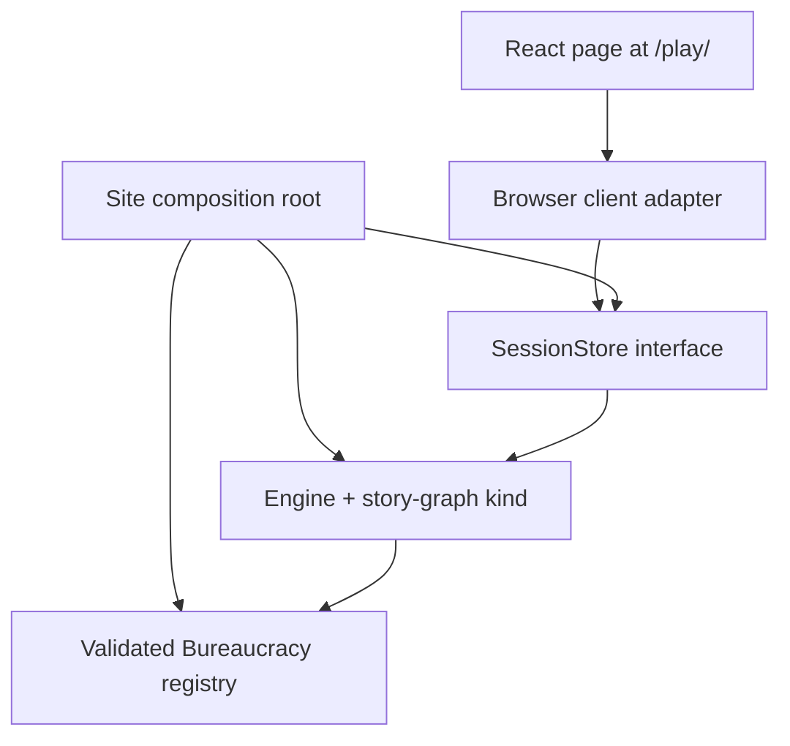

<!-- Generated from design/10-design.md by build/ConvertTo-HumanDocumentation.ps1. Do not edit directly. -->

# Playable Web Demo — Browser Client and Static Delivery

**Document status:** Revision 2 — W61 shipped as Revision 1. §4's checksum mechanism and
bundle gate and §5's checkpoint lifetime are restated against what was built; §1's opening
path, §10's non-goals and §11's first row are restated against the multi-campaign shelf W63
and W64 shipped. §§2–3 and §§6–9 are unchanged except where they cited §5's same-page limit.

**Reading order:** after [`09-clients.md`](09-clients.md). That document owns what every
client may do; this one owns the first public browser client's product boundary, composition,
and delivery.

> **Scope of this document**
>
> A publicly shareable, browser-playable proof at `/play/`. It turns the already-complete
> Bureaucracy MVP into something a visitor can play without cloning the repository, while
> preserving the rule that clients present state and never calculate game results.
>
> This is an **engine demo**, not the claim that Life in the Fast Lane or Sun Trap is a
> finished game. The distinction remains visible in the page copy.

---

## 1. Outcome and Boundary

The public demo is one complete vertical path:

> A visitor opens `/play/`, picks a `story-graph` campaign from the shelf, sees the current
> scene and every shown choice, reaches an ending, sees the achievement and final state, and
> can start again — with no install, account, backend, or game logic in React.

**Bureaucracy is the proof fixture, and that is separate from what the shelf offers.** It is
the MVP campaign, already proves gated choices, a loop, seeded randomness, an achievement,
save/load, and an ending, and carries the strongest replay and client-parity evidence in the
repository — so it is the arc §7's tests drive whatever else ships beside it. W61 shipped it
alone for exactly that reason; W64 expanded the story campaigns and W63's shelf
([`14-game-interface.md`](14-game-interface.md) §4) presents them, without weakening a single
proof, because a shelf adds a route into the same client rather than a second client.

What has *not* moved is the boundary: one kind at `/play/` (§10). A world-graph inspector or a
Stable Life dashboard would widen presentation into a second kind's surface without proving
another engine boundary, and remains a different unit's work.

The page demonstrates the engine's existing capabilities. It does not add mechanics, change
campaign outcomes, rewrite authored strings, or introduce a web-specific game path.

## 2. Player Flow

The route has five visible states:

1. **Ready** — campaign title, a short accurate explanation, and one `Start` action.
2. **Playing** — scene body, actions, visible state, achievements, and checkpoint controls.
3. **Previewing** — an explicitly labelled prospective result from `previewAction`; nothing
   is committed until the visitor chooses the original action.
4. **Ended** — ending text, outcome messages, achievements, and `Play again`.
5. **Failed** — a recoverable message and retry/restart where possible; an unsupported-browser
   failure is named before a session starts.

Shown-but-unavailable choices remain visible and disabled with their engine-supplied reason.
A `showWhen`-hidden choice is absent and the page never tries to discover it. Once a session
exists, all campaign, scene, action, reason, achievement, and outcome text resolves through its
string table. Before `Start`, the site composition root resolves the one configured campaign's
title from its validated registry into the demo's frozen startup configuration; it passes a
plain string, never a `LocKey`, to the page. `Start` remains the only operation that creates a
session. A raw `LocKey` is a visible defect, not a fallback presentation.

The state panel is a projection, not a debug dump. It may render fields already present in
`PlayerView` with human labels, but it never requests or displays `GameState`, the seed,
action log, hidden variables, or opaque kind state.

## 3. Composition and Dependency Direction

The browser demo has two layers with different permissions:

- **The site composition root** may assemble the engine, kind, validated campaign registry,
  host defaults, and session store. It also creates one frozen `BrowserDemoConfig` containing
  the selected public `campaignId` and its already-resolved ready title. It imports supported
  engine entry-point symbols rather than private modules.
- **The browser client adapter and React components** receive `SessionStore` as their only
  game-facing dependency, plus that declarative startup configuration. They do not import the
  engine, a kind, a campaign, validation, projection, or persistence helpers. The adapter uses
  the configured id only to form `CreateSessionConfig` when the visitor selects `Start`; it
  never reads or resolves registry content itself.
- **Components render adapter DTOs.** They do not grow a parallel interpretation of
  `ReasonCode`, `Condition`, or action parameters.

The committed campaign builders become supported package exports because the composition root
needs content to construct the demo without a deep import. That exposes existing content; it
does not move content into the client. As the shelf grew past Bureaucracy the export set grew
with it, and the rule that keeps it principled is **a builder, never its internals**: the
package root exports `build<Campaign>Campaign` and its id constant, and nothing that would let
a caller assemble or mutate a campaign's nodes.

`TextClient` is exported for the same composition reason and one further one: 09 §1 makes the
client rule testable as *two clients, same inputs, byte-identical `serialize()`*, and the
browser parity test cannot instantiate the other client without it. A client in the engine's
public surface is a mild oddity — it is presentation, and 02 §1 puts presentation above
everything — but the alternative is a parity proof that reaches into `src/clients/` by path,
which is the deep import this section exists to forbid.

## 4. Browser Portability Is an Engine Property

The package describes itself as platform-independent, but its current public runtime graph
contains Node-only boundaries: package-version discovery reads `node:fs`, save checksums use
`node:crypto`, and the observability guard reads an unprotected `process.env`. The CLI hides
that mismatch because it runs in Node.js; a real browser bundle exposes it.

W61 closes the mismatch at the shared implementation rather than creating a reduced browser
fork:

- The **same public entry point** used by Node.js is bundleable for a standards-based browser.
- Its production runtime graph contains no `node:` import and no unguarded Node.js global.
- `ENGINE_VERSION` remains owned by package metadata and is made available without runtime
  filesystem I/O; it is not duplicated by hand in site code.
- Save-envelope checksums remain SHA-256 over the exact canonical bytes §10.2 specifies. The
  envelope, hex digest, `Engine.serialize`, and pure `advance` path are unchanged.
- Do not add a second checksum algorithm or a browser-only save format.

**`computeChecksum` stays synchronous, over a portable SHA-256 dependency.** Web Crypto was
the obvious candidate and was not taken: `crypto.subtle.digest` is async, and making it reach
`saveGame`/`loadGame` means async-ifying `computeChecksum`, `buildSaveEnvelope`, and every
caller and test between them — a refactor of the envelope path to obtain a hash the engine can
already compute. A small, audited, dependency-free SHA-256 library (`@noble/hashes`) produces
the identical digest over the identical bytes and runs unchanged in both runtimes.

The cost is real and is the reason this is recorded rather than assumed: **the engine package
now has a runtime dependency**, where it previously had none, and it hashes with library code
rather than the platform primitive. Both are reversible — the digest is the contract, not how
it is produced — and the trigger for reversing them is a synchronous checksum becoming
unnecessary, not a preference for the standard.

Support is capability-based: ES2022 modules, `crypto.randomUUID`, and `TextEncoder`. The
static page detects a missing required capability before composition and renders an actionable
unsupported-browser message instead of failing during play.

A browser production-bundle smoke test is the gate, and it is an **assertion over the emitted
bundle**, not the build succeeding. The site's build verification scans the produced assets for
`node:` specifiers and Node-only globals and fails on a hit. "The bundler would have
complained" is the same class of claim as "typechecking DOM declarations proves portability" —
it may be true today, and it is not a gate. The site now depends on the engine by path, so a
future engine change can reintroduce a Node-only import with nothing else watching.

## 5. Checkpoints and Lifetime

W61 exposes the existing `saveGame` and `loadGame` operations as **checkpoints**. They
demonstrate the save envelope and let a visitor explore a branch and return without restarting.

**Revision 2.** Revision 1 made them same-page only, and gave three reasons: the session store
was in-memory, the client contract forbids a client persisting authoritative state, and no
browser storage port existed. The third is no longer true — 06 §5.2 draws the seam at
`SessionPersistence` (04 §7.2) — and the first two never argued against durability, only
against React reaching for `localStorage` behind the store's back.

So the line moves, and it moves without weakening either rule that produced it:

- **The client still persists nothing.** React holds a `SessionStore` and calls
  `saveGame`/`loadGame`. It does not see a blob, a save envelope, or a storage key.
- **The site composition root supplies a `SessionPersistence` adapter over `localStorage`.**
  That is host composition, above the client boundary and squarely inside 06 §2's rule: an
  adapter that stores and returns the exact bytes the store gave it cannot change
  `serialize()` output.
- **A save is addressed by its `saveId`** (04 §7.2). An adapter keyed on anything else — the
  campaign id, say — writes successfully and reads nothing back.
- **Storage is best-effort and the page says so honestly.** A quota error, a disabled store, or
  a private-browsing restriction surfaces as `storage_failure` (04 §7.2), rendered through the
  string table, and the run continues in memory. "Saved" is claimed only after a write the
  adapter confirmed.
- **What durability means here is one local checkpoint per campaign, in one browser.** Reopening
  `/play/` offers to resume it. Nothing syncs, nothing is shared between devices, and clearing
  site data clears it.

Accounts, cloud sync, cross-device resume, and server-held sessions remain in the deferred
hosting layer, unchanged.

## 6. Route, Visual System, and Delivery

`/play/` is a real static route with its own `play/index.html`, entry module, title,
description, canonical URL, and social metadata. GitHub Pages has no SPA fallback; a route
that works only after visiting `/` is not shipped.

The page joins the existing standalone site rather than Docusaurus:

- reuse the shared `SiteHeader`, `SiteFooter`, colors, type, focus treatment, and content
  measure;
- add `Play` to the public-site header and a clear landing-page call to action;
- keep the game surface quieter than the narrative landing page — one scene, one action list,
  one optional state panel;
- use CSS decoration only. Campaign art, animation, audio, and a new design system are not
  prerequisites for proving play;
- extend the existing multi-page build and protected merge so `/`, `/roadmap/`, `/play/`,
  and `/docs/` coexist in one artifact.

**Engine code is bundled; campaign content is fetched.** Revision 1 said the deployment
performed no runtime network request and that content was bundled at build time. The engine
half is still true and is the load-bearing half. The content half is not: campaigns ship as
JSON under `campaigns/` in the same static artifact, and the page fetches `manifest.json` and
each listed campaign file at startup, before the shelf renders. That is a same-origin request
for a file the deployment already contains — a build-time decision about *packaging*, not the
introduction of a backend.

What that costs, stated rather than implied: `/play/` needs a network round-trip to *start*,
where before it needed none, and a failure to fetch is a start-up failure the error boundary
in §9 must own. What it does not cost is any of the properties the original sentence existed
to protect, each of which still holds:

- **No backend, no engine API, no server-held session.** Nothing the page fetches is computed;
  every file is a static byte-identical asset of the deployment.
- **A network outage after the page loads cannot change an outcome.** Resolution is entirely
  local once the registry is built, which is before the first action.
- **No third-party request, no analytics, no runtime font or content service.** Every fetch is
  same-origin and enumerable from `manifest.json`.

The gate is the part that is missing rather than the mechanism: nothing today asserts that the
emitted bundle's startup path issues no request other than same-origin `campaigns/`, which is
the same class of unasserted claim §4 already rejected for `node:` specifiers. It is sliced,
not assumed.

## 7. Client Proof and Tests

The browser column added to `09-clients.md` §4 is complete only when all ten operations,
including `previewAction`, are driven through the real browser adapter in automated tests. The
visible `previewAction` control is optional engine-demonstration UI; its adapter coverage is
not optional. `saveGame`/`loadGame` power the checkpoint §5 specifies, and their adapter
coverage is asserted against the store, not against whether a given browser's storage is
writable — a run with `SessionPersistence` omitted must satisfy the same ten rows.

The load-bearing parity test uses the Bureaucracy campaign, the same seed, the same counting
`IdSource`, and the same committed choices through the browser adapter and text client. At
each step their `Scene` and `PlayerView` agree, and the final `serialize()` output is
byte-identical. Normalizing away `gameId` or hidden fields is not permitted.

Additional acceptance:

- a production browser bundle contains no Node.js built-in or unresolved Node global;
- a direct static request to `/play/` succeeds and the combined deployment artifact retains
  `/docs/` unchanged;
- the full Bureaucracy loop, gated choice, random transition, ending, achievement, preview,
  checkpoint and restore each have a named test;
- no player-facing raw localization key renders in ready, playing, rejected, or ended states;
- the existing text client, MCP, replay corpus, save-envelope fixtures, and canonical
  serialization remain byte-identical.

## 8. Accessibility and Responsive Behaviour

- One H1; scene titles and panels follow a coherent heading hierarchy.
- Every action is a native button. Disabled choices remain keyboard-discoverable through
  adjacent reason text rather than relying on a tooltip.
- Submission results and scene changes are announced through a restrained live region;
  focus moves to the new scene heading after a committed action and nowhere after a preview.
- Status, availability, success, and failure never rely on colour alone.
- The action list and state panel have no horizontal overflow at 320 px, 390 px, 768 px, and
  1280 px. Long authored text and localization keys wrap safely.
- Loading and submission prevent duplicate input without automatically retrying an action.
- Reduced motion is complete and immediate; no animation is required to understand a state
  change.

## 9. Failure Behaviour

- Registry or campaign build failure prevents the demo from starting and renders one
  non-player-data error boundary. It does not silently remove invalid content.
- A rejected action displays the localized engine message and leaves the current scene
  authoritative.
- A sink failure remains invisible to play, exactly as the engine contract requires.
- An unexpected adapter exception preserves a restart path and may log technical detail to
  the browser console; it never renders raw save data or hidden state.
- Deployment failure leaves the existing landing page, roadmap, and documentation artifact
  unchanged; the protected merge remains the release boundary.

## 10. Explicit Non-Goals

- **Stable Life or the world-graph MVP** at `/play/`. Both remain out: this route proves the
  `story-graph` kind, and adding a second kind's surface is a different unit's work.
  Revision 1 also listed the four other Bulgaria arcs here — see §11.
- Durable browser storage, accounts, profiles across reloads, cloud sync, or a backend.
- New mechanics, campaign rewrites, balance changes, or a connected five-arc metagame.
- Visual-novel art, bespoke illustration, audio, animation, or controller support.
- Analytics, telemetry, session capture, cookies, or user identity.
- Offline installation, a service worker, or a progressive web app.
- A generic embeddable web-client package. W61 builds one honest client against the existing
  contract; reuse is earned only after a second consumer exists.

## 11. Decision Summary

**Revision 2 corrects the first row.** Revision 1 read *Bulgaria Bureaucracy only*, and §10
made the other Bulgaria arcs a non-goal. Both were true of W61 and neither survived W64,
which expanded the story campaigns, or W63, whose story shelf
([`14-game-interface.md`](14-game-interface.md) §4) is a multi-campaign surface by
construction. §3 was updated for the six sanctioned builder exports and these two were not,
which left one document arguing both sides. The rule that produced the original row is
unchanged and is what still bounds the route: **one kind, `story-graph`** — that is what §10
now says, and it is the line adding Stable Life or the world-graph MVP would cross.

Bureaucracy keeps a distinct standing that is not "first": it is the MVP fixture and carries
the client-parity and replay evidence §7 depends on, so it is the campaign the proofs run
against whatever else is on the shelf.

| Decision | Choice |
|---|---|
| Public campaigns | The six shipped `story-graph` campaigns, presented as a shelf ([`14`](14-game-interface.md) §4); Lucifer Chronicles is featured, Bureaucracy remains the proof fixture (Rev. 2) |
| Route | Real static `/play/` entry in the existing React site |
| Authority | `SessionStore`; React receives projections only |
| Runtime | Engine executes locally in the browser; no backend |
| Browser compatibility | One shared public engine surface, no Node.js fork |
| Saves | One local checkpoint per campaign, via a host `SessionPersistence` adapter (Rev. 2) |
| Storage failure | Best-effort: `storage_failure` surfaces, the run continues in memory |
| Checksums | Synchronous SHA-256 over a portable library, not async Web Crypto |
| Demonstration feature | Explicit non-committing action preview |
| Styling | Existing site system, responsive and keyboard-first |
| Delivery | Existing GitHub Pages artifact beside `/`, `/roadmap/`, and `/docs/` |
| Expansion | Cloud sync, accounts, and cross-device resume require later slices |
