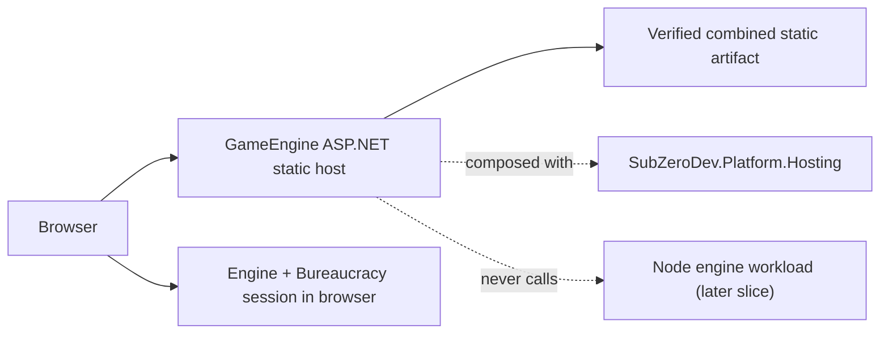

<!-- Generated from design/10-design.md by build/ConvertTo-HumanDocumentation.ps1. Do not edit directly. -->

# Platform Static Host — Container Delivery without a Hosted Engine

**Document status:** Revision 2 — **historical.** Revision 1 was the agreed W62 build target
and shipped; this block is no longer a target the repository builds against. Two things
outdated it. W69 removed `/play/` from the site build, so the four-route artifact §4 and §6
describe is a three-route artifact
([`13-playable-web-demo.md`](13-playable-web-demo.md), Revision 4). And the hosted direction
moved out of this repository along with the play surface. The route lists below are corrected
rather than left false — a retired document that is also wrong about what it retired teaches
a reader two things instead of one — but nothing here is a specification to build to.

> **The image workflow is still live, and that is the sharp edge of retiring this block.**
> `.github/workflows/host-image.yml` still builds, smokes and publishes on every merge, and
> `src/host/` is still in the tree. It is not one of the three required checks
> (`CLAUDE.md`, *Git and Pull Requests*) and W62 deliberately deploys nothing, so nothing is
> gated on a contract that no longer binds — but a future change to that workflow or that host
> now has no document to check itself against. Whether the host follows the play surface out
> of this repository is a decision this reconciliation did not make; it is recorded in
> `90-decisions.md`.

**Reading order:** after [`14-game-interface.md`](14-game-interface.md). That document owns
the presentation layer over the browser client; this one owns an additional container delivery
surround for the same combined static artifact.

> **Scope of this document**
>
> Package the completed public site, roadmap, playable demo, and documentation behind a
> product-owned ASP.NET Core host composed with `SubZeroDev.Platform.Hosting`. Build and smoke
> the image in pull requests, publish a new immutable GHCR image from `main` when its inputs
> change, and leave it undeployed. GitHub Pages remains the public host.

---

## 1. Outcome and Boundary

W62 proves that SubZeroDev.Platform can host this product without pretending the browser demo
has become a hosted game engine:

> The same verified static artifact served by GitHub Pages is baked into a container, served
> through Platform's supported web-host composition, health-checked in CI, and published as an
> immutable image. Opening `/play/` still downloads the application and runs the engine in the
> browser with no engine API or runtime content request.

The host is a **delivery surround**, not another client and not a game service. It must not
receive actions, own sessions, calculate results, persist saves, or expose the engine package
over HTTP. W61's browser-client boundary and byte-level engine evidence remain unchanged.

## 2. Ownership and Dependency Direction

The composition root belongs in this repository because it is product policy: which routes to
serve, which artifact to embed, and which Platform capabilities to enable. Platform remains a
reusable hosting framework and must not reference GameEngine.

The product host lives under `src/host/`. It calls `AddPlatformWebHost()` and maps Platform's
probe endpoints, but does not add the Platform worker host, persistence, migrations, outbox, or
account facilities. The dependency direction is always:

> GameEngine host → released Platform package; Platform → no GameEngine dependency.

## 3. Platform Package Gate

Implementation may begin against a temporary sibling project reference to
`../SubZeroDev.Platform/src/SubZeroDev.Platform.Hosting/SubZeroDev.Platform.Hosting.csproj`.
That is a local-development scaffold only. It must not be the merged or published dependency:

- W62 cannot merge until Platform's S9 package publication is complete;
- the final project pins one exact `SubZeroDev.Platform.Hosting` NuGet version, with no floating
  range and no sibling checkout required by CI;
- a clean clone restores the package from GitHub Packages using the workflow's short-lived
  credential;
- no registry token is committed, copied into an image, passed as a Docker build argument, or
  retained in a build layer. Container restore uses a secret mount or an equivalently
  non-persistent mechanism.

This gate makes the first real Platform consumer evidence about the package that will ship,
not evidence about source-tree adjacency.

## 4. Artifact Assembly and Routes

One multi-stage image build owns the production assembly from a single GameEngine commit:

1. install pinned JavaScript dependencies and build the standalone site;
2. build the Docusaurus documentation through the repository's supported template path;
3. run the protected merge and prove the documentation subtree byte-identical before and
   after the overlay;
4. publish the ASP.NET product host;
5. copy only the verified combined artifact into the runtime image's `wwwroot`.

The container serves real files at `/`, `/roadmap/`, and `/docs/`. There is no SPA
fallback: an unknown route returns `404`, and a direct request to every supported route works
without first requesting `/`. Static bytes are not rewritten by the host.

> **Revision 1 listed `/play/` as a fourth route.** W69 removed it from the site build, and
> the host followed in the same branch: `StaticArtifact.RequiredRelativePaths` is
> `index.html`, `roadmap/index.html`, `docs/index.html`, and the missing-artifact fixture that
> proves the startup guard fails red now deletes `roadmap/index.html` instead of
> `play/index.html`. The no-fallback property is unaffected and still asserted.

Platform's liveness and readiness endpoints are also mapped. They are operational endpoints,
not part of the static artifact and not routed through a catch-all. Successful startup means
the baked artifact and required configuration were already validated; the host must fail the
build or startup rather than serve a partial site.

## 5. Runtime Contract

- The runtime image contains the published host and combined static artifact, not Node.js,
  npm caches, source trees, registry credentials, or build tooling.
- It runs as a non-root user, supports a read-only root filesystem, writes no product data, and
  listens on the ASP.NET port supplied by its environment.
- Normal static serving performs no outbound network request. Once the page and assets load,
  losing the network cannot change a game outcome.
- `SIGTERM` follows Platform's graceful-shutdown behavior. Liveness and readiness remain
  suitable for a future container orchestrator even though W62 does not deploy one.
- Logs and error envelopes inherit Platform's correlation and redaction boundary. Static-route
  failures must not add request bodies, cookies, tokens, or player data to logs.

The image is intentionally stateless. Restarting the container loses nothing because the only
game session is W61's in-browser memory, and refreshing the page already starts a new demo.

## 6. CI, Publication, and Deployment Boundary

Pull requests build the image, start it, and smoke-test:

- `200` responses for `/`, `/roadmap/`, `/docs/`, liveness, and readiness;
- `404` for a named unknown route, proving there is no fallback;
- the expected route metadata and protected documentation-subtree digest; and
- an orderly container stop.

> **Revision 1 required a sixth check and a browser production smoke, and both went with the
> route.** The smoke existed to prove `/play/` made no engine API request and no request
> outside the same-origin `campaigns/` files; with no `/play/` in the artifact it has nothing
> left to assert, so the step and its playwright project were removed in W69's follow-up
> rather than left green over an absent route.
>
> **Retired, not reassigned — [issue #273](https://github.com/The-Running-Dev/SubZeroDev.GameEngine/issues/273).**
> §4's Node-only-import property moved to a named replacement (Adventures' own
> `scripts/verify-build.mjs`) because that property is still true of the package Adventures
> bundles. This one is not: it asserted *no backend, no engine API, same-origin files only*,
> and [SubZeroDev.Adventures](https://github.com/The-Running-Dev/SubZeroDev.Adventures) is
> deliberately the opposite — a hosted Fastify API with Postgres persistence and accounts,
> reached over the network on every save, load, and catalog call. There is no host left that
> the property is still true of, so there is no bundle for a replacement check to assert it
> over. It ends here rather than moving.

The workflow must contain a negative fixture or test mode that deliberately omits or corrupts a
required artifact and proves the build or startup goes red. A smoke test that has never been
seen fail is not evidence of the boundary.

After merge, a path-filtered workflow publishes to GHCR only when the host, site, documentation
build, protected merge, container definition, or their locked dependencies change. Each
publication receives an immutable full-commit tag and digest; W62 creates no `latest` tag and
no deployment. Unrelated engine-only changes do not republish identical hosting inputs unless
they alter the browser bundle included by the site build.

GitHub Pages and its exact-merge deployment workflow remain active and authoritative for the
public URL. Publishing the image is an artifact event, not a production cutover. DNS, TLS,
runtime environment, rollback policy, and digest-pinned deployment require a later slice.

## 7. Failure Behaviour

- A missing site route, missing docs artifact, failed protected merge, stale generated page,
  or unavailable exact Platform package fails CI before an image is published.
- A malformed runtime configuration or missing baked artifact prevents readiness and exits
  rather than serving whichever files happen to exist.
- Unknown routes return `404`; they never return the landing page with `200`.
- A Platform operational concern may affect health or request delivery but cannot change an
  engine state, replay input, save envelope, or rendered action result.
- A GHCR publication failure leaves the existing GitHub Pages site and previously published
  immutable images unchanged.

## 8. Explicit Non-Goals

- Public deployment, DNS, TLS, a custom domain, traffic cutover, or removal of GitHub Pages.
- A Node.js engine process, JSON/HTTP engine API, MCP transport, remote session, or server-side
  action execution. Those form a later hosted-engine-edge slice's `.NET Platform edge → Node
  engine workload` boundary.
- Durable sessions, browser persistence, accounts, authentication, profiles, cloud sync,
  databases, migrations, outbox processing, or a worker process.
- A generic static-site feature added to Platform. This is a product-owned consumer of the
  existing Platform web-host contract.
- Changes to campaign content, gameplay, browser UI, engine serialization, or W61's client
  contract.

## 9. Decision Summary

| Decision | Choice |
|---|---|
| First Platform use | Static product host; hosted engine follows separately |
| Composition owner | GameEngine repository under `src/host/` |
| Platform capability | Web host and probes only |
| Engine execution | Still local in the browser |
| Artifact | Same protected combined site/docs output built from one commit |
| Development dependency | Temporary sibling project reference permitted |
| Merge dependency | Exact released NuGet package required after Platform S9 |
| PR behavior | Build, run, positive/negative smoke; no publish |
| Main behavior | Path-filtered immutable GHCR publish when hosting inputs change |
| Public hosting | GitHub Pages remains authoritative; image is undeployed |
