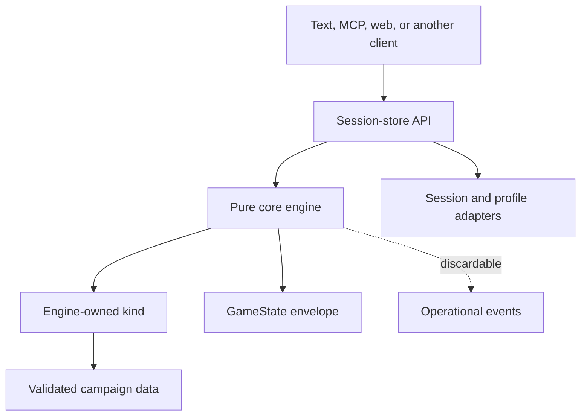

<!-- design-digest: 11806725d815a1d3e10f094157dbc80aeb637c90a305bbe618f8c6a24305f37b -->

> Generated from `design/` by `/make-human-docs`. Do not edit by hand — edit the
> design docs and regenerate. `/reconcile` reports when this has gone stale.

The five agent-kit documents under `design/` are the canonical source. The detailed pages under
`docs/docs/engine/` are generated from marked blocks in those files and must not be edited
directly.

# Developer Guide

SubZeroDev.GameEngine is a deterministic narrative-game engine written in TypeScript. It
separates game-independent execution (the core) from game-category rules (a kind) and campaign
data, then exposes every game through one session API. Text, MCP, and browser clients are
siblings over that API; none owns rules or holds authoritative state. Node.js is the proven
runtime, and the same public entry point bundles for a standards-based browser without a reduced
fork — a downstream client repository ships that browser build today.

Use this guide when integrating the package, implementing a client or campaign, or extending an
engine-owned kind. The exact public types, signatures, error tables, persisted schemas, and
assertable invariants live in the
[generated contract](https://github.com/The-Running-Dev/SubZeroDev.GameEngine/blob/main/design/20-contract.md).

## What exists today

- The core engine, content builder, tiered validation, session and profile stores, save
  migration, observability, the determinism harness, and cross-version replay are all
  implemented.
- `story-graph` is the flagship, MVP-complete kind: content, projection, text client and MCP all
  cover it. Six campaigns — the Bulgaria Bureaucracy arc, four further Bulgaria arcs, and Lucifer
  Chronicles — provide real fixtures.
- `simulation` is a real, registered kind: state, content definitions, the weekly resolution
  pipeline, validation, and a full player projection (`SimulationView`) all exist. Its text-client
  and MCP coverage now matches `story-graph`'s row of the API coverage checklist one for one, and
  the Stable Life fixtures prove both a winning and a losing replay path.
- `world-graph` is a real, registered kind — the same status as the other two. Its twenty-system
  tick pipeline (build, utility, routing, queues, staff, finance, incidents, terminal precedence)
  is registered, ordered, and tested for that ordering. Two of the twenty systems are
  known-and-retained stubs or partial implementations (one no-op, one partial); see
  `design/90-decisions.md`, *Known-and-retained implementation gaps: `world-graph` tick systems*,
  for the current list.
- **There is no browser demo in this repository.** A public `/play/` route existed, ran the
  shipped `story-graph` campaigns as a story shelf over the same session-store boundary the text
  and MCP clients use, and was removed from the site build in W69. The play surface is now
  [SubZeroDev.Adventures](https://github.com/The-Running-Dev/SubZeroDev.Adventures), a client
  repository that consumes this engine as a pinned git submodule and adds a hosted API, durable
  persistence, and accounts — with no reciprocal engine change. The retired route's browser
  adapter and its tests still live under `site/src/play/` and still run: they remain the evidence
  behind the browser column of the API coverage checklist, not leftovers.
- A Platform-backed static container exists: an ASP.NET Core host under `src/host/` that packages
  the verified combined artifact as an immutable image, serving `/`, `/roadmap/`, and `/docs/`.
  It is an alternative delivery surface for the same bytes, not a hosted engine API, and GitHub
  Pages remains the public host. Its design block is now historical, but the workflow that builds,
  smokes, and publishes it still runs on every merge.
- Content pack resolution and experiment gating are implemented and exported: `resolvePacks`,
  `applyExperimentGates`, `computeResolutionId`, `resolveBucketKey`, `resolveExperimentAssignments`,
  and the `ExperimentSource` port. One piece is deliberately unbuilt: `SessionHost.experiments` is
  declared but read by nothing, because the session layer receives an already-resolved registry
  and has no way to derive the assignment map itself. Resolve packs above the session seam.
- Privacy-safe session capture is specified, not implemented — it is deferred to the hosting layer
  that gates it.

## The mental model



The split is strict:

- The **core** owns the envelope, seeded RNG streams, canonical serialization, resolution
  orchestration, projection, saves, the validation vocabulary, and the shared scene/action shapes
  every client renders.
- A **kind** owns one category's turn model, its own state shape, what an action means, scene
  rendering, projection, campaign validation, event names, reason codes, migration, and terminal
  identity.
- A **campaign** is immutable, validated data for exactly one kind.
- The **session store** owns persisted state and command ordering; the pure engine itself keeps
  no session.
- A **client** presents projected DTOs and submits declared inputs. The moment it needs to compute
  an outcome, read raw state, or emulate a store operation that does not exist, the boundary has
  broken.

## Install and consume the package

The published package is `@the-running-dev/game-engine`. Its root export is deliberately narrow:
consumers get the supported engine, builder, session, observability, localization, and kind
surfaces — nothing lets a caller reach into internal modules.

Build one composition root per process:

1. Build and validate a content registry.
2. Register the kinds the campaigns in that registry need.
3. Create the pure engine from the registry, the kinds, and any deterministic id/event ports the
   host wants.
4. Create the session service from the engine plus concrete session and profile persistence.
5. Give clients the session service and nothing else.

The engine performs no filesystem or network I/O while resolving play. Parsing JSON or YAML,
reading files, database access, clocks, hosting, and process lifetime all belong to outer
adapters.

## Published narrative content lives outside this repository

Narrative campaigns are authored and published by
[SubZeroDev.Adventures.Content](https://github.com/The-Running-Dev/SubZeroDev.Adventures.Content),
not by this repository. It builds portable JSON from TypeScript campaign sources and publishes the
manifest hosts fetch. This engine stays the authority for deterministic mechanics, kinds,
validation, and portable hydration.

The package root (`@the-running-dev/game-engine`) is for runtime hosts. A separate subpath,
`@the-running-dev/game-engine/authoring`, is for repositories that own campaign source: it exports
the content-registry builder, the story-graph and adventure source builders and their migration
helpers, portable serialization and manifest-digest functions, and replay-runner types. Import
from `/authoring` only when writing or publishing campaign content — a runtime host must never
import authored campaign source merely to play already-published portable JSON.

`toPortable` and `digestManifestResolution` are `/authoring`-only. `fromPortable` is root-only.
`digestPortableCampaign` is exported from both, because both a runtime host verifying fetched
content and a publishing pipeline digesting source before it ships need it.

A handful of frozen campaigns (the Bulgaria Bureaucracy arc among them) still ship as package-root
exports for compatibility. They are regression fixtures, not a publication source, and the
breaking `0.9.0` release removes them from the root — that peg has already moved once, from
`0.8.0`, because `0.8.0` was spent on an additive release instead, so check
`src/engine/package.json` against `design/20-contract.md` §19 before assuming which release does
it. Build against `/authoring` and the Adventures.Content feed, not against these root exports,
when integrating narrative content going forward. The retired `/play/` route follows the same
boundary and is removed in the same release; its browser host for published content going forward
is [SubZeroDev.Adventures](https://github.com/The-Running-Dev/SubZeroDev.Adventures).

## Build content before creating the engine

Authors write player-facing text inline, as keyed authored text. The pure content builder:

1. validates the kind's source schema;
2. lifts inline text into the shared string table;
3. rejects one key paired with conflicting text;
4. converts source into runtime content carrying localization keys only;
5. runs kind validation;
6. merges protected core, kind, and campaign strings;
7. freezes campaigns and strings.

Never hand the engine partially validated or mutable content. Registry construction is the
failure boundary: a Tier 1 error means there is no registry and therefore no playable engine.

### Validation tiers

- **Tier 1, hard failure** — duplicate or invalid ids, dangling references, undeclared variables,
  mistyped effects, missing strings, invalid weights, forbidden namespace writes, and other static
  contract violations.
- **Tier 2, warning** — unreachable content, suspicious cycles, non-interactive story campaigns,
  and similar structures that may be deliberate.
- **Tier 3, simulation/replay** — unwinnable states, never-satisfiable actions, and anything that
  cannot be decided by reading definitions alone. Not part of load, and not proven by the
  determinism harness either — that harness compares a build against itself, which cannot tell you
  whether an ending is reachable. Tier 3 is an author-facing check run out of band: `npm run
  validate-campaign` in the engine package searches the actual state space using the kind's own
  settle, condition, and achievement logic, so its answers match real play, but nothing in the
  registry path imports it — a campaign loads, plays, and serializes identically whether or not it
  has ever been checked. The search is bounded (an explored-state cap, a turn-depth cap, the same
  settle-step cap the engine itself enforces), and it reports `bounded` whenever any cap was hit
  anywhere. **A bounded result means "not proven," never "passed."** Treat the two as identical and
  you get a guarantee the checker never offered — it declines to credit an ending found exactly at a
  cap so it never claims to have explored more than it did.

Every registered code — Tier 1, Tier 2, and the codes a kind uses to reject a player action —
needs a localized message, or registry construction fails; a validation code never reaches a
player, because a campaign carrying a Tier 1 finding never produces a registry at all. How
specific those codes are is a per-kind choice: `story-graph` publishes twelve, `world-graph`
twenty-nine, because its content is a map, a terrain graph, ten catalogues, and a scenario, and
one generic "invalid definition" would not tell an author which of them was wrong. The full
per-kind lists are in
[the contract](https://github.com/The-Running-Dev/SubZeroDev.GameEngine/blob/main/design/20-contract.md).

AI-authored content takes this same path. AI may draft campaign data; it never authors or loads
executable kinds.

A **campaign-shape builder** takes the same path for the same reason. `adventure-builder.ts` is the
built one — a parameterized function that takes authored prose, choices and endings and emits the
repetitive graph topology around them. Eight of the nine shipped story-graph campaigns are
constructed through it; `what-would-lucifer-do-engineers-cut` and the Tier 3 reachability fixture
are written out longhand instead, which is the point proven in practice rather than just stated: a
campaign whose topology genuinely differs can simply skip the builder. It is tooling, not a layer:
it runs before the engine, emits an ordinary campaign source, is validated by the tiers above
exactly as hand-written content is, and leaves no trace in `serialize()`. A campaign is free not to
use one; that freedom is what keeps a shared shape a convenience rather than an undeclared content
schema.

### Assembling a registry from content packs

There are two ways to reach a registry, and they differ in what they can say about identity.
`buildContentRegistry` folds already-built campaigns and knows nothing about packs. `resolvePacks`
folds an **ordered** array of packs, and the order is significant: a later pack replaces an
earlier campaign wholesale by id, and replaces strings per key. That asymmetry is deliberate — a
culture pack must be able to restyle one line without restating a whole campaign, but a campaign
is a validated graph, and a field-level merge across packs could produce one no pack author ever
validated.

`resolvePacks` is pure and total: either every structural check passes and the call returns a
complete registry, or it returns every conflict at once and no registry. The checks: a pack's
`kindId` matches every campaign it carries; a `dependsOn` names a pack present in the set at
exactly that version; no two packs require different versions of the same pack; there is no
dependency cycle; no campaign id repeats within one pack; and no pack writes a `core.reason.*`
string. Overriding something no earlier pack supplied is a warning, not an error — legal, and
almost always a misspelled key that would otherwise fail invisibly at play.

Dependencies are exact `{id, version}` pairs; there is no range solving, deliberately — a
backtracking resolver would make *which content a game ran against* non-deterministic.

A pack's own `version` is not something its author hand-writes. It is derived —
`1.0.0+<canonical-digest-12>` over the pack's campaigns and its sorted string table — so the
version moves automatically whenever the pack's content moves, rather than depending on every
author of a file that feeds a pack remembering to bump a constant nobody's file mentions. Treat it
as generated identity, not a field to edit by hand. The type does not enforce this — `version` is
a plain string, and today each pack file (`stable-life-packs.ts`) calls its own local helper to
compute it, so a new pack is only correct if its author copies the pattern.

The identity consequence is the part worth planning around. `resolvePacks` digests the ordered
`{id, version}` list into a `ResolutionId` and stamps it as the `version` of every campaign it
produces, so a game records the content it actually ran against rather than a campaign version two
different pack sets could share. **Reordering packs therefore changes every campaign version**,
and every existing save becomes a save of a different content version. That is correct, but it
means pack order is not a knob to adjust on a live deployment. Experiment gates ride the same
identity mechanism: two sessions resolving different variants resolve different pack sets, hence
different `ResolutionId` digests, hence different `campaignVersion`s, with no additional
machinery.

## Use the session API, not raw engine state

The session service is the application boundary. It provides campaign listing, creation, resume,
scene/view queries, localization strings, action submission, preview, save, and load. Exact
operation signatures are in the
[contract](https://github.com/The-Running-Dev/SubZeroDev.GameEngine/blob/main/design/20-contract.md#public-signatures).

Starting a session takes a campaign id, an optional explicit seed, an optional audience, and an
optional profile id — there is no `locale` parameter. When no seed is supplied the session
boundary generates and persists one. The returned handle carries a `sessionId` and a scene, never
the envelope.

Submitting an action follows one atomic path:

```mermaid
sequenceDiagram
  participant C as Client
  participant S as Session service
  participant E as Pure engine
  participant K as Kind
  participant P as Persistence

  C->>S: submit(sessionId, actionId, declared params)
  S->>P: load complete serialized state
  S->>E: submitAction(state, action)
  E->>K: advance(kindState, action, scoped context)
  K-->>E: new kind state, or a structured rejection
  alt accepted
    E-->>S: new envelope + changes/messages
    S->>P: atomically persist envelope
    S-->>C: projected scene/result
  else rejected
    E-->>S: unchanged state + error
    S-->>C: error; no log or state write
  end
```

Different sessions resolve concurrently. Commands for the same `sessionId` are serialized by the
store, so the second command always reads the first command's committed state. A query returns a
projection of one complete stored revision, never a half-written one.

A stored session record carries more than the serialized envelope: an `audience`, an
`attemptCounter` only `submitAction` increments, an optional `profileId`, a `replayCompatible`
flag that turns false forever once a migrated load touches the lineage, and wall-clock
`createdAt`/`updatedAt` timestamps set through the `Clock` port — all of it outside the replayable
`GameState` and never read by `advance`.

### Durability is a host adapter, and the store is not

The session store itself is engine-owned. Its two lock domains, its trace-and-stamp decorator,
save-envelope assembly, and the idempotent profile upsert are behavior you get, not behavior you
supply. What you may supply is `SessionPersistence` — a pair of record stores that get and put a
session record, and get, put, and delete a save record. Omit it and the store's own in-memory maps
are the whole implementation, which is the default and what every test runs against.

Two rules an adapter must not get wrong:

- **Address a save by its `saveId`.** `get` and `put` must reach the same record. An adapter keyed
  on anything else writes successfully, reads nothing, and fails no gate — the first shipped
  adapter did exactly that.
- **Store the bytes you were given.** The record holds a canonical serialization, not a live
  object graph, and nothing on it may be written into `GameState`.

Failures throw `SessionStoreError`, because none of the store's return shapes has a field an error
could travel in. It is not opaque: `operation` names the call and `code` is a registered reason
code with a shipped `core.reason.*` message, so a client renders it through the string table like
any other rejection and never reads `message`. Whatever exception an adapter raises is caught and
re-raised as `storage_failure` by default — a Postgres timeout and a browser quota error are
deliberately indistinguishable to a client, since neither admits a different response.

One failure is classified rather than flattened: a **lost update**. The store's per-session lock
orders operations inside a single process; run several instances over one database and nothing
here serializes them, so an adapter is the only party that can tell another writer moved the
record first. Signal it by setting `name` on the thrown exception to the exported
`SESSION_PERSISTENCE_CONFLICT` string, and the store raises `concurrent_modification` instead — a
code the client can act on differently, by re-reading the session and retrying. The store matches
on `name` rather than `instanceof`, so the signal survives a duplicated copy of the package. Brand
nothing else with it: a timeout or a deadlock branded this way tells a player to refresh a session
that never changed, and left unbranded it arrives as `storage_failure`, which is correct for it. A
single-writer adapter — in-memory, `localStorage` — never raises it. A rejected write must also
never leave the store's own cache ahead of what it just failed to persist; an operation that
mutates a cached record before dispatching the write has to restore or evict that record when the
write throws, or the retry the `concurrent_modification` message asks for cannot succeed.

### Previewing an action

Clients may call `previewAction(sessionId, actionId, params?)` before submitting. It runs the same
authoritative resolution path as submission, but projects the prospective result and discards the
state: it never writes a session or profile, consumes a command attempt, appends to the action
log, or emits an action-lifecycle event. It still shares the per-session command queue, so it
cannot present a result for a revision a neighboring submission has already replaced. The text
client and the MCP `preview_action` tool expose the same operation; neither duplicates placement or
other kind rules — `world-graph` is the kind that forced preview to exist at all, because a spatial
placement must be checkable before it commits and no client can call the pure engine directly.

### Profiles are optional mirrors

Pass a `profileId` when achievements should survive a session. After a successful action, the
session service idempotently mirrors new achievements to the profile store; resolution itself
never reads the profile.

- No profile id means no profile read or write.
- A missing or corrupt profile behaves as empty and returns a warning.
- A failed profile write warns but never rolls back the completed game action.
- Never put profile identity or profile contents into `GameState`.

Arbitrary kind-owned profile data is not currently supported; profile-scoped simulation event
chains in particular remain outside the executable contract.

## Projection is mandatory

Clients receive a generic `Scene` and `PlayerView` plus a kind-projected view. They never receive
the seed or action log, raw `kindState`, non-visible story variables or visit counts, hidden
choices, unrevealed simulation/world opportunities or entity internals, or achievement conditions
and other future-state hints.

Do not add a trusted-client escape hatch. The projection is what makes hidden information safe
across text, MCP, web, and AI audiences. If a new client needs more information, decide whether it
is genuinely player-visible and extend the relevant kind's projection deliberately.

Client code switches on stable reason codes and renders localization keys — it never parses an
English error sentence, and a missing localization key is a registry-build defect, not a client
fallback opportunity. Two things follow that are easy to get wrong when implementing a client or a
kind:

- **A rejection gives you both an error and a message, and you may render either.** Every kind
  attaches one visible `OutcomeMessage` built from the same localization key its `ValidationError`
  carries, so a client that renders only `messages` still shows the player why an action failed. A
  kind's own rejection path owes that message too.
- **Audit records carry reason codes as well.** The `reason` on a `StateChange` is an ordinary
  registered code with a localized message, not a private label, so a visible change is renderable
  the same way a rejection is. `achievement_unlocked` is base vocabulary because the session store
  acts on it without knowing the kind; `consequence_applied` belongs to `story-graph`. A kind
  adding an audit reason registers it like any other code.

### Building a browser client

This repository no longer ships a browser client. Its own `/play/` route was removed from the site
build in W69; the play surface is
[SubZeroDev.Adventures](https://github.com/The-Running-Dev/SubZeroDev.Adventures), a client
repository consuming this engine as a pinned submodule. If you are building a browser client,
build it the way Adventures does.

The engine-side constraints below still apply, because they are about the *engine's* browser
boundary rather than about a specific route. Adventures proves the two rules that matter most: a
client composes the engine and the engine never learns the client exists, and adding a hosted API,
durable persistence, and accounts required no reciprocal engine change.

Keep the composition root separate from the client. The root assembles the engine, the kind,
validated campaigns, and the session store, resolves each campaign's title before start, and
passes a frozen startup configuration carrying plain titles and campaign ids to the page. The
browser adapter and any UI components use `SessionStore` as their only game-facing dependency —
they do not read a registry, and `Start` remains the action that creates the session.

The package root exports the committed campaign builders so a composition root needs no deep
import — a builder and its id constant, never anything that would let a caller assemble or mutate
nodes. `TextClient` is exported for the same composition reason plus one more: the browser/text
parity proof cannot instantiate the other client without it.

The same supported engine entry point must bundle for Node.js and the browser, with no `node:`
import and no unguarded Node global in its production graph. Save checksums remain SHA-256 over
the same canonical bytes and stay synchronous, computed by a portable library rather than Web
Crypto — `crypto.subtle.digest` is async, and adopting it would mean async-ifying the whole
envelope path to obtain an identical digest.

**Nothing in this repository proves browser portability anymore, and that check is now yours.**
The scan for `node:` specifiers and unguarded Node globals used to run over the emitted `/play/`
bundle; with that route retired there is no engine code left in this repository's bundles for it
to see. If you ship a browser build of this package, scan your own emitted bundle — Adventures
does, and that is now the only place the property is actually asserted.

Browser hosts must define the `__GAME_ENGINE_PRODUCTION__` build-time flag. Node callers fall back
to `NODE_ENV`; a browser bundle that omits it silently gets dev-mode emitter behavior.

Checkpoints work the same way anywhere: React (or an equivalent UI layer) holds a `SessionStore`
and calls `saveGame`/`loadGame` — it never sees a blob, an envelope, or a storage key. A host
composition root supplies a `SessionPersistence` adapter (over `localStorage`, for instance).
Storage is best-effort: a quota error or disabled storage surfaces as `storage_failure` and the run
continues in memory, and "saved" is claimed only after a write the adapter confirmed. Whatever
route a client serves must be a real document in its static artifact, never an SPA fallback.

## Determinism rules that will bite you

The replay input is campaign identity, seed, and successful submitted actions. Preserve that model
by following these rules in every resolution path:

- Use only the scoped RNG supplied by the kind context, or a stream derived from it.
- Never call ambient randomness, the wall clock, filesystem, network, or a banned non-bit-stable
  math function.
- Do not persist an RNG cursor — derive a fresh handle from seed and stable stream id every time.
- Do not let a client supply a time or money cost the engine can derive itself.
- Sort dictionary keys before any state-affecting traversal.
- Define explicit tie-breaks for every unordered candidate set.
- Keep money in integer cents and simulation rates in integer basis points.
- Keep wall-clock metadata outside the game envelope.
- Add a new action parameter to the declared schema before letting it affect behavior.

The stream key matters as much as the generator. Per-action draws use the successful action
sequence. World-level autonomous draws use simulated tick and system. Agent draws use the agent's
own stored draw counter, never the number of client submissions that happened first — keying an
agent's randomness to the action sequence would make it depend on how many actions preceded it,
which is exactly what a per-agent stream exists to avoid.

The same-build harness proves byte identity, property-seed reproducibility, and emitter
independence: every golden fixture replays under `nullEmitter` and under `createRecordingEmitter()`
with byte-identical `serialize()` output. It also proves event-stream reproducibility directly —
the same fixture, run twice under a recording emitter, is asserted to yield the identical event
sequence (names, order, data), with `gameId` normalized out because a replay is a new game and
legitimately carries a new one. None of this by itself detects a deterministic *behavior* change;
that is the cross-version replay oracle's job, below.

## Story-graph campaigns

Use `story-graph` for authored branching narrative whose unit of play is one choice.

A campaign declares bool, bounded-int, and enum variables; choice, automatic, random, and ending
nodes; choices with optional visibility and availability conditions; typed consequences over
declared variables; conditional achievements; and localization keys with authored text.

There are two different gates on a choice:

- `showWhen` removes a choice completely. Submitting its id returns exactly what submitting an
  unknown id returns, so a client — or an AI agent over MCP — cannot probe for secret paths.
- `requirements` leaves the choice visible but unavailable and supplies a player-facing reason.

After every transition the kind enters the destination node, increments its visit count and turn,
applies achievement checks, and settles through automatic/random nodes until it reaches another
choice or an ending. Random settlement draws from the scoped seeded stream, and a bounded settle
guard turns a pass-through cycle into a defect rather than an infinite loop.

Only variables declared visible appear in the player view or in text interpolation.
Relationships, money, and campaign-specific clocks are all ordinary typed variables — the kind
imposes no relationship or currency model of its own.

The MVP's worked example — the Bulgaria Bureaucracy arc — exercises every part of this at once:
typed variables and clamping, requirement-gated retries with a real reason, a self-referential
loop gated on a visit count, a seeded random transition, and a single achievement that fires
exactly once. The full authored form is in the
[contract's worked example](https://github.com/The-Running-Dev/SubZeroDev.GameEngine/blob/main/design/20-contract.md#12-worked-example--the-mvp-bureaucracy-arc).

## Simulation campaigns

Use `simulation` for a weekly life simulation whose unit of play is a complete week. The player
builds an immutable plan with logged `plan.add`, `plan.remove`, and `plan.clear` actions, then
submits `end_week` to resolve it.

The week pipeline is contract behavior, not an implementation detail. Start-of-week time handling
splits around effect expiry — the week must increment before checking which effects have expired,
but commitments must be recomputed after, because an expiring effect changes what those
commitments are. End-of-week systems then run once in a fixed, tested order: income and expenses
run before housing so current wages can fund rent, while finance reconciliation runs after housing
so arrears and eviction see that week's actual rent decision.

**State stores base values; modifiers never write to state.** A derived value is computed on every
read by layering active modifiers over the base, in a fixed order: sum the adds and subtracts,
multiply the multiplies as one product rounded once, then let the highest-priority `set` win with
ties broken by earliest applied week, then clamp. Because nothing was overwritten, an expiring
effect has nothing to undo — the value simply recomputes against a shorter list. Every reader must
resolve through that layer, not just the projection, or a goal condition reading a raw stored need
would disagree with what the same field shows in the view.

**Being derived does not make a path read-only; having no stored counterpart does.**
`player.needs.*`, `player.attributes.*`, and `player.skills.*` are derived *and* writable — a
modifier setting a need for three weeks is the motivating case. The four formula-only paths —
`player.housing.quality`, `player.career.effectivePerformance`, `calendar.energyRecoveryRate`,
`world.strangeness` — have no writable field at all, and a `Modifier` targeting one is a Tier 1
`read_only_field` error.

Important constraints:

- Plan time and money totals derive from the planned actions; they are never serialized fields.
- Action costs always come from content/engine rules, never caller input.
- The `custom` action is an adapter-translation placeholder with no resolver — translate it to a
  concrete supported action before submission.
- Opportunities distinguish acceptance, decline, expiry, and revocation explicitly.
- Scheduled events fire once committed; cancellation requires an explicit shared chain id.
- Hidden exact economy values project as bands, not raw optimization inputs.

The player view (`SimulationView`) carries the calendar, identity, finances, needs, attributes,
education, career, housing, inventory, and relationships — with `luck` and relationship
`resentment` stripped, `flags`/`counters` withheld entirely, status effects reduced to their
visible fields, opportunities limited to what is currently offered and unexpired, and sector demand
exposed only as a band (`cold`/`steady`/`hot`), never the raw value job-availability rolls read.
It also carries the pending plan itself and everything a client needs to build one: every
currently-offerable action type for `plan.add`, and the plan's own action list so a client can
compute a valid `plan.remove` index.

Terminal identity is a record on state, not a computation. The `goals`, `failure`, and
`week_limit` end-of-week systems write `SimulationKindState.resolution` once, while campaign data
is still in scope, and `Kind.outcome` simply reads it back — it cannot derive one, since it
receives no campaign and a scenario's week limit is campaign data. **Precedence is settled: goals
and failure always win over the week limit.** A week that both lands every goal and exhausts the
limit reports `goals_met`; a week that both fails a goal and exhausts the limit reports `failed`,
the more specific fact; `week_limit_reached` is what a week reports only when neither goals nor
failure had anything to say. Across multiple goals the resolution stays conservative: any single
failed goal makes the whole resolution `failed`.

The Stable Life fixtures prove both winning and losing engine/replay paths. The full state, action,
and projection catalogue is in the
[contract's simulation-kind section](https://github.com/The-Running-Dev/SubZeroDev.GameEngine/blob/main/design/20-contract.md).

## World-graph campaigns

Use `world-graph` for a navigable world with autonomous inhabitants, where the unit of play is a
batch of simulated ticks rather than a single choice or a week. `worldGraphKind` is exported from
the package root and registered exactly as `story-graph` and `simulation` are, with all twenty
tick systems registered, ordered, and tested for that ordering. Two of the twenty are
known-and-retained stubs or partial implementations — see `design/90-decisions.md` for the current
list.

Its load-bearing property is **batch invariance**: for any two non-negative tick counts, starting
from identical kind state, campaign, and seed, `advance_ticks (a + b)` and `advance_ticks a`
followed by `advance_ticks b` must finish in deeply equal canonical kind state. Four rules make
this hold — no system observes a batch's requested length, cleanup runs only in a dedicated
finalize system rather than after the outer loop, this kind draws nothing from the per-action RNG
stream, and world/agent draws key off simulated tick and a stored draw counter rather than off how
a client happened to batch its requests.

A scenario selects a map from the campaign-owned catalog; a pure builder validates and materializes
typed definitions before play begins. One atomic tick then runs the fixed, twenty-system pipeline —
pathfinding and routing, queue and service handling, staff work, finance, incidents, and terminal
precedence — in that declared order every time.

`AvailableAction` carries no parameter schema, and for this kind that matters: enumerating `build`
against every definition, every map cell, and every rotation is combinatorial. So the seam splits
— `availableActions` returns the spatial verbs themselves (`build`, `demolish`, `hire_staff`,
`assign_staff`, `set_price`, `advance_ticks`, and the rest) with an availability flag and reason,
while the parameter domain — the build catalogue, staff roster, price ranges — lives entirely in
the projection. This kind is also why `previewAction` exists at all: a spatial placement has to be
checkable before it commits, and nothing else in the seam could do that without risking a second,
drifting copy of the placement rules.

Win and loss are read through `Kind.outcome`, not through `GameStatus` — the same terminal-identity
mechanism the replay oracle uses for every kind, not a status field specific to this one. A win
requires at least one declared objective, with every one met; a scenario declaring none has nothing
to win, which is why validation warns rather than silently granting a win by vacuous truth.

The full system-by-system pipeline, content model, and reason-code table are in the
[contract's world-graph section](https://github.com/The-Running-Dev/SubZeroDev.GameEngine/blob/main/design/20-contract.md).

## Saves and migrations

A save wraps canonical serialized `GameState` with independently versioned save, serialization,
engine, kind, and campaign metadata plus a checksum and a replay-compatibility flag.

Loading follows this order:

1. Validate the wrapper, checksum, serialization version, and state shape.
2. If the kind version changed, run the engine-owned kind-state migration.
3. If the campaign version changed, run the campaign migration against the migrated shape.
4. Validate the result.
5. Replace the session only after every step succeeds.

Missing or failed migration is loud and leaves the old record intact. An engine-version mismatch by
itself is provenance, not by itself a reason to reject a load. Any successful migration
permanently marks the save lineage not replay-compatible, because the old action log may no longer
regenerate its current state.

Published ids are stable. Renaming a node, definition, reason, or other persisted id is migration,
not cleanup.

## Replay and incident diagnosis

Use two complementary checks:

- The **determinism harness** reruns one build and compares canonical bytes and events — it
  answers *is the engine deterministic*, and compares a build against itself.
- The **replay oracle** runs committed inputs across engine versions and compares only stable
  outcomes — submission decisions and reasons, achievements, and kind terminal identity. It
  answers *did this change alter a game that already exists*, which the determinism harness is
  blind to by design: a change that alters every game identically is still perfectly
  deterministic.

Fixtures record every submitted action and declared params, not internal action-log entries or raw
state — a rejected submission never advances the engine's own sequence number, so a fixture cannot
reuse the action log as its submission history. Results are indexed by submission position for the
same reason.

Do not add prose, timestamps, balance values, or serialization bytes to a cross-version outcome —
those legitimately change without changing what happened to the player, and including them would
make the oracle cry wolf on every content edit.

A production incident should become a minimal replay fixture when privacy permits. The specified
capture flow excludes identity, timing, raw state, and undeclared parameters; capture happens only
for an explicit report or an error-severity event. Promotion into the committed corpus is reviewed
and never automatic — that hosting integration is not implemented yet.

## Observability without behavioral influence

The engine has two distinct outputs, and conflating them is the mistake this section exists to
prevent:

- `StateChange` is a localized domain audit record the player may see.
- `EngineEvent` is operational telemetry for developers and content authors.

Operational events are clock-free inside resolution and use stable names, sequence, ordinal, and
sanitized scalar data only. The session boundary may add a timestamp, session id, and trace id
afterward, but never inside resolution itself.

Kinds may emit only names they declare under `kind.<kindId>.*`. Emitting an undeclared name, or a
name outside that namespace, is a coding defect: it throws in every non-production build (dev, CI,
tests, vitest's own default), so the mistake surfaces long before it ships. In a production build
(`NODE_ENV=production`) the same violation is silently dropped instead — no event is built or
emitted, and the resolution that triggered it continues unaffected, on the same "removing every
event changes nothing" reasoning that already governs a throwing sink.

An emitter returns nothing. Sink exceptions are isolated by the core, so a throwing sink cannot
break a game. Removing every event must leave the serialized game byte-identical. Never include
unresolved caller action ids, free text, identity, or undeclared params in event data.

## Adding extension points

The practical test for a host port is: can it change canonical serialized game state? If yes, it
does not belong as a host-supplied port at all.

Existing host seams cover deterministic game ids and seeds (`IdSource`), and session and save ids
(`RecordIdSource`); session-record durability (`SessionPersistence`) and profile persistence
(`ProfileStore`); operational event sinks; boundary clocks used only for metadata; and experiment
assignment (`ExperimentSource`), which selects content packs and never reaches a kind.

Note which of the two persistence seams is which. `ProfileStore` is a port in the plain sense —
supply the whole thing. `SessionStore` is not: it is engine-owned, and what a host replaces is
`SessionPersistence` underneath it. A store supplied wholesale would be four invariants nobody
checks.

One further seam is not a port at all and is easy to miss: `__GAME_ENGINE_PRODUCTION__` is a
build-time flag substituted by the bundler, because a value supplied at construction cannot be
tree-shaken. Node hosts define nothing and get the right answer from `NODE_ENV`; browser hosts must
define it themselves.

`RecordIdSource` is easy to mistake for part of `IdSource` and is deliberately separate. `IdSource`
supplies `gameId` and `seed`, which are written into the envelope and are replay inputs;
`RecordIdSource` supplies `newSessionId` and `newSaveId`, which never enter `GameState` at all —
they key the session and save records, which are host metadata. Supply it on the session host, not
the engine host. Omit it and the layer mints random ids exactly as before. If you implement one:
return values unique within your store, never derive them from game state, and note that
`traceId`/`spanId` stay minted internally rather than being covered by this port.

`ExperimentSource` resolves an A/B or feature-flag variant at session-creation time so it can
select content packs, and it is boundary-only by design — a kind can never see or branch on a
variant, and the result never enters `GameState`. The port exists and its machinery is built; what
is not is `SessionHost.experiments`, which is declared and read by nothing. Resolve assignments
yourself above the session seam: call `resolveBucketKey` (`profileId`, else the seed), then
`resolveExperimentAssignments` over your candidate packs, then `applyExperimentGates`, then
`resolvePacks` — and build one `Engine` per resulting registry, keyed by the `ResolutionId` that
resolution produced. `null` from `resolve` means "not enrolled" and can never match a gate's
variant, which is what makes "no `ExperimentSource` supplied" safe rather than merely lucky.

Kinds, reducers, migrations, condition meaning, content validation, and deterministic tie-breaks
remain engine-owned. A new theme, scenario, culture, or body of content is not a new kind. Add a
kind only when turn model, runtime state, projection, and determinism contract diverge materially
from every existing one — the [architecture doc's own test](https://github.com/The-Running-Dev/SubZeroDev.GameEngine/blob/main/design/10-design.md)
for "is it a kind?" is worth reading before proposing one.

## Failure handling checklist

- Return stable structured errors, never string-matchable exceptions.
- Reject content before freezing the registry; never expose a partial registry.
- On a rejected game action, persist nothing and append no action-log entry.
- On session write failure, never acknowledge success; retry only after store recovery.
- On host storage failure, surface `storage_failure` through the string table and keep playing —
  never leak an adapter's own exception type across the store boundary. Brand only a lost update as
  the classified conflict; it arrives as `concurrent_modification`, and the caller re-reads and
  retries rather than continuing blindly.
- On profile failure, preserve the successful game result and return a warning.
- On migration failure, retain the previous session/save untouched.
- On sink failure, preserve both the returned and the serialized game results.
- On an unknown or hidden action, reveal no information beyond `unknown_action`.
- On unsupported deferred behavior, reject or exclude it rather than selecting plausible semantics
  on its behalf.

## Verification before handing off a change

Run the checks appropriate to what changed:

```powershell
./build/Test-Documentation.ps1
Set-Location src/engine
npm run typecheck
npm run lint
npm test
Set-Location ../..
git diff --check
git status --short --branch
```

For documentation routes and heading anchors, also run the production Docusaurus build when Docker
and the generated `docs.ps1` are available. The development server is not the route/link gate.

For engine behavior, add or update the narrow unit test, a same-build deterministic fixture when
serialization should remain stable, and a release replay fixture when the behavior is part of a
published campaign's stable outcome.
