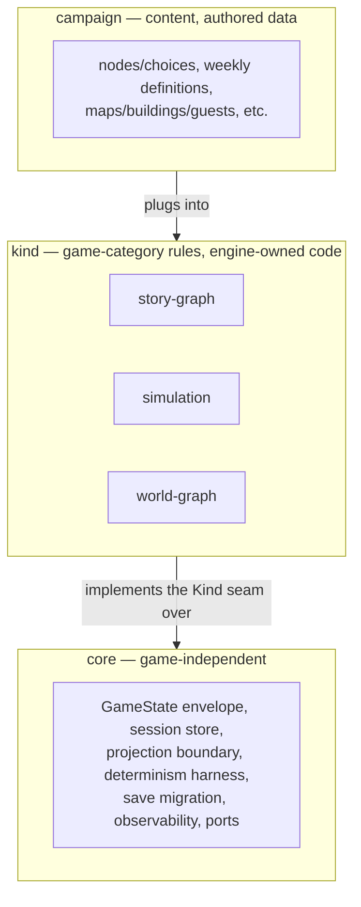
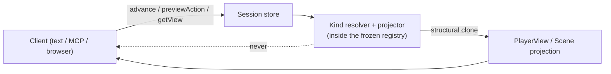
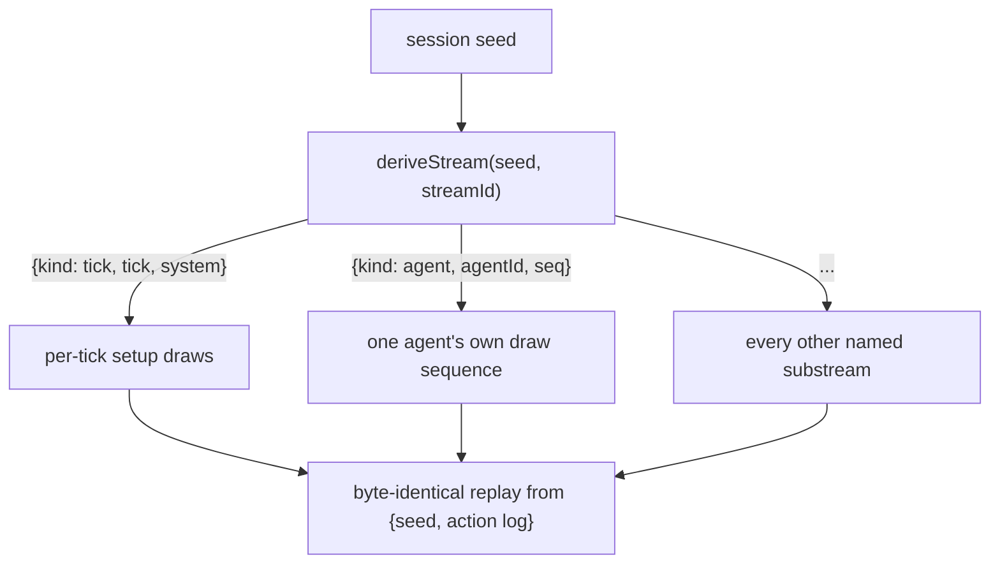
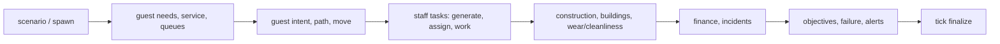

<!-- design-digest: add0e3fe78bbebd12ff4c5fc3b66c5dd70c8b748faa28434db6e5bd8455c9f4c -->

> Generated from `design/` by `/make-human-docs`. Do not edit by hand — edit the
> design docs and regenerate. `/reconcile` reports when this has gone stale.

The five agent-kit documents under `design/` are the canonical source. The detailed pages under
`docs/docs/engine/` are generated from marked blocks in those files and must not be edited
directly.

# Developer Guide

SubZeroDev.GameEngine is a deterministic narrative-game engine written in TypeScript. It
separates game-independent execution (the core) from game-category rules (a **kind**) and
campaign data, then exposes every game through one session API. Text, MCP, and browser clients
are siblings over that API; none owns rules or holds authoritative state.

Use this guide when integrating the package, implementing a client, authoring a campaign, or
extending an engine-owned kind. The exact public types, signatures, error tables, persisted
schemas, and assertable invariants live in [Core Specification](/docs/engine/core) and the kind
contracts it links to — this guide never repeats a signature that document already owns.

## What exists today

- The core engine, content builder, tiered validation, session and profile stores, save
  migration, observability, the determinism harness, and cross-version replay are all specified
  as a complete, buildable contract.
- **`story-graph`** is the flagship kind: nodes, choices, typed variables, requirements,
  consequences, endings, and achievements are fully specified.
- **`simulation`** is a real, registered kind against the same seam: state, every content
  definition a campaign needs, the weekly resolution pipeline, validation, reason codes, events,
  and terminal identity are all specified. Rival agents resolve through the same resolver code
  the player does; projects and businesses are durable, instance-addressed entities; campaigns
  can declare event chains that persist across games on a player's profile. A `where` clause on
  an `exists`/`count` requirement against a field an array element does not declare currently
  resolves `false` at evaluation time rather than failing at load time — the contract itself
  calls this an interim state, not the intended one.
- **`world-graph`** is the third kind: a navigable world with autonomous inhabitants, advanced in
  fixed ticks through a twenty-system pipeline. It qualifies as its own kind by the code it needs
  (pathfinding, guest utility scoring), not by having a richer state shape, and its closest
  relative is `simulation`, not `story-graph`, despite the shared "graph" suffix. The contract's
  own projection section (`WorldGraphView`, §10) is marked **specified, not yet implemented** —
  the shipped projector still returns an earlier, smaller shape and is missing content
  definitions, the active scenario, staff hiring options, construction sites, the guest roster,
  incidents, positions, and alert target ids. NPC seeding has the same status: a scenario's
  `startingMemories` content validates and loads, but nothing yet creates the runtime NPC records
  it describes, so `world.npcs` is always empty in a live session today. Both gaps are recorded in
  `design/90-decisions.md` and routed to `/slices`, not silent.
- **The public browser demo that once lived at `/play/` is retired.** It proved browser
  portability and "clients never hold state"; the play surface now is
  [SubZeroDev.Adventures](https://github.com/The-Running-Dev/SubZeroDev.Adventures), a client
  repository consuming this engine as a pinned git submodule. The engine-side portability
  property it proved is still binding — see [Browser portability](#browser-portability) — but
  this repository no longer asserts it over an emitted bundle, because it no longer emits one.
- Content pack resolution and identity (merge, override, dependency, and the `ResolutionId`
  becoming part of what `campaignVersion` names) is specified as a post-MVP layer that needs no
  code changes to the kinds themselves — see [Content packs and experiment gates](#content-packs-and-experiment-gates).

## The mental model

Three layers, in one direction only:

**Core** owns everything game-independent: the `GameState` envelope (session id, status, seed,
action log, and the handful of fields every kind shares), the session store operations a client
calls, the projection boundary, the determinism harness, save migration, and the observability
channel. It never branches on which kind is loaded.

**A kind** is engine-owned TypeScript that implements one fixed seam — turn resolution, content
validation, projection, reason codes, events, and terminal identity — for one category of game.
Three ship in v1: `story-graph` (authored branching narrative), `simulation` (weekly
resource-and-relationship management), and `world-graph` (a navigable world advanced in ticks).
Adding a fourth kind means writing engine code against that seam; it is not something a campaign
author or a host can do from outside.

**A campaign** is data: node graphs, weekly content catalogs, maps and building definitions,
whatever the kind's content types declare. The engine ships with zero campaigns built in — Life
in the Fast Lane (`simulation`) and Sun Trap (`world-graph`) are separate game repositories that
consume this engine and supply their own content, balance, and client.

### Is it a kind, or is it content?

Before adding a fourth kind or extending an existing one with a special case, ask whether the
distinction can be expressed as campaign data against the existing seam instead. A new kind is
warranted only when the game category needs code the existing seam cannot express — a different
turn shape, a different resolution algorithm, a different family of runtime entities — not
because the content looks thematically different. `world-graph` earns its existence because
nothing else in the engine does pathfinding or per-guest utility scoring; a themed reskin of an
existing kind's content does not.

## Install and consume the package

The engine is consumed as an npm package (or, for the browser client today, a pinned git
submodule). A host process:

1. Builds a `Campaign` from its own `*Source` content plus the registry's string table, through
   the kind's pure content builder (never construct campaign content by hand — see
   [Build content before creating the engine](#build-content-before-creating-the-engine)).
2. Registers one or more built campaigns and kinds into a `ContentRegistry`, which freezes after
   construction.
3. Opens sessions against that frozen registry through the session store operations described in
   [Use the session API](#use-the-session-api-not-raw-engine-state) — never by importing a kind's
   internal resolver and calling it directly.

### Published narrative content lives outside this repository

This repository ships the engine and its kind contracts, not finished games. A game repository
(Life in the Fast Lane, Sun Trap, or a new one) owns its own content catalogs, balance numbers,
and client. Nothing in the engine depends on any specific campaign's content existing.

## Build content before creating the engine

Every kind's campaign content has a source shape and a runtime shape: `*DefinitionSource` types
carry inline authored English (`AuthoredText`, `{ key, text }` pairs) and `*Definition` types
carry only `LocKey` references into the registry's string table. A pure builder — total, no I/O,
no simulation — lifts every `AuthoredText` into the string table, rejects a duplicate key whose
text disagrees, applies each kind's declared defaults for omitted optional catalogs (an omitted
array becomes `[]`, never `undefined`), sorts catalogs and their nested collections into
canonical order, and returns the runtime `Campaign`. Registering a campaign runs that campaign's
kind's `validateCampaign(campaign, strings)` before the registry freezes.

### Validation tiers

Validation happens in three tiers, and only two of them run at load time:

- **Tier 1 — hard failure.** The campaign is rejected before the registry freezes. Every id the
  kind reads must be non-empty, must contain no `.` (dots are the path separator for
  `StateChange.path`, so a dotted id would make audit paths ambiguous), and must be unique within
  its own catalog. Every foreign key must resolve inside its declared namespace. Every number
  must be an integer within its documented range, with ranges internally consistent (a maximum
  not below a minimum, a price default inside its band, curve inputs strictly increasing).
  Structural rules specific to a kind — a building needing at least one walkable entrance cell, a
  scenario's placements fitting the map after rotation without overlap — are also Tier 1. A
  campaign that fails Tier 1 never becomes playable.
- **Tier 2 — warning.** The campaign loads, but something about it is probably a content mistake:
  a definition unreachable from any scenario, a scenario that already resolves at tick zero, a map
  region no spawn or exit can reach.
- **Tier 3 — simulation-time findings.** Things a load-time check cannot see at all — a dominant
  strategy, an infinite-money loop, a queue deadlock — are not validation. Catching them would
  mean running search or simulation inside registry construction, which is required to stay pure
  and total. They are the job of a separate balance harness that belongs to the game repository,
  not the engine.

Every validator reports a precise, structured path into the source content (a catalog array
index plus nested field, e.g. `buildings[0].entrances[1].x`), never an unstructured message
standing in for one — the path is what makes a validation failure something a campaign author can
act on instead of something they have to guess at.

### Content packs and experiment gates

Content packs are a post-MVP resolution layer, specified but requiring no changes to the kinds
that consume the result. A campaign's shipped content can be resolved from an ordered list of
packs — a base pack plus overrides — through a pure ordered fold: later packs in the list replace
whole definitions they redeclare, and localized strings replace per key rather than per pack, so a
translation pack can override only the strings it translates without having to restate every
definition. Pack dependencies are exact-version and acyclic; a cycle or an unresolved dependency
is rejected before resolution runs.

The identity consequence is the load-bearing part: two players on the same nominal campaign
version but different resolved pack sets are playing different games, and the plain
`campaignVersion` string had no way to say so. Resolution closes that gap by making
`campaignVersion` a digest of the ordered pack list that produced it, not just a name for the
campaign — so replay, save compatibility, and cross-version comparison all key off what was
actually resolved, not what was nominally requested.

Experiment gates sit at the same layer: a campaign can declare content behind an experiment key,
and an `ExperimentSource` port (supplied by the host, never by the engine) decides which arm a
given session resolves against. Because the gate decision happens at resolution time and folds
into the same digest, two sessions in different experiment arms are, correctly, two different
`campaignVersion`s.

## Use the session API, not raw engine state

A client never imports a kind's internals or mutates `GameState` directly. It goes through a
fixed set of session store operations — the same set regardless of which kind is loaded, with one
addition for `world-graph` (see [Previewing an action](#previewing-an-action)). The full method
signatures, return types, and error/reason-code tables live in
[Core Specification](/docs/engine/core) and the client contract page — this guide names what each
operation is for, not its shape.

At the center is **`advance`**: submit one action with its params, and the store either applies it
and returns the updated projection plus any `StateChange`/`Outcome` records, or rejects it with a
typed reason code and leaves state untouched. Every kind expresses its whole turn as calls through
this one entry point — `story-graph`'s single choice, `simulation`'s `plan.add`/`plan.remove`/
`plan.clear`/`end_week`, and `world-graph`'s nine instant actions plus `advance_ticks`, all funnel
through `advance`.

### Listing, branching, and deleting saves

Sessions are addressed by id; a store lists a player's sessions, opens a fresh one against a
campaign version, and can branch a new session from an existing save point without disturbing the
original — useful for "what if" exploration in a client without risking the player's progress.
Deleting a session removes it from the store; it does not, by itself, touch anything mirrored to
the profile store (achievements, cross-game facts) that survived past that session.

### Durability is a host adapter, and the store is not

The session store's operations are specified against a `SessionPersistence` port, not against a
concrete database. A host supplies the adapter (in-memory for tests, a real database for
production); the store itself only ever calls the port's interface. That split is what makes a
host's persistence choice replaceable without touching engine code — see
[Extensibility and ports](#extensibility-and-ports).

### Previewing an action

`world-graph` adds one operation the other two kinds do not need: **`previewAction(sessionId,
actionId, params?)`**. It runs exactly the same resolution `advance` would, against the same
`ResolverTable`, and returns the result without committing it. This exists because
`AvailableAction` in that kind's projection carries no parameter schema — the combinatorics of
every building/staff/price/tick-count parameter space make a declarative schema impractical — so a
client that wants to show "here's what would happen" before the player commits has nowhere else to
get that answer. A separate `validateCommand`-style dry-run type was deliberately rejected: it
would be a second copy of the same ruleset, which is exactly the kind of duplication that drifts.
Because this is the one kind-specific addition, `world-graph`'s own client checklist counts ten
operations and ten MCP tools where the other two kinds count nine — see the client contract's
API coverage checklist for the full accounting.

### Profiles are optional mirrors

A `ProfileStore` holds facts that outlive one session — unlocked achievements, in `world-graph`'s
case player-scoped achievement state mirrored the same way `story-graph` does it. Mirroring
happens only after a successful action, and resolution itself never reads the profile back into a
turn — an achievement unlock cannot retroactively change what already happened.

### Kind-owned cross-game data

`simulation` can carry campaign-declared event chains whose membership and order are determined
by each event's own `chainId`/`chainStep` fields rather than a stored step list, letting an event
sequence span multiple playthroughs of the same profile. This is kind-owned data flowing through
the profile mechanism, not a core capability every kind gets automatically.

## Projection is mandatory

No client — text, MCP, or browser — ever sees raw `GameState` or a kind's internal `kindState`.
Every read goes through the kind's projector, which returns a `PlayerView`/`Scene`-shaped
structure built by structural clone at the kernel boundary, so a client cannot obtain and mutate a
live reference into engine state even by accident.

Each kind's projection hides different things by design, not by accident: `simulation`'s
`SimulationView` withholds `luck` and `resentment` entirely, and withholds `flags`/`counters`
completely rather than partially. `world-graph`'s `WorldGraphView` is specified in full in the
contract but, as noted above, is not yet what the shipped projector returns — treat the contract
shape as the target, and the "What exists today" gap list above as the current reality.

### Clients

A client is defined by what it must never do: it holds no authoritative state, computes no game
logic, and is proven correct by running two clients against the same input sequence and comparing
`serialize()` byte-for-byte. Text, MCP, and browser clients are siblings over the same session API
— none gets special access.

### Browser portability

The property that made a browser demo possible — the same deterministic core replaying
byte-identically from a seed and an action log regardless of host environment — is an engine
property, not something a browser client itself has to prove. It remains binding even though this
repository no longer emits a bundle that exercises it: the external client repository
(SubZeroDev.Adventures) exercises it now, over the same submodule-pinned engine.

## Determinism rules that will bite you

The engine must replay byte-for-byte from a seed and an input log. That constraint is enforced
mechanically, not by convention:

- An eslint rule bans `Math.random`, every non-bit-stable `Math.*` function, and `Date.now` inside
  `src/`. Do not work around it with an indirection — the point is that nothing in engine code can
  observe wall-clock time or non-reproducible entropy.
- Randomness comes only from a seeded PCG32 stream, and never from one shared stream. Every draw
  goes through `deriveStream(seed, streamId)` (or the `KindContext.derive` helper kinds use), which
  produces a **named substream** keyed by a structured id — `ctx.derive({kind: "tick", tick,
  system})` for per-tick setup draws, `ctx.derive({kind: "agent", agentId, seq})` for one rival
  agent's own draw sequence, and so on. Two different draws must never share a derived stream
  identity; deriving the same id twice restarts that stream and is a defect, not a shortcut.
- All arithmetic that ends up in persisted state or an audit record is integer arithmetic.
  `world-graph` in particular never calls `Math.sqrt` — distance scoring uses squared, Manhattan,
  or Chebyshev distance specifically so no floating-point value can enter state — and every
  proportional/rate calculation (wages, passive income proration) uses an exact rational
  cross-multiplication rounded once, never a running floating remainder.
- Every tie a kind can encounter resolves through one fixed comparator registry, not
  ad hoc ordering. `world-graph`'s canonical collections sort by entity id, where an id is
  `(prefix, ordinal)` compared with the ordinal read **numerically, never lexicographically** —
  `building:10` sorts after `building:2`.
- Entity ids that get serialized are drawn from a kind's own deterministic counter
  (`nextEntityOrdinal` in `world-graph`), never from the `IdSource` port. The rule is narrower
  than "ids must be deterministic": a host-supplied port may only ever influence things that
  cannot change `serialize()` output, and a session/game id qualifies while an entity id — which
  is part of persisted, replayed state — does not.

## Story-graph campaigns

`story-graph` is authored branching narrative: nodes, choices, and typed variables. A node offers
choices; each choice can be gated by a requirement over the campaign's typed variables, and
resolving it applies consequences (variable writes, transitions to another node, or an ending).
Endings and achievements are both terminal in different senses — an ending is where a playthrough
stops; an achievement is a persistent, once-only unlock mirrored to the profile store after a
successful action, the same mirroring pattern `world-graph` reuses for its own achievements.

Requirements and consequences are expressed over a closed set of variable types (booleans,
integers, enums, and similar), never free-form script — the same design choice every kind in this
engine makes, so that content stays authorable data rather than embedded code. For the exact
`RequirementType`/`ConsequenceType` unions, node/choice schemas, and the worked example arc, see
[the story-graph kind contract](/docs/engine/story-graph-kind).

## Simulation campaigns

`simulation` is a weekly resource-and-relationship management kind. Its one-action model
(`plan.add`/`plan.remove`/`plan.clear` to build a week's plan, `end_week` to resolve it) sits
under a much richer campaign-authored surface: locations, backgrounds, traits, skills, and full
`AgentStrategy`/`AgentState` support for rival agents that resolve through the same
`ResolverTable` the player does, keyed by their own derived stream
(`{kind: "agent", agentId, seq: agent.rngSeq}`) so a rival's decisions are exactly as replayable
as the player's.

The campaign envelope carries several optional, absent-by-default subsystems — an
`emptyPlanPolicy`, a `relationshipDrift` rule, an `attendanceTracking` config — each of which is a
genuine no-op when the campaign omits it, not a hidden default behavior a campaign author has to
discover by reading code.

`ProjectDefinition` and `BusinessDefinition` content is instantiated by `start_project` /
`start_business` actions into durable runtime records addressed by their own `instanceId`, not by
the originating `definitionId` — a player can run more than one instance of the same defined
project or business. A registered `business` posts its revenue and expenses once per week, inside
the same end-of-week pipeline that resolves everything else that week.

Terminal identity is a closed three-way `resolution`: `"goals_met"`, `"failed"`, or
`"week_limit_reached"`, with a fixed precedence — goals and failure both always outrank hitting
the week limit, so a week that both completes a goal and runs out the clock always resolves as a
win, never a timeout. The requirement language supports `exists`/`count` conditions over a fixed
set of seven collections (`player.inventory`, `player.relationships`,
`player.career.pendingApplications`, `player.education.enrollments`, `player.projects`,
`player.businesses`, `world.npcs`) — the `where`-clause gap on those collections noted at the top
of this guide sits here.

For the full state shape, content-definition types, reason-code tables, and the projection
(`SimulationView`, which withholds `luck`/`resentment` entirely and `flags`/`counters` completely),
see [the simulation kind contract](/docs/engine/simulation-kind).

## World-graph campaigns

`world-graph` is a navigable world with autonomous inhabitants — guests who arrive, form intents,
path to a destination, queue, get served, and leave; staff who work tasks; buildings that operate,
wear, and get demolished. The turn is not one action but a **tick batch**: `advance_ticks {ticks}`
runs the world forward that many ticks in one call, alongside nine instant, no-time-passes actions
(`build`, `demolish`, `hire_staff`, `fire_staff`, `assign_staff`, `set_price`, `open_building`,
`close_building`, `dismiss_alert`) that a player can issue between batches.

### The tick pipeline

Each tick runs twenty ordered systems, always in the same order, covering scenario setup, guest
spawning, guest needs, guest service, queue management, guest intent formation, guest pathing,
guest movement, staff task generation and assignment, staff work, construction, building
maintenance, cleanliness/wear decay, finance, incidents, objectives, failure conditions, alerts,
and tick finalization.

Order matters because later systems depend on earlier ones having already run that tick — a guest
cannot queue for service before its intent system has decided it wants service, and finance cannot
post a completed sale before the service system that completed it. Path lookups use canonical
Dijkstra, not A* — an earlier design pass specified A* for performance and walked it back once it
was clear the two are behaviorally identical and only A* trades away an admissibility guarantee it
did not need yet.

### Batch invariance

The one property that makes `advance_ticks` behave like a real turn rather than a
performance shortcut is **batch invariance**: `advance_ticks(a + b)` from a given kind state must
reach the same canonical kind state as `advance_ticks(a)` followed by `advance_ticks(b)` from that
same starting state. (The envelope's own action log may legitimately differ between the two paths
— only the kind state itself is required to agree.) This is why the `tick` variant of
`KindContext.derive` exists at all in the core determinism harness: every per-tick setup draw is
keyed by `{kind: "tick", tick, system}` specifically so that splitting a batch differently never
reorders or reseeds a draw relative to running it unsplit. A client that fast-forwards at 4x and
one that steps tick-by-tick must be able to produce byte-identical saves from the same input.

### Actions, previewing, and audit at batch grain

Every instant action returns its own `StateChange` row immediately, because each is a single,
player-initiated mutation with no volume problem. `advance_ticks`, by contrast, cannot return one
`StateChange` per guest transaction — a 360-tick batch with hundreds of active guests can produce
on the order of 10⁵ per-guest events — so `StateChange` from a tick batch is **aggregated to batch
grain**: money aggregated per category, building status transitions, objective progress, and
scenario resolution, each row spanning the whole batch (`previous` before, `value` after, omitted
when unchanged). Per-guest and per-tick detail is available as an **event** instead — see
[Observability](#observability-without-behavioral-influence) — which is discardable by design, so
no game-affecting decision may depend on it.

Because there is no declarative parameter schema for an action, `previewAction` (described under
[Use the session API](#previewing-an-action)) is the only way a client can show a player what a
candidate action would do before committing it.

### Terminal identity and win/loss

`world-graph` is the only kind whose outcome type is exported and named at the package root
(`WorldGraphOutcome`, carrying `resolution`, `objectivesMet`, and `failureId`) rather than
satisfied structurally the way the other two kinds' outcomes are. There is a fixed two-token
resolution set — no scenario-declared custom terminal states — and a scenario's
`resolutionPrecedence` decides whether simultaneous objective completion and failure resolve as a
win or a loss.

### Content and validation

A `world-graph` campaign authors maps, terrain, scenery, guest meters (needs, conditions,
opinions, preferences — all open, content-declared vocabularies rather than a fixed engine list),
products, buildings, guest archetypes, staff roles, incidents, objectives, failures, policies,
achievements, and scenarios, all expressed through closed condition/effect/metric unions
(`WorldCondition`, `WorldEffect`, `WorldMetric`) rather than free-form state paths — the same
"no arbitrary path" discipline the audit-path rule above depends on. Full Tier 1/Tier 2 validation
rules, the closed type definitions, and a complete minimal valid campaign fixture are in
[the world-graph kind contract](/docs/engine/world-graph-kind), §14–§15.

## Turn pipelines inside a kind

Each kind's "turn" is shaped differently on purpose, and a client or campaign author should not
assume one kind's turn semantics transfer to another:

| Kind | One turn is | Resolved by |
|---|---|---|
| `story-graph` | one choice at the current node | requirement check, consequence application, transition |
| `simulation` | a week's plan, built incrementally then resolved together | `plan.add`/`remove`/`clear`, then `end_week` runs the weekly pipeline once |
| `world-graph` | a tick batch, or one of nine instant actions between batches | `advance_ticks {ticks}` runs the ordered twenty-system pipeline once per tick; instant actions mutate immediately with no tick cost |

What is shared across all three: every turn resolves inside one `advance` call, produces its
`StateChange`/event records through the same two observability channels, and is exactly as
replayable as every other kind's turn from `{config, actionLog}`.

## Saves and migrations

A save is the persisted envelope plus a kind's persisted `kindState`. Because a kind's state shape
can change between versions, each kind that needs it defines its own migration steps over a closed
`*IdDomain` union — `simulation`'s `SimulationMigration`/`SimulationMigrationStep` support four
operations (`remap`, `remove`, `default`, `require`). A migration is always pure data, described
declaratively, never a function — a persisted save is JSON, and JSON cannot carry a function to
replay later.

### Migrations in published campaigns

A migration step is versioned alongside the campaign content it migrates. When a campaign's
content shape changes in a way that breaks an existing save's assumptions (a removed definition
id, a renamed field), the migration steps for that transition ship with the campaign version that
introduced the change, not retrofitted later once players have already hit the break.

## Replay and incident diagnosis

A `ReplayFixture` records a session's `submissions` — every action call, including each
`advance_ticks` with its own `ticks` parameter — so replay reproduces exactly how the session was
batched, not just what state resulted. This is what makes batch invariance load-bearing beyond
correctness: a fixture captured from a client running at 4x and the same play captured at 1x must
compare equal by deep canonical kind-state equality, even though their action logs differ.

Replay compares an `Outcome` built only from cross-version-stable vocabulary (`GameStatus`, reason
codes, achievement ids) across engine versions — this is a different comparison from the
determinism harness, which checks a build against itself. `Outcome` equality alone is not
sufficient proof of no regression, because it deliberately omits balance-sensitive detail; the
full state comparison is the stronger check.

A captured session becomes a fixture through a separate, privacy-constrained process: no player
identity, only the kind-declared action params a caller actually sent, no wall-clock timing. The
seed is the one sensitive value a capture carries, and promoting a captured fixture into the
committed regression corpus is a reviewed, one-way decision.

## Observability without behavioral influence

Everything a game does that a player can see going through `StateChange`/`Outcome` records lives
on one channel; free-form diagnostic detail — the per-guest, per-tick events a tick batch produces
in volume — lives on a separate `EngineEvent` channel. The load-bearing guarantee is that dropping
every single event, all the time, changes nothing about game behavior: a host runs a `nullEmitter`
in production and only turns on a recording emitter to diagnose something. No event may ever be
load-bearing for what a session decides.

Every event name a kind emits maps to exactly one severity, read from one table per kind
(`events.ts`) rather than a severity literal scattered across individual emit call sites — a
mechanical test compares that table against the kind's declared event names and a live call site
on every run, specifically so the mapping cannot silently drift out of sync with what the code
actually emits.

## Extensibility and ports

The engine is **not** a plugin system. Kinds stay engine-owned code; a host cannot add a new kind
from outside the package. What a host *can* supply is a fixed set of **ports** — `IdSource`,
session/profile persistence, `Emitter`, `Clock`, `ExperimentSource` — each governed by one rule: a
host may supply anything that cannot change `serialize()` output. That rule is what decides every
individual seam question (why a session id may come from a host-supplied `IdSource` but an
in-game entity id may not, for example) rather than each port needing its own bespoke
justification.

There are two composition roots (where ports actually get wired to concrete implementations) and
one build-time flag (`__GAME_ENGINE_PRODUCTION__`) that a host sets rather than the engine
inferring an environment. For the seam map (which concepts are inside the trust boundary, which
are outside and open for a host to supply, which are outside and deliberately not open, and which
sit above the boundary entirely) and the full port catalogue, see
[the extensibility design](/docs/engine/architecture#extensibility) and
[06-extensibility.md](https://github.com/The-Running-Dev/SubZeroDev.GameEngine/blob/main/design/10-design.md).

## Failure handling checklist

When an `advance` (or `previewAction`) call comes back rejected instead of applied:

- Read the reason code, not just the boolean — every kind's reason codes are typed and
  tabulated (resolution codes checked at action time, validation codes from content authoring,
  audit codes from the events/`StateChange` channel). A generic "invalid" code is deliberately
  avoided in favor of granular, author-facing codes wherever the content-authoring surface needs
  the precision — `world-graph`'s validation table alone carries around two dozen distinct codes
  rather than collapsing them.
- A rejected action never partially applies and never mutates state — check for absence of a
  `StateChange`/projection change as the confirmation, not just the reason code.
- For a `world-graph` tick batch specifically, remember that per-tick/per-guest detail that would
  explain *why* a batch resolved the way it did lives on the event channel, not in the
  batch-grain `StateChange` rows — if you need that resolution, run with a recording emitter.

## Verification before handing off a change

This guide is generated; verifying a change to the engine itself (not to this guide) runs the
gates the project's own contribution rules define — typechecking, linting, the determinism
harness, and the documentation build/link checks. Those commands and what each one covers belong
to the project's own contribution conventions, not to this guide.
