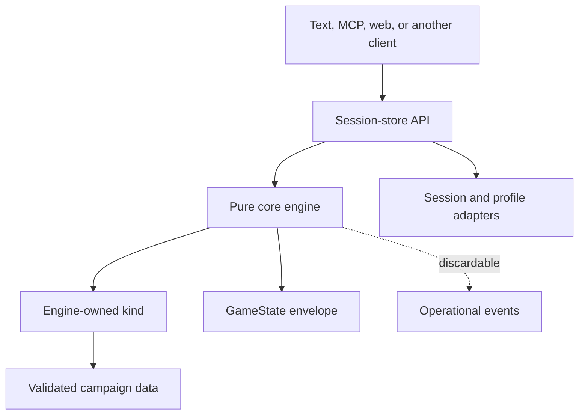

<!-- design-digest: 4b7b8b7863bb7948aee6fb7229e9dde12e409e71fc405975069205c830d81f7b -->

> Generated from `design/` by `/make-human-docs`. Do not edit by hand — edit the
> design docs and regenerate. `/reconcile` reports when this has gone stale.

The five agent-kit documents under `design/` are the canonical source. The detailed pages under
`docs/docs/engine/` are generated from marked blocks in those files and must not be edited
directly.

# Developer Guide

SubZeroDev.GameEngine is a deterministic narrative-game engine written in TypeScript. Node.js is
the proven runtime, and the same public entry point is required to bundle for a standards-based
browser without a reduced fork — a downstream client repository ships that browser build today.
The engine separates game-independent execution from game-category rules and campaign data, then
exposes every game through one session API. Text, MCP, and browser clients are siblings over that
API; none owns rules or authoritative state.

Use this guide when integrating the package, implementing a client or campaign, or extending an
engine-owned kind. The exact public types, signatures, error tables, persisted schemas, and
assertable invariants are in the
[generated contract](https://github.com/The-Running-Dev/SubZeroDev.GameEngine/blob/main/design/20-contract.md).

## What exists today

- The core engine, content builder, validation, session/profile stores, save migration,
  observability, deterministic harness, and cross-version replay are implemented.
- `story-graph` is complete through content, projection, text client, and MCP. Six campaigns —
  the Bulgaria Bureaucracy arc, four further Bulgaria arcs, and Lucifer Chronicles — provide
  real fixtures.
- `simulation` has state, content definitions, weekly resolution, validation, a registered kind,
  a full player projection (`SimulationView`), and Stable Life winning/losing replay fixtures.
  Text-client and MCP parity now match `story-graph`'s row of the API coverage checklist, one
  for one.
- `world-graph` is a real, registered kind: `worldGraphKind` is exported from the package root,
  and its twenty-system tick pipeline — build, utility, routing, queues, staff, finance,
  incidents, and terminal precedence — is registered, ordered, and tested. Five of the twenty
  systems are known-and-retained stubs or partial implementations; see
  `design/90-decisions.md`, *Known-and-retained implementation gaps: `world-graph` tick
  systems*. It is registered and usable the same way `story-graph` and `simulation` are, within
  that scope.
- **There is no browser demo in this repository.** A public `/play/` route existed, ran the
  shipped `story-graph` campaigns as a story shelf through the same session-store boundary as
  the text and MCP clients, and was removed from the site build in W69. The play surface is
  [SubZeroDev.Adventures](https://github.com/The-Running-Dev/SubZeroDev.Adventures), a client
  repository that consumes this engine as a pinned submodule. Build a browser client the way
  Adventures does; do not build against the retired route.
  The browser *adapter* and its tests are still here, under `site/src/play/`, and still run —
  they are the evidence behind the browser column of the API coverage checklist, not leftovers.
- A Platform-backed static container is implemented: an ASP.NET Core host under `src/host/`
  packaging the verified combined artifact as an immutable image, serving `/`, `/roadmap/` and
  `/docs/`. It is an alternative delivery artifact for the same bytes, not a hosted engine API;
  the existing GitHub Pages deployment remains public. Its design block is now historical —
  the workflow still builds, smokes and publishes on every merge, but nothing specifies it.
- Content pack resolution and experiment gating are implemented and exported: `resolvePacks`,
  `applyExperimentGates`, `computeResolutionId`, `resolveBucketKey`, `resolveExperimentAssignments`
  and the `ExperimentSource` port. One piece is deliberately unbuilt — `SessionHost.experiments`
  is declared but read by nothing, because the session layer receives an already-resolved
  registry and cannot derive the assignment map itself. Resolve packs above the session seam.
- Privacy-safe session capture is specified and not implemented; it is deferred to the hosting
  layer that gates it.

## The mental model



The split is strict:

- The **core** owns the envelope, seeded streams, canonical serialization, session-independent
  execution, projection orchestration, saves, validation vocabulary, and shared scene/action
  shapes.
- A **kind** owns one category's turn model, kind state, action meanings, scene, projection,
  validation, event names, reason codes, migration, and terminal identity.
- A **campaign** is immutable validated data for one kind.
- The **session store** owns persisted state and command ordering. The engine itself retains no
  session.
- A **client** presents projected DTOs and submits declared inputs. If it needs to calculate an
  outcome, inspect raw state, or emulate a missing store operation, the boundary has been broken.

## Install and consume the package

The published package is `@the-running-dev/game-engine`. Its root export is intentionally
explicit: consumers receive the supported engine, builder, session, observability, localization,
and kind surfaces without reaching into internal paths.

Create one composition root for the process:

1. Build and validate a content registry.
2. Register the implemented kinds required by those campaigns.
3. Create the pure engine with the registry, kinds, and optional deterministic id/event ports.
4. Create the session service with the engine and concrete session/profile persistence.
5. Give clients only the session service.

The engine package performs no filesystem or network I/O while resolving play. Parsing JSON or
YAML, reading campaign files, database access, clocks, hosting, and process lifetime belong to
outer adapters.

## Published narrative content lives outside this repository

Narrative campaigns are authored and published by
[SubZeroDev.Adventures.Content](https://github.com/The-Running-Dev/SubZeroDev.Adventures.Content),
not by this repository. It builds portable JSON from TypeScript campaign sources and publishes
the manifest that hosts fetch. This engine stays the authority for deterministic mechanics,
kinds, validation, and portable hydration.

The package root (`@the-running-dev/game-engine`) is for runtime hosts. A separate subpath,
`@the-running-dev/game-engine/authoring`, is for repositories that own campaign source: it
exports the content-registry builder, the story-graph and adventure source builders and their
migration helpers, portable serialization and manifest-digest functions, and replay-runner
types. Import from `/authoring` only when writing or publishing campaign content — a runtime
host must never import authored campaign source merely to play published portable JSON.

`toPortable` and `digestManifestResolution` are available only through `/authoring`.
`fromPortable` is root-only. `digestPortableCampaign` is exported from both: the root, so a host
can verify fetched content, and `/authoring`, so a publishing pipeline can digest campaign
source before it ships.

A handful of frozen campaigns (the Bulgaria Bureaucracy arc among them) still ship as
package-root exports for compatibility. They are regression fixtures, not a publication source,
and the breaking 0.8.0 release removes them from the root. Build against `/authoring` and the
Adventures.Content feed, not against these root exports, when integrating narrative content
going forward. The retired `/play/` route follows the same boundary: it stays in this
repository through 0.7.0 and is removed with that same breaking release; the browser host for
published content is [SubZeroDev.Adventures](https://github.com/The-Running-Dev/SubZeroDev.Adventures).

## Build content before creating the engine

Authors may write player-facing text inline as keyed authored text. The pure content builder:

1. validates the kind's source schema;
2. lifts text into the shared string table;
3. rejects one key paired with conflicting text;
4. converts the source into runtime content that carries localization keys;
5. runs kind validation;
6. merges protected core, kind, and campaign strings;
7. freezes campaigns and strings.

Do not hand the engine partially validated or mutable content. Registry construction is the
failure boundary: a Tier 1 error means there is no registry and therefore no playable engine.

### Validation tiers

- **Tier 1, hard failure:** duplicate or invalid ids, dangling references, undeclared variables,
  mistyped effects, missing strings, invalid weights, forbidden namespace writes, and other
  static contract violations.
- **Tier 2, warning:** unreachable content, suspicious cycles, non-interactive story campaigns,
  and similar structures that may be deliberate.
- **Tier 3, simulation/replay:** unwinnable states, never-satisfiable actions, and behavior that
  cannot be decided by reading definitions alone.

Tier 1 and Tier 2 findings come back as reason codes, and each kind publishes its own set
alongside the codes it uses to reject a player action — they are registered together but reach
different readers, and a validation code never reaches a player, because a campaign carrying a
Tier 1 finding never produces a registry at all. How specific those codes are is a per-kind
choice: `story-graph` publishes twelve, `world-graph` twenty-nine, because its content is a map,
a terrain graph, ten catalogues and a scenario and one generic "invalid definition" would not
tell an author which of them was wrong. The per-kind lists are in
[the contract](https://github.com/The-Running-Dev/SubZeroDev.GameEngine/blob/main/design/20-contract.md).

AI-authored content takes this same path. AI may draft campaign data; it does not author or load
executable kinds.

A **campaign-shape builder** takes the same path for the same reason. Every shipped story-graph
campaign is constructed through one — a parameterized function that takes the authored prose,
choices and endings and emits the repetitive graph topology around them. It is tooling, not a
layer: it runs before the engine, emits an ordinary campaign source, is validated by the tiers
above exactly as hand-written content is, and leaves no trace in `serialize()`. A campaign is
free not to use one, and that freedom is what keeps the shared shape a convenience rather than an
undeclared content schema. If a campaign needs a different topology, write it out longhand.

### Assembling a registry from content packs

There are two ways to reach a registry, and they differ in what they can say about identity.
`buildContentRegistry` folds already-built campaigns and knows nothing about packs.
`resolvePacks` folds an **ordered** array of packs, and the order is significant: later packs
replace campaigns wholesale by id, and replace strings per key. That asymmetry is the point — a
culture pack must be able to restyle one line without restating a campaign, but a campaign is a
validated graph and a field-level merge could produce one no pack author ever validated.

`resolvePacks` is pure and total: either every structural check passes and you get a complete
registry, or you get every conflict at once and no registry. The checks are that a pack's
`kindId` matches every campaign it carries, that a `dependsOn` names a pack present in the set at
exactly that version, that no two packs require different versions of the same pack, that there
is no cycle, that no campaign id repeats *within* one pack, and that no pack writes a
`core.reason.*` string. Overriding something no earlier pack supplied is a warning, not an error —
legal, and almost always a misspelled key that would otherwise fail invisibly at play.

Dependencies are exact `{id, version}` pairs. There is no range solving, deliberately: a
backtracking resolver would make *which content a game ran against* non-deterministic.

The identity consequence is the part to plan around. `resolvePacks` digests the ordered
`{id, version}` list into a `ResolutionId` and stamps it as the `version` of every campaign it
produces, so a game records the content it actually ran against rather than a campaign version
two different pack sets could share. **Reordering packs therefore changes every campaign version**,
and every existing save becomes a save of a different version of the content. That is correct, and
it means pack order is not a knob to adjust on a live deployment.

## Use the session API, not raw engine state

The session service is the application boundary. It provides campaign listing, creation,
resume, scene/view queries, localization strings, action submission, save, and load. The exact
operation signatures are in the [contract](https://github.com/The-Running-Dev/SubZeroDev.GameEngine/blob/main/design/20-contract.md#public-signatures).

Starting a session takes a campaign id, an optional explicit seed, an optional audience, and an
optional profile id — there is no `locale` parameter. When no seed is supplied, the session
boundary generates and persists one. The returned handle contains a `sessionId` and scene, never
the envelope.

Submitting an action follows one atomic path:

```mermaid
sequenceDiagram
  participant C as Client
  participant S as Session service
  participant E as Pure engine
  participant K as Kind
  participant P as Persistence

  C->>S: submit(sessionId, actionId, declared params)
  S->>P: load complete serialized state
  S->>E: submitAction(state, action)
  E->>K: advance(kindState, action, scoped context)
  K-->>E: new kind state or structured rejection
  alt accepted
    E-->>S: new envelope + changes/messages
    S->>P: atomically persist envelope
    S-->>C: projected scene/result
  else rejected
    E-->>S: unchanged state + error
    S-->>C: error; no log or state write
  end
```

Different sessions may resolve concurrently. Commands for the same `sessionId` must be
serialized by the service/store so the second command reads the first command's committed state.
A query returns a projection of one complete stored revision, never a half-written result.

A stored session record carries more than the serialized envelope: an `audience`, an
`attemptCounter` that only `submitAction` increments, an optional `profileId`, a
`replayCompatible` flag that turns false forever once a migrated load touches the lineage, and
wall-clock `createdAt`/`updatedAt` timestamps set via the `Clock` port — all of it outside the
replayable `GameState` and never read by `advance`.

### Durability is a host adapter, and the store is not

The session store itself is engine-owned. Its two lock domains, its trace-and-stamp decorator,
save-envelope assembly, and the idempotent profile upsert are behaviour you get, not behaviour
you supply. What you may supply is `SessionPersistence`: a pair of record stores that get and
put a session record, and get, put and delete a save record. Omit it and the store's in-memory
maps are the whole implementation, which is the default and what every test runs against.

Two rules an adapter must not get wrong:

- **Address a save by its `saveId`.** `get` and `put` must reach the same record. An adapter
  keyed on anything else writes successfully, reads nothing, and fails no gate — the first
  shipped adapter did exactly that.
- **Store the bytes you were given.** The record holds a canonical serialization, not a live
  object graph, and nothing on it may be written into `GameState`.

Failures throw `SessionStoreError`, because none of the store's signatures has a field an error
could travel in. It is not opaque: `operation` names the call, and `code` is a registered reason
code with a shipped `core.reason.*` message, so a client renders it through the string table like
any other rejection and never reads `message`. Whatever exception your adapter raises is caught
and re-raised as `storage_failure` — a Postgres timeout and a browser quota error are
indistinguishable to a client deliberately, since neither admits a different response.

### Previewing an action

Clients may call `previewAction(sessionId, actionId, params?)` before submitting an action. It
uses the same authoritative resolution path as submission, but projects the prospective result
and discards its state: it never writes a session or profile, consumes a command attempt, adds to
the action log, or emits an action lifecycle event. Same-session previews share the command
queue, so they cannot present a result for a revision that a neighbouring submission has already
replaced. The text client and MCP `preview_action` tool expose the same operation; neither
duplicates placement or other kind rules.

### Profiles are optional mirrors

Pass a `profileId` when achievements should survive a session. After a successful action, the
session service idempotently mirrors new achievements to the profile store. Resolution never
reads the profile.

- No profile id means no profile read or write.
- A missing or corrupt profile behaves as empty and produces a warning.
- A failed profile write warns but does not roll back the completed game action.
- Do not put profile identity or profile contents into `GameState`.

Arbitrary kind-owned profile data is not currently supported. In particular, profile-scoped
simulation event chains remain outside the executable contract.

## Projection is mandatory

Clients receive a generic `Scene` and `PlayerView` plus a kind-projected view. They never receive:

- the seed or action log;
- raw `kindState`;
- non-visible story variables or visit counts;
- hidden choices;
- unrevealed simulation/world opportunities or entity internals;
- achievement conditions or other future-state hints.

Do not add a trusted-client escape hatch. The projection is what makes hidden information safe
across text, MCP, web, and AI audiences. If a new client needs more information, decide whether it
is genuinely player-visible and extend the relevant kind projection deliberately.

Client code switches on stable reason codes and renders localization keys. It never parses an
English error sentence. A missing localization key is a registry-build defect, not a client
fallback opportunity.

Two things follow from that which are easy to get wrong when you implement a client or a kind:

- **A rejection gives you both an error and a message, and you may render either.** Every kind
  attaches one visible `OutcomeMessage` built from the same localization key its
  `ValidationError` carries, so a client that renders only `messages` still shows the player why
  an action failed. If you write a kind, your rejection path owes that message too.
- **Audit records carry reason codes as well.** The `reason` on a `StateChange` is an ordinary
  registered code with a localized message, not a private label — so a visible change is
  renderable the same way a rejection is. `achievement_unlocked` is core vocabulary because the
  session store acts on it without knowing the kind; `consequence_applied` belongs to
  `story-graph`. A kind adding an audit reason registers it like any other code.

### Building a browser client

This repository no longer ships a browser client. Its own `/play/` route was removed from the
site build in W69; the play surface is
[SubZeroDev.Adventures](https://github.com/The-Running-Dev/SubZeroDev.Adventures), a client
repository that consumes the engine as a pinned submodule. If you are building a browser
client, build it the way Adventures does.

Everything below still applies, because it is about the *engine's* browser boundary rather than
about a route — bundling, the composition split, the production flag, and what a client may
hold. Adventures also proves the two rules that matter most here: a client composes the engine
and the engine never learns the client exists, and adding a hosted API, durable persistence and
accounts required no reciprocal engine change.

Keep the composition root separate from the client. The root may assemble the engine, the kind,
validated campaigns, and the session store, and it resolves each campaign's title before start,
passing a frozen startup configuration carrying plain titles and campaign ids to the page. The
browser adapter and React components use `SessionStore` as their only game-facing dependency;
they do not read a registry, and `Start` remains the action that creates the session. The
retired route's adapter, `site/src/play/`, is still in the tree as the worked example and as the
proof behind the browser column of the API coverage checklist.

The package root exports the committed campaign builders so the root needs no deep import — a
builder and its id constant, never anything that would let a caller assemble or mutate nodes.
`TextClient` is exported for the same reason plus one more: the browser/text parity proof cannot
instantiate the other client without it. Do not deep-import a campaign or let a component
construct a registry.

The same supported engine entry point must bundle for Node.js and the browser, with no `node:`
import and no unguarded Node global in its production graph. Remove them at the shared
implementation rather than creating a reduced browser fork. Save checksums remain SHA-256 over
the same canonical bytes and stay synchronous, computed by a portable library rather than Web
Crypto — `crypto.subtle.digest` is async, and adopting it would mean async-ifying the whole
envelope path to obtain an identical digest.

**Nothing in this repository proves that any more, and you should assume that job is yours.**
The check was an assertion scanning the emitted bundle for Node-only references, and it lived
on the route that bundled the engine. With no such route here, the scan has no engine code to
read. If you ship a browser build of this package, scan your own emitted bundle for `node:`
specifiers and unguarded Node globals — Adventures does, and that is now the only place the
property is asserted. A build that merely succeeded is not the check.

Browser hosts must also define the `__GAME_ENGINE_PRODUCTION__` build-time flag. Node callers
fall back to `NODE_ENV`; a browser bundle that omits it silently gets dev-mode emitter behaviour.

The page exposes scenes, shown choices, disabled reasons, the projected state, achievements,
optional action preview, and save/load. Checkpoints are locally durable — one per campaign, in
one browser — through a `SessionPersistence` adapter the site composition root supplies, and
reopening the route offers to resume one. React still persists nothing: it holds a
`SessionStore` and never sees a blob, an envelope, or a storage key. Storage is best-effort, so a
quota error or disabled storage surfaces as `storage_failure` and the run continues in memory;
claim "saved" only after a write the adapter confirmed. Nothing syncs and nothing crosses devices.

**Engine code bundles; campaign content need not.** The retired route shipped campaigns as JSON
files in the same static artifact and fetched a manifest plus each listed campaign at startup,
before the shelf rendered. That was a packaging decision, not a backend: every file was a static
same-origin asset the deployment already contained, resolution stayed entirely local once the
registry was built, and no third-party host, analytics endpoint, or engine API was involved. What
it cost was a round-trip to *start*, so a failed fetch was a start-up failure the error boundary
had to own rather than something the page could play through. Both the pattern and its cost carry
to any client that packages content the same way. Those files are still in `site/public/campaigns/`
and still copied into every artifact, with nothing reading them.

Whatever route a client serves must be a real document in the static artifact, not an SPA
fallback. This site's combined-artifact verification now covers `/`, `/roadmap/` and `/docs/`,
and proves the protected documentation subtree is unchanged by the merge. The product,
accessibility, failure, parity, and non-goal boundary the browser demo was held to is recorded
in [`13-playable-web-demo.md`](engine/13-playable-web-demo.md); its §§1–2 and §§6–9 describe the
retired route and are history, while its constraints on the package itself still bind.

### Styling the game interface

**Historical.** This section specifies the appearance of the `/play/` route, and that route has
been retired — see *Building a browser client* above. SubZeroDev.Adventures has since taken the
play surface in a different visual direction and owns that choice. Nothing here binds a new
client. It is retained because the client-boundary rules in the second paragraph below are
general, and because it records what the engine's own play surface was.

W63 redesigns the existing story shelf and story-graph play surface as an original absurd
adventure cabinet: a dossier-like campaign shelf, dominant scene stage, tactile action deck,
and projected status console. The reference games supply qualities—graphic-adventure staging,
life-board density, and 1990s tactility—not assets or a screen to copy. Do not copy or trace
their art, layouts, characters, logos, fonts, sounds, or trade dress.

Keep this work above the client boundary. Components render the `BrowserClient` DTOs they
already receive; visual metadata such as campaign accent, backdrop, emblem, and eyebrow is a
closed site-owned mapping with a complete default. It cannot affect action order, availability,
resolution, persistence, or serialization. The scene renders authored prose unchanged, the
action deck retains full labels and engine order, and the status console reads only
`PlayerView`. Never surface raw node ids, localization keys, seed, action log, hidden variables,
or opaque kind state.

Treat absurdity as a budget: one hero joke and at most two minor jokes per visible state. A joke
may decorate a shelf, status prop, save flourish, or ending placard; it may not replace campaign
text, content notices, disabled reasons, error text, control labels, or accessible names. Every
gauge prints its value, campaigns without visible stats get an honest empty state, and missing
decorative art leaves a complete CSS interface.

The responsive reading order is marquee, scene, actions, then projected status. Treat the phone
as the composed case, not the shrunken one. Type and hit-area floors apply at every width, and
they are floors measured at 320 px: authored prose 1.125 rem at line-height 1.6 or more, choice
labels 1.0625 rem, cabinet controls 1 rem, stat text 0.9375 rem, reason and journey text
0.875 rem, and a 44 × 44 px minimum hit area produced by padding with at least 8 px between
adjacent choice controls. Only stamped marquee, eyebrow, and disk labels may go smaller, and
uppercase is confined to those same labels — never authored prose, choice labels, reasons, or
error text.

Below 768 px a turn is two scroll-snapped pages in one ordinary scrolling column: a scene page
filling the viewport and naming how many choices wait, then a choice page of full-width cards
under a pinned single-line scene echo. Snapping is `proximity` and assists only — both pages
stay in the DOM in reading order, every choice is reachable by plain scrolling with snapping,
smooth scrolling, and the cue's script path all unavailable, and no swipe, drag, long-press, or
horizontal paging is introduced. Committing an action lands on the new turn's scene page with
focus on the scene. Measure full-height panels in dynamic viewport units rather than `vh`, add
`env(safe-area-inset-*)` padding to every inset-facing edge, and go full-bleed below 768 px —
an offset shadow outside a full-width element is horizontal overflow at 320 px, not decoration.
At 768 px and above, the desktop compositions are unchanged and no snapping applies.

Keep native controls, visible focus, forced-colours support, 200% zoom, and WCAG AA contrast in
every campaign theme. The authored scene belongs in a labelled region with a short real
heading — prose marked up as a heading makes the phone screen-reader's heading rotor useless.
Reduced motion removes transforms, parallax, wipes, flicker, and staged delay completely, and
makes the cue jump and post-commit return instant; authoritative state never waits for
animation. The retro identity is a fixed input: palette values, type family, scan lines,
stamped labels, offset shadows, double borders, and campaign accents do not change, because
only size, spacing, safe areas, and reading order are in play. Original raster art is PNG/JPG,
local to the static build, and stays inside the W63 asset budgets. The complete visual grammar,
proof matrix, and non-goals are in
[`14-game-interface.md`](engine/14-game-interface.md).

### Hosting the static artifact with Platform

**Historical, and the workflow is not.** The design block behind this section is retired, while
`.github/workflows/host-image.yml` still builds, smokes and publishes on every merge. Read what
follows as a description of what exists rather than a specification to build to; if you change
`src/host/` or that workflow, there is currently no document to check yourself against.

W62 adds a separate ASP.NET Core composition root under `src/host/`. It uses
`SubZeroDev.Platform.Hosting`'s supported web-host composition and probes, then serves the same
verified combined artifact at `/`, `/roadmap/`, and `/docs/` — three routes since W69 removed
`/play/` from the site build, and the host requires exactly those three documents to be present
before it will start. It does not add a worker, persistence, accounts, remote sessions, an
engine API, or an SPA fallback. Unknown routes return `404`.

Build the site and documentation from one commit inside a multi-stage image, run the protected
merge, and copy only the published host plus verified artifact into the non-root runtime image.
The final host project must reference one exact released `SubZeroDev.Platform.Hosting` NuGet
package. A sibling project reference may unblock local work before Platform S9, but it must not
merge or become a CI dependency. Keep private-registry credentials in a non-persistent build
secret; never put them in repository configuration, Docker arguments, or image layers.

PRs build, start, and smoke the image, including supported routes, Platform probes, an unknown
route, a clean shutdown, and a deliberately broken-artifact case. Relevant merges to `main`
publish an immutable full-commit tag and digest to GHCR, with no `latest` tag and no deployment.
GitHub Pages remains authoritative until a later deployment slice. The complete boundary is in
[`15-platform-static-host.md`](engine/15-platform-static-host.md).
## Determinism rules that will bite you

The replay input is campaign identity, seed, and successful submitted actions. Preserve that
model by following these rules in every resolution path:

- Use only the scoped RNG supplied by the kind context or a stream derived from it.
- Never call ambient randomness, the wall clock, filesystem, network, or banned non-bit-stable
  mathematics.
- Do not persist an RNG cursor. Derive a fresh handle from seed and stable stream id.
- Do not let a client supply time or money costs that the engine can derive.
- Sort dictionary keys before any state-affecting traversal.
- Define explicit tie-breaks for every unordered candidate set.
- Keep money in integer cents and simulation rates in integer basis points.
- Keep wall-clock metadata outside the game envelope.
- Add new action parameters to the declared schema before allowing them to affect behavior.

The stream key matters as much as the generator. Per-action draws use the successful action
sequence. World-level autonomous draws use simulated tick and system. Agent draws use the
agent's own stored draw counter, not the number of client submissions that happened first.

The same-build harness proves byte identity, property-seed reproducibility, and emitter
independence: every golden fixture replays under `nullEmitter` and under `recordingEmitter` with
byte-identical `serialize()` output. It also proves event-stream reproducibility directly — the
same fixture, run twice under `recordingEmitter`, is asserted to yield the identical event
sequence (names, order, data), with `gameId` normalized out because a replay is a new game and
legitimately carries a new one. None of this by itself detects a deterministic behavior change;
that is the cross-version replay oracle's job.

## Story-graph campaigns

Use `story-graph` for authored branching narrative whose unit of play is one choice.

A campaign declares:

- bool, bounded int, and enum variables;
- choice, automatic, random, and ending nodes;
- choices with optional visibility and availability conditions;
- typed consequences over declared variables;
- conditional achievements;
- localization keys and authored text.

There are two different gates:

- `showWhen` removes a choice completely. Submitting its id returns the same result as submitting
  an unknown id, so clients cannot probe secret paths.
- `requirements` leaves the choice visible but unavailable and supplies a player-facing reason.

After every transition, the kind enters the destination, increments its visit count and turn,
applies achievement checks, and settles through automatic/random nodes until it reaches another
choice or ending. Random settlement uses the scoped seeded stream. A bounded settle guard turns a
pass-through cycle into a defect rather than an infinite loop.

Only variables declared visible appear in the player view or text interpolation. Relationships,
money, and campaign-specific clocks are ordinary typed variables; the kind does not impose the
simulation model on a branching story.

## Simulation campaigns

Use `simulation` for a weekly life simulation whose unit of play is a complete week. The player
builds an immutable plan with logged `plan.add`, `plan.remove`, and `plan.clear` actions, then
submits `end_week` to resolve it.

The week pipeline is contract behavior. Start-of-week time handling is split around effect expiry;
end-of-week systems run once in declared order. Income and expenses run before housing so current
wages can fund rent, while finance reconciliation runs after housing so arrears and eviction see
the rent decision from that week.

**State stores base values; modifiers never write to state.** A derived value is computed on
every read by layering active modifiers over the base, in a fixed order: sum the adds and
subtracts, multiply the multiplies as one product rounded once, then let the highest-priority
`set` win with ties broken by earliest applied week, then clamp. Because nothing was overwritten,
an expiring effect has nothing to undo — the value simply recomputes against a shorter list.

Every reader must resolve through that layer, not just the projection. A goal condition reading
a raw stored need would disagree with what the same field shows in the view.

**Being derived does not make a path read-only; having no stored counterpart does.**
`player.needs.*`, `player.attributes.*` and `player.skills.*` are derived *and* writable — they
are what the layering exists to serve, and a modifier setting a need for three weeks is the
motivating case. The four formula-only paths — `player.housing.quality`,
`player.career.effectivePerformance`, `calendar.energyRecoveryRate`, `world.strangeness` — have
no writable field, and a `Modifier` targeting one is a Tier 1 `read_only_field` error.

Important constraints:

- Plan time and money totals derive from planned actions; they are not serialized fields.
- Action costs come from content/engine rules, never caller input.
- The `custom` action is an adapter translation placeholder and has no resolver. Translate it to
  a concrete supported action before submission.
- Opportunities explicitly distinguish acceptance, decline, expiry, and revocation.
- Scheduled events fire once committed; cancellation requires an explicit shared chain id.
- Hidden exact economy values project as bands, not raw optimization inputs.

The player view (`SimulationView`) carries the calendar, identity, finances, needs, attributes,
education, career, housing, inventory, and relationships — with `luck` and relationship
`resentment` stripped, `flags`/`counters` withheld entirely, status effects reduced to their
visible fields, opportunities limited to what is currently offered and unexpired, and sector
demand exposed only as a band (`cold`/`steady`/`hot`), never the raw value that job-availability
rolls read. It also carries the pending plan itself, plus the domain a client needs to build one:
every currently-offerable action type (for `plan.add`) and the plan's own action list (so a client
can compute a valid `plan.remove` index). A separate, narrower `PublicWorldState` shape exists for
rival-agent strategy selection — the same world information a client's projection carries, with no
actor's own private state — but no unit yet wires a rival agent into `end_week`'s resolution, so
nothing constructs one at runtime yet.

Terminal identity is a record on state, not a computation. The `goals`, `failure` and
`week_limit` end-of-week systems write `SimulationKindState.resolution` once, while campaign data
is still in scope, and `Kind.outcome` reads it back — it cannot derive one, because it receives
no campaign and a scenario's week limit is campaign data. **Precedence is settled: goals and
failure always win.** A week that both lands every goal and exhausts the limit reports
`goals_met`; a week that both fails a goal and exhausts it reports `failed`, the more specific
fact; `week_limit_reached` is what a week reports only when neither had anything to say. The
`week_limit` system runs after both and writes only into a still-null resolution, which is where
that rule actually lives.

Across multiple goals the resolution stays conservative: any failed goal makes the whole
resolution `failed`. That rule is verified only against single-goal scenarios so far, and it is
decided in the `failure` system rather than in `outcome`.

The Stable Life fixtures prove winning and losing engine/replay paths.

## World-graph campaigns

Use `world-graph` for a navigable world with autonomous inhabitants, where the unit of play is a
batch of simulated ticks rather than a single choice or a week. `worldGraphKind` is a real,
exported, registered kind — the same status as `story-graph` and `simulation` — with all twenty
tick systems registered, ordered, and tested for that ordering. Five of the twenty are
known-and-retained stubs or partial implementations (three no-op, two partial); see
`design/90-decisions.md`, *Known-and-retained implementation gaps: `world-graph` tick systems*,
for the current list.

Its load-bearing rule is **batch invariance**: advancing N ticks in one call must reach the same
kind state as any ordered partition of that N totalling the same number of ticks. Everything else
in the kind exists to make that true.

A scenario selects a map from the campaign-owned catalog; a pure builder validates and
materializes typed definitions before play begins. One atomic tick then runs a fixed, ordered
20-system pipeline: pathfinding and routing, queue and service handling, staff work, finance,
incidents, and terminal precedence, in that declared order every time.

Win and loss are read through `Kind.outcome`, not through `GameStatus` — the same terminal-identity
mechanism the replay oracle uses for every kind, not a `world-graph`-specific status field.

## Saves and migrations

A save wraps canonical serialized `GameState` with independently versioned save, serialization,
engine, kind, and campaign metadata plus a checksum and replay-compatibility flag.

Loading follows this order:

1. Validate the wrapper, checksum, serialization version, and state shape.
2. If the kind version changed, run the engine-owned kind-state migration.
3. If the campaign version changed, run the campaign migration against the migrated shape.
4. Validate the result.
5. Replace the session only after every step succeeds.

Missing or failed migration is loud and leaves the old record intact. Engine-version mismatch by
itself is provenance, not a reason to reject a load. Any successful migration permanently marks
the save lineage not replay-compatible because the old action log may no longer regenerate its
current state.

Published ids are stable. Renaming a node, definition, reason, or other persisted id is migration,
not cleanup.

## Replay and incident diagnosis

Use two complementary checks:

- The **determinism harness** reruns one build and compares canonical bytes and events.
- The **replay oracle** runs committed inputs across versions and compares only stable outcomes:
  submission decisions/reasons, achievements, and kind terminal identity.

Fixtures record submitted actions and declared params, not internal action-log entries or state.
Results are indexed by submission position because rejected submissions do not advance engine
sequence numbers.

Do not add prose, timestamps, balance values, or serialization bytes to a cross-version outcome.
Those legitimately change without changing what happened to the player.

A production incident should become a minimal replay fixture when privacy permits. The specified
capture flow excludes identity, timing, raw state, and undeclared parameters; capture happens only
for an explicit report or error event. Promotion into the committed corpus is reviewed and never
automatic. That hosting integration is not implemented yet.

## Observability without behavioral influence

The engine has two distinct outputs:

- `StateChange` is a localized domain audit record that the player may see.
- `EngineEvent` is operational telemetry for developers and content authors.

Operational events are clock-free inside resolution and use stable names, sequence, ordinal, and
sanitized scalar data. The session boundary may add timestamp, session id, and trace id afterward.

Kinds may emit only names they declare under `kind.<kindId>.*`. Emitting an undeclared name, or a
name outside that namespace, is a coding defect: it throws in every non-production build (dev, CI,
tests, `vitest`'s own default), so the mistake surfaces long before it ships. In a production
build (`NODE_ENV=production`) the same violation is silently dropped instead — no event is built
or emitted, and the resolution that triggered it continues unaffected, on the same "removing every
event changes nothing" reasoning that already governs a throwing sink.

An emitter returns nothing. Sink exceptions are isolated. Removing all events must leave the
serialized game byte-identical. Never include unresolved caller action ids, free text, identity,
or undeclared params in event data.

## Adding extension points

The practical test for a host port is: can it change canonical serialized game state? If yes, it
does not belong as a host-supplied port.

Existing host seams cover:

- deterministic game ids and seeds (`IdSource`), and session and save ids (`RecordIdSource`);
- session record durability (`SessionPersistence`) and profile persistence (`ProfileStore`);
- operational event sinks;
- boundary clocks used only for metadata;
- experiment assignment (`ExperimentSource`), which selects content packs and never reaches a kind.

Note which of those two persistence seams is which. `ProfileStore` is a port in the plain sense —
supply the whole thing. `SessionStore` is not: it is engine-owned, and what a host replaces is
`SessionPersistence` underneath it. A store supplied wholesale would be four invariants nobody
checks.

One further seam is not a port at all and is easy to miss: `__GAME_ENGINE_PRODUCTION__` is a
build-time flag, substituted by the bundler, because a value supplied at construction cannot be
tree-shaken. Node hosts define nothing and get the right answer from `NODE_ENV`; browser hosts
must define it.

`RecordIdSource` is easy to mistake for part of `IdSource` and is deliberately separate. `IdSource`
supplies `gameId` and `seed`, which are written into the envelope and are replay inputs;
`RecordIdSource` supplies `newSessionId` and `newSaveId`, which never enter `GameState` at all —
they key the session and save records, which are host metadata. Supply it on the session host, not
the engine host. Omit it and the layer mints random ids exactly as before. If you implement one:
return values unique within your store, never derive them from game state, and note that
`traceId`/`spanId` are not covered — those stay internal per-command correlation.

`ExperimentSource` resolves an A/B or feature-flag variant at session-creation time so it can
select content packs, and it is boundary-only by design — a kind can never see or branch on a
variant, and the result never enters `GameState`. The port and the machinery it feeds are built;
what is not is `SessionHost.experiments`, which is declared and read by nothing. Resolve
assignments yourself above the session seam: call `resolveBucketKey` (`profileId`, else the seed),
then `resolveExperimentAssignments` over your candidate packs, then `applyExperimentGates`, then
`resolvePacks` — and build one `Engine` per resulting registry, keyed by the `ResolutionId` that
resolution produced. `null` from `resolve` means "not enrolled" and can never match a gate's
variant, which is what makes "no `ExperimentSource` supplied" safe rather than lucky.

Kinds, reducers, migrations, condition meaning, content validation, and deterministic tie-breaks
remain engine-owned. A new theme, scenario, culture, or body of content is not a new kind. Add a
kind only when turn model, runtime state, projection, and determinism contract diverge materially.

## Failure handling checklist

- Return stable structured errors, never string-matchable exceptions.
- Reject content before freezing the registry; expose no partial registry.
- On rejected game actions, persist nothing and append no action-log entry.
- On session write failure, do not acknowledge success; retry only after store recovery.
- On host storage failure, surface `storage_failure` through the string table and keep playing;
  never leak the adapter's own exception type across the store boundary.
- On profile failure, preserve the successful game result and return a warning.
- On migration failure, retain the previous session/save untouched.
- On sink failure, preserve both returned and serialized game results.
- On unknown or hidden action, reveal no information beyond `unknown_action`.
- On unsupported deferred behavior, reject/exclude it rather than selecting plausible semantics.

## Verification before handing off a change

Run the checks appropriate to what changed:

```powershell
./build/Test-Documentation.ps1
Set-Location src/engine
npm run typecheck
npm run lint
npm test
Set-Location ../..
git diff --check
git status --short --branch
```

For documentation routes and heading anchors, also run the production Docusaurus build when
Docker and the generated `docs.ps1` are available. The development server is not the route/link
gate.

For engine behavior, add or update the narrow unit test, a same-build deterministic fixture when
serialization should remain stable, and a release replay fixture when the behavior is part of a
published campaign's stable outcome.
