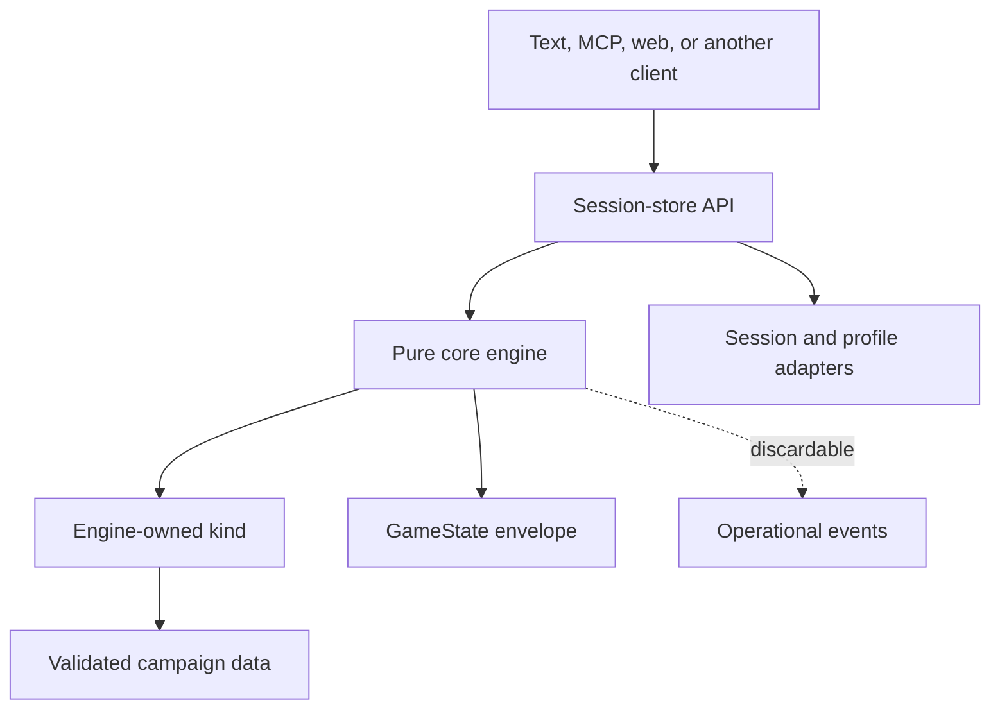

<!-- design-digest: 949e4e3aef2e76de48400f9d327f1b55be39e2c0d408c31d503d3452e7a2d597 -->

> Generated from `design/` by `/make-human-docs`. Do not edit by hand — edit the
> design docs and regenerate. `/reconcile` reports when this has gone stale.

The five agent-kit documents under `design/` are the canonical source. The detailed pages under
`docs/docs/engine/` are generated from marked blocks in those files and must not be edited
directly.

# Developer Guide

SubZeroDev.GameEngine is a deterministic narrative-game engine written in TypeScript. It
separates game-independent execution (the core) from game-category rules (a kind) and campaign
data, then exposes every game through one session API. Text, MCP, and browser clients are
siblings over that API; none owns rules or holds authoritative state.

Use this guide when integrating the package, implementing a client or campaign, or extending an
engine-owned kind. The exact public types, signatures, error tables, persisted schemas, and
assertable invariants live in [Core Specification](/docs/engine/core) and the kind contracts it
links to — this guide never repeats a signature that document already owns.

## What exists today

- The core engine, content builder, tiered validation, session and profile stores, save
  migration, observability, the determinism harness, and cross-version replay are all specified
  as a complete, buildable contract.
- **`story-graph`** is the flagship kind. Its MVP Definition of Done — a playable arc, a
  requirement-gated retry, a visited-count loop, a seeded random transition, an achievement that
  fires exactly once, byte-identical replay under two clients, and profile-scoped achievement
  persistence — is fully specified and checked, one box at a time, against named tests.
- **`simulation`** is a real, registered kind against the same seam: state, content definitions,
  the weekly resolution pipeline, validation, reason codes, events, and terminal identity are all
  specified in full. The contract is explicit that "the shape is whole" is not the same claim as
  "every system is built" — several end-of-week systems are documented, deliberately inert stubs
  behind their normative pipeline position, because the flagship slice only needed enough logic to
  prove a goal can be won and lost. `design/90-decisions.md` carries the current stub list.
- **`world-graph`** is the third kind: a navigable world with autonomous inhabitants, advanced in
  fixed ticks through a twenty-system pipeline. As of the current contract, every system that
  pipeline names is real — the tick-system register in `design/90-decisions.md` closes with no
  rows outstanding — though the flagship game built on it (Sun Trap) is a separate repository with
  its own content, balance, and client.
- **The public browser demo that once lived at `/play/` is retired.** It proved browser
  portability and clients-never-hold-state; the play surface is now
  [SubZeroDev.Adventures](https://github.com/The-Running-Dev/SubZeroDev.Adventures), a client
  repository consuming this engine as a pinned git submodule. The engine-side portability property
  it proved is still binding — see [Browser portability](#browser-portability) — but this
  repository no longer asserts it over an emitted bundle, because it no longer emits one.
- A Platform-backed static container exists as an alternative delivery surface for the same site
  artifact (`/`, `/roadmap/`, `/docs/`), composed with `SubZeroDev.Platform.Hosting`. It is
  historical relative to its own design document but its build/smoke/publish workflow still runs;
  it is not a hosted engine API, and GitHub Pages remains the public host.
- Content pack resolution and identity (merge, override, dependency, and the `ResolutionId`
  digest that becomes a campaign's `campaignVersion`) are fully specified. Experiment gating's
  composition contract is settled too: `ExperimentSource` stays above the session seam, while
  `SessionHost.experiments` carries only the resolved, non-null map used for event attribution.
  The current package still needs the declaration and record-stamping implementation brought into
  line with that contract — see [Content packs](#content-packs-and-experiment-gates).
- Session capture — turning a played session into a committed replay fixture — is specified as a
  privacy contract, not implemented. It is deliberately gated on a hosting layer this repository
  defers entirely.

## The mental model



The split is strict:

- The **core** owns the envelope, seeded RNG streams, canonical serialization, resolution
  orchestration, projection, saves, the validation vocabulary, and the shared scene/action shapes
  every client renders.
- A **kind** owns one category's turn model, its own state shape, what an action means, scene
  rendering, projection, campaign validation, event names, reason codes, migration, and terminal
  identity.
- A **campaign** is immutable, validated data for exactly one kind — a kind is engine code,
  reviewed and compiled in; a campaign is data anyone (including AI) may author, validated
  identically regardless of who produced it.
- The **session store** owns persisted state and command ordering; the pure engine itself keeps
  no session and does no I/O.
- A **client** presents projected DTOs and submits declared inputs. The moment it needs to compute
  an outcome, read raw state, or emulate a store operation that does not exist, the boundary has
  broken — [Clients](#clients) makes this testable rather than aspirational.

Whether something you're adding is a new kind or just a campaign has one test, stated in full in
[Architecture](/docs/engine/architecture): a kind exists only when its resolution logic cannot be
expressed as validated data over an *existing* kind's `advance`. A richer state shape, a bigger
turn quantum, or a new theme never qualifies on their own — story-graph's node graph, simulation's
weekly plan, and world-graph's tick pipeline all differ by more than that; each needed genuinely
new code inside `advance`, not just more data.

## Install and consume the package

The published package is `@the-running-dev/game-engine`. Its root export is deliberately narrow:
consumers get the supported engine, builder, session, observability, localization, and kind
surfaces — nothing lets a caller reach into internal modules.

Build one composition root per process:

1. Build and validate a content registry (directly, or by resolving an ordered set of content
   packs — see [Content packs](#content-packs-and-experiment-gates)).
2. Register the kinds the campaigns in that registry need.
3. Create the pure engine from the registry, the kinds, and any deterministic id/event ports the
   host wants (see [Extensibility](#extensibility-and-ports)).
4. Create the session service from the engine plus concrete session and profile persistence.
5. Give clients the session service and nothing else.

The engine performs no filesystem or network I/O while resolving play. Parsing JSON or YAML,
reading files, database access, clocks, hosting, and process lifetime all belong to outer
adapters — that boundary is what makes "the full suite passes with no DOM and no network adapter
installed" a structural property rather than a discipline.

### Published narrative content lives outside this repository

Narrative campaigns are authored and published by
[SubZeroDev.Adventures.Content](https://github.com/The-Running-Dev/SubZeroDev.Adventures.Content),
not by this repository. It builds portable JSON from TypeScript campaign sources and publishes the
manifest hosts fetch. This engine stays the authority for deterministic mechanics, kinds,
validation, portable hydration, and the author-time primitives exposed through `/authoring`.

The package root is the runtime contract; `@the-running-dev/game-engine/authoring` is the separate
author-time contract for a repository that owns campaign source. It exports the generic campaign
builder, the story-graph source builder, the simulation source builder with its content-definition
source types, the shared adventure builder with its source factory and its migration helper,
portable serialization and manifest-digest functions, and replay-runner types. Import from
`/authoring` only when writing or publishing campaign content — a runtime host must never import
authored campaign source merely to play already-published portable JSON. `toPortable` and the
manifest-resolution digest are `/authoring`-only; `fromPortable` is root-only; the
portable-campaign digest function is exported from both, because both a runtime host verifying
fetched content and a publishing pipeline digesting source before it ships need it. Portable
campaign documents stay at format version 2.

**A kind's export split follows one rule, regardless of which kind it is:** the builder and its
source types are author-time and belong on `/authoring`; the campaign, state, view, and outcome
types are what a runtime host compiles against and belong at the root. `buildWorldGraphCampaign`
is a stated exception — its root placement predates the `/authoring` subpath and was left there
rather than moved.

A frozen Bureaucracy campaign may still remain inside the engine as story-graph regression
evidence only — it is not published and not listed in any manifest. Every other frozen campaign
left the package root in the breaking 0.9.0 release; `src/engine/package.json` is at `0.10.0`, so
that removal has already shipped. A version named here as a future removal target is a name to
check against `package.json` before bumping, not after — this section's own removal estimate moved
once before it landed.

One further category is sanctioned at the root and is neither a runtime export nor a frozen
fixture: **a kind's own reference campaign** — engine-owned content that exists to make a kind
registrable and exercisable at all, never authored by
[SubZeroDev.Adventures.Content](https://github.com/The-Running-Dev/SubZeroDev.Adventures.Content)
and never a frozen fixture. `buildWorldGraphMvpCampaign` / `WORLD_GRAPH_MVP_CAMPAIGN_ID` is the
instance — the only content a host can register the `world-graph` kind against today. The rule
that keeps this from swallowing the boundary above: the root still publishes no *narrative*
campaign, which `src/engine/src/authoring.test.ts` enforces in both directions.

## Build content before creating the engine

Authors write player-facing text inline, as keyed authored text. The pure content builder:

1. validates the kind's source schema;
2. lifts inline text into the shared string table;
3. rejects one key paired with conflicting text;
4. converts source into runtime content carrying localization keys only;
5. runs kind validation;
6. merges protected core, kind, and campaign strings;
7. freezes campaigns and strings.

Never hand the engine partially validated or mutable content. Registry construction is the
failure boundary: a Tier 1 error means there is no registry and therefore no playable engine.

### Validation tiers

- **Tier 1, hard failure** — duplicate or invalid ids, dangling references, undeclared variables,
  mistyped effects, missing strings, invalid weights, forbidden namespace writes, and other static
  contract violations.
- **Tier 2, warning** — unreachable content, suspicious cycles, non-interactive campaigns that
  settle straight to an ending, and similar structures that may be deliberate (a vignette, a test
  fixture).
- **Tier 3, simulation/replay** — unwinnable states, never-satisfiable choices, and anything that
  cannot be decided by reading definitions alone. Not part of load, and not proven by the
  determinism harness either — that harness compares a build against itself, which cannot tell you
  whether an ending is reachable. Tier 3 is an author-facing check run out of band: `npm run
  validate-campaign` in the engine package searches the actual state space using the kind's own
  settle, condition, and achievement logic, so its answers match real play, but nothing in the
  registry path imports it — a campaign loads, plays, and serializes identically whether or not it
  has ever been checked. The search is bounded (an explored-state cap, a turn-depth cap, the same
  settle-step cap the engine itself enforces), and it reports `bounded` whenever any cap was hit
  anywhere. **A bounded result means "not proven," never "passed."** Treat the two as identical and
  you get a guarantee the checker never offered — it declines to credit an ending found exactly at
  a cap so it never claims to have explored more than it did.

Every registered code — Tier 1, Tier 2, and the codes a kind uses to reject a player action —
needs a localized message, or registry construction fails; a validation code never reaches a
player, because a campaign carrying a Tier 1 finding never produces a registry at all. How
specific those codes are is a per-kind choice — `story-graph` publishes a dozen, `world-graph`
closer to thirty, because its content is a map, a terrain graph, ten catalogues, and a scenario,
and one generic "invalid definition" would tell an author nothing about which shape was wrong. The
full per-kind lists live in [Story-Graph Kind](/docs/engine/story-graph-kind),
[Simulation Kind](/docs/engine/simulation-kind), and [World-Graph Kind](/docs/engine/world-graph-kind).

AI-authored content takes this same path. AI may draft campaign data; it never authors or loads
executable kinds — that boundary is what "the engine always validates the final result" means
concretely.

A **campaign-shape builder** takes the same path for the same reason: a parameterized function
that emits the repetitive graph topology around authored prose, choices, and endings. It runs
before the engine, produces an ordinary campaign source, is validated by the tiers above exactly
as hand-written content is, and leaves no trace in `serialize()`. A campaign is free not to use
one; that freedom is what keeps a shared shape a convenience rather than an undeclared fourth
content schema.

### Content packs and experiment gates

There are two ways to reach a registry, and they differ in what they can say about identity.
The direct builder folds already-built campaigns and knows nothing about packs. The pack resolver
folds an **ordered** array of content packs, and the order is significant: a later pack replaces
an earlier campaign wholesale by id, and replaces strings per key. That asymmetry is deliberate —
a culture pack must be able to restyle one line without restating a whole campaign, but a campaign
is a validated graph, and a field-level merge across packs could produce one no pack author ever
validated.

Pack resolution is pure and total: either every structural check passes and the call returns a
complete registry, or it returns every conflict at once and no registry. The checks: a pack's
`kindId` matches every campaign it carries; a `dependsOn` names a pack present in the set at
exactly that version; no two packs require different versions of the same pack; there is no
dependency cycle; no campaign id repeats within one pack; and no pack writes a `core.reason.*`
string. Overriding something no earlier pack supplied is a warning, not an error — legal, and
almost always a misspelled key that would otherwise fail invisibly at play.

Dependencies are exact `{id, version}` pairs; there is no range solving, deliberately — a
backtracking resolver would make *which content a game ran against* non-deterministic.

A pack's own `version` is not something its author hand-writes. It is a canonical digest over the
pack's campaigns and its sorted string table, prefixed `1.0.0+`, so the version moves
automatically whenever the pack's content moves rather than depending on an author remembering to
bump a constant. Treat it as generated identity, not a field to edit by hand — the type does not
enforce this today, so a new pack is only correct if its author follows the same convention as the
shipped ones.

The identity consequence is the part worth planning around. Pack resolution digests the ordered
`{id, version}` list into a `ResolutionId` and stamps it as the `version` of every campaign it
produces, so a game records the content it actually ran against rather than a campaign version two
different pack sets could share. **Reordering packs therefore changes every campaign version**,
and every existing save becomes a save of a different content version. That is correct, but it
means pack order is not a knob to adjust on a live deployment. Experiment gates ride the same
identity mechanism: two sessions resolving different variants resolve different pack sets, hence
different `ResolutionId` digests, hence different `campaignVersion`s, with no additional
machinery — a gate is simply one more reason a pack might not be in the resolved set.

The `ExperimentSource` port resolves a stable variant per `(experimentId, bucketKey)` at
session-creation time — `bucketKey` is `profileId` when the session is profiled, else the seed —
and `null` always means "not enrolled," never a value that could accidentally match a gate. That
resolution happens *before* the pack array reaches the resolver and stays host-side: build one
`Engine` and session layer per distinct assignment combination, keyed by the `ResolutionId` that
combination produces, and route each `createSession` call to the matching layer. If the caller
omits a seed, an experimenting host must generate it before bucketing and pass the same seed into
`createSession`; the ordinary no-experiment path can keep the engine's default generation.

Only the narrowed, non-null assignment map crosses the session seam as
`SessionHost.experiments`; the layer stamps it unchanged onto emitted records. Candidate packs and
the `ExperimentSource` itself never cross that boundary, because the layer already has a fixed
registry and engine. The current package still exposes the old, unused source-typed field and does
not stamp the map, so do not rely on experiment attribution until the implementation follow-up
lands. See [Content Packs](/docs/engine/content-packs) §5a–§6 for the full mechanism.

## Use the session API, not raw engine state

The session service is the application boundary. It provides campaign listing, creation, resume,
scene/view queries, localization strings, action submission, preview, save, and load. Exact
operation signatures live in [Core Specification](/docs/engine/core).

Starting a session takes a campaign id, an optional explicit seed, an optional audience, and an
optional profile id — there is no `locale` parameter. When no seed is supplied the session
boundary generates and persists one. The returned handle carries a `sessionId` and a scene, never
the envelope.

Submitting an action follows one atomic path:

```mermaid
sequenceDiagram
  participant C as Client
  participant S as Session service
  participant E as Pure engine
  participant K as Kind
  participant P as Persistence

  C->>S: submit(sessionId, actionId, declared params)
  S->>P: load complete serialized state
  S->>E: submitAction(state, action)
  E->>K: advance(kindState, action, scoped context)
  K-->>E: new kind state, or a structured rejection
  alt accepted
    E-->>S: new envelope + changes/messages
    S->>P: atomically persist envelope
    S-->>C: projected scene/result
  else rejected
    E-->>S: unchanged state + error
    S-->>C: error; no log or state write
  end
```

Different sessions resolve concurrently. Commands for the same `sessionId` are serialized by the
store, so the second command always reads the first command's committed state. A separate lock
domain, keyed by `profileId`, serializes only the profile upsert — the two never couple, which is
what lets many players' sessions interleave freely. A query returns a projection of one complete
stored revision, never a half-written one.

A stored session record carries more than the serialized envelope: an `audience`, an
`attemptCounter` only `submitAction` increments, an optional `profileId`, a `replayCompatible`
flag that turns false forever once a migrated load touches the lineage, and wall-clock
`createdAt`/`updatedAt` timestamps set through the `Clock` port — all of it outside the replayable
`GameState` and never read by `advance`.

### Durability is a host adapter, and the store is not

The session store itself is engine-owned. Its two lock domains, its trace-and-stamp decorator,
save-envelope assembly, and the idempotent profile upsert are behavior you get, not behavior you
supply. What you may supply is `SessionPersistence` — a pair of record stores that get and put a
session record, and get, put, and delete a save record. Omit it and the store's own in-memory maps
are the whole implementation, which is the default and what every test runs against.

Two rules an adapter must not get wrong:

- **Address a save by its `saveId`.** `get` and `put` must reach the same record. An adapter keyed
  on anything else writes successfully, reads nothing, and fails no gate — the first shipped
  adapter did exactly that.
- **Store the bytes you were given.** The record holds a canonical serialization, not a live
  object graph, and nothing on it may be written into `GameState`.

Failures throw `SessionStoreError`, because none of the store's return shapes has a field an error
could travel in. It is not opaque: `operation` names the call and `code` is a registered reason
code with a shipped `core.reason.*` message, so a client renders it through the string table like
any other rejection and never reads `message`. Whatever exception an adapter raises is caught and
re-raised as `storage_failure` by default — a database timeout and a browser quota error are
deliberately indistinguishable to a client, since neither admits a different response.

One failure is classified rather than flattened: a **lost update**. The store's per-session lock
orders operations inside a single process; run several instances over one database and nothing
here serializes them, so an adapter is the only party that can tell another writer moved the
record first. Signal it by setting `name` on the thrown exception to the exported
`SESSION_PERSISTENCE_CONFLICT` string, and the store raises `concurrent_modification` instead — a
code the client can act on differently, by re-reading the session and retrying. The store matches
on `name` rather than `instanceof`, so the signal survives a duplicated copy of the package. Brand
nothing else with it: a timeout or a deadlock branded this way tells a player to refresh a session
that never changed, and left unbranded it arrives as `storage_failure`, which is correct for it. A
single-writer adapter — in-memory, `localStorage` — never raises it. A rejected write must also
never leave the store's own cache ahead of what it just failed to persist; an operation that
mutates a cached record before dispatching the write has to restore or evict that record when the
write throws, or the retry the `concurrent_modification` message asks for cannot succeed.

### Previewing an action

Clients may call `previewAction(sessionId, actionId, params?)` before submitting. It runs the same
authoritative resolution path as submission, but projects the prospective result and discards the
state: it never writes a session or profile, consumes a command attempt, appends to the action
log, or emits an action-lifecycle event. It still shares the per-session command queue, so it
cannot present a result for a revision a neighboring submission has already replaced. The text
client and the MCP `preview_action` tool expose the same operation; neither duplicates placement or
other kind rules — `world-graph` is the kind that forced preview to exist at all, because a spatial
placement must be checkable before it commits and no client can call the pure engine directly.

### Profiles are optional mirrors

Pass a `profileId` when achievements should survive a session. After a successful action, the
session service idempotently mirrors new achievements to the profile store; resolution itself
never reads the profile.

- No profile id means no profile read or write.
- A missing or corrupt profile behaves as empty and returns a warning.
- A failed profile write warns but never rolls back the completed game action.
- Never put profile identity or profile contents into `GameState`.

Arbitrary kind-owned profile data is not currently supported; a `"profile"`-scoped simulation event
chain in particular has nowhere to persist yet and remains an open item.

## Projection is mandatory

Clients receive a generic `Scene` and `PlayerView` plus a kind-projected view. They never receive
the seed or action log, raw `kindState`, non-visible story variables or visit counts, hidden
choices, unrevealed simulation/world opportunities or entity internals, or achievement conditions
and other future-state hints.

Do not add a trusted-client escape hatch. The projection is what makes hidden information safe
across text, MCP, web, and AI audiences. If a new client needs more information, decide whether it
is genuinely player-visible and extend the relevant kind's projection deliberately.

**A view you receive is yours to mutate, because it is a copy.** Every core surface that hands you
a projection — `Engine.view`, and the `view` bundled on a `Scene` — returns a structural clone, so
mutating anything reachable from it, however deeply nested, cannot reach `GameState`, a later read,
`serialize()` output, or the action log. Two things follow. A view has no stable object identity:
two projections of one state are equal and are never the same object, so a view is not a cache key
and comparing two by reference is always false. And if you are implementing a kind, `project` may
freely return values that alias `kindState` — that is explicitly allowed, since a projection
legitimately reuses the value it narrows — but its result must be plain, structurally cloneable
data. Return a function, or an object whose prototype the view depends on, and the first `view()`
throws instead of quietly handing out a live reference into game state.

Client code switches on stable reason codes and renders localization keys — it never parses an
English error sentence, and a missing localization key is a registry-build defect, not a client
fallback opportunity. Two things follow that are easy to get wrong when implementing a client or a
kind:

- **A rejection gives you both an error and a message, and you may render either.** Every kind
  attaches one visible `OutcomeMessage` built from the same localization key its `ValidationError`
  carries, so a client that renders only `messages` still shows the player why an action failed. A
  kind's own rejection path owes that message too.
- **Audit records carry reason codes as well.** The `reason` on a `StateChange` is an ordinary
  registered code with a localized message, not a private label, so a visible change is renderable
  the same way a rejection is. `achievement_unlocked` is base vocabulary because the session store
  acts on it without knowing the kind; `consequence_applied` belongs to `story-graph`. A kind
  adding an audit reason registers it like any other code.

### Clients

The contract behind all of this is one testable rule: two different clients, given the same
campaign, seed, `IdSource`, and action sequence, must produce byte-identical `serialize()` output.
A client contributes nothing to a game but the order of the actions it submits. A client may only
call the `SessionStore` surface — it does not import the pure engine, a kind, the registry, or the
projection machinery. It may render what the store returns, format it for locale, and cache the
latest scene to redraw; it may never decide which actions are available, evaluate a condition
itself, compute a consequence, string-match English to infer meaning, or retry a rejected action
automatically. If removing the client and driving the store directly would change the game, the
client is doing something it should not.

### Browser portability

This repository no longer ships a browser client. Its own `/play/` route was removed from the site
build; the play surface is
[SubZeroDev.Adventures](https://github.com/The-Running-Dev/SubZeroDev.Adventures), a client
repository consuming this engine as a pinned submodule. If you are building a browser client,
build it the way Adventures does: a composition root separate from the client, assembling the
engine, the kind, validated campaigns, and the session store, and passing the browser adapter
nothing but a `SessionStore` and a frozen startup configuration carrying plain titles and campaign
ids — no registry access, no deep import.

The engine-side constraints still apply, because they are about the *engine's* browser boundary
rather than about a specific route:

- The same supported package entry point must bundle for Node.js and the browser, with no `node:`
  import and no unguarded Node global in its production graph.
- Save checksums remain SHA-256 over the same canonical bytes and stay synchronous, computed by a
  portable library rather than Web Crypto — `crypto.subtle.digest` is async, and adopting it would
  mean async-ifying the whole envelope path to obtain an identical digest.
- Browser hosts must define the `__GAME_ENGINE_PRODUCTION__` build-time flag themselves. Node
  callers fall back to `NODE_ENV`; a browser bundle that omits it silently gets dev-mode emitter
  behavior.
- Checkpoints work the same way anywhere: the UI layer holds a `SessionStore` and calls
  `saveGame`/`loadGame` — it never sees a blob, an envelope, or a storage key. A host composition
  root supplies a `SessionPersistence` adapter (over `localStorage`, for instance). Storage is
  best-effort: a quota error or disabled storage surfaces as `storage_failure` and the run
  continues in memory, and "saved" is claimed only after a write the adapter confirmed.
- Whatever route a client serves must be a real static document, never an SPA fallback.

**Nothing in this repository proves browser portability anymore, and that check is now yours if
you ship a bundle.** The scan for `node:` specifiers and unguarded Node globals used to run over
the emitted `/play/` bundle; with that route retired there is no engine code left in this
repository's own bundles for it to see. Adventures carries the assertion now, over a bundle it can
actually see — scan your own emitted bundle the same way.

## Determinism rules that will bite you

The replay input is campaign identity, seed, and successful submitted actions. Preserve that model
by following these rules in every resolution path:

- Use only the scoped RNG supplied by the kind context, or a stream derived from it.
- Never call ambient randomness, the wall clock, filesystem, network, or a banned non-bit-stable
  math function.
- Do not persist an RNG cursor — derive a fresh handle from seed and stable stream id every time.
- Do not let a client supply a time or money cost the engine can derive itself.
- Sort dictionary/record keys before any state-affecting traversal.
- Define explicit tie-breaks for every unordered candidate set.
- Keep money in integer cents and simulation/world rates in integer basis points; keep every other
  scored or accumulated value integer, with any fraction expressed as fixed-point.
- Keep wall-clock metadata outside the game envelope.
- Add a new action parameter to the declared schema before letting it affect behavior.

The stream key matters as much as the generator — `deriveStream(seed, streamId)` is a pure
function of the pair, so which id you key by is the whole determinism story for that draw.
Per-action draws use the accepted action's sequence number; a start-of-game draw uses its own
`system:"start"` stream, distinct from the first action's, so the two can never collide even
though both use sequence zero. World-level autonomous draws (a spawn roll, an incident roll) key
by simulated tick and the drawing system's own stable id, never by how many API calls it took to
reach that tick — this is what makes a tick batch reproduce identically however a caller splits
it. Agent draws use the agent's own stored draw counter, never the number of client submissions
that happened first — keying an agent's randomness to the action sequence would make it depend on
how many actions preceded it, which is exactly what a per-agent stream exists to avoid.

The same-build determinism harness proves byte identity, property-seed reproducibility, and
emitter independence: every golden fixture replays under the discarding default emitter and under
a recording one with byte-identical `serialize()` output. It also proves event-stream
reproducibility directly — the same fixture, run twice under a recording emitter, is asserted to
yield the identical event sequence (names, order, data), with `gameId` normalized out because a
replay is a new game and legitimately carries a new one. None of this by itself detects a
deterministic *behavior* change; that is the cross-version replay oracle's job, in
[Replay](#replay-and-incident-diagnosis).

## Story-graph campaigns

Use `story-graph` for authored branching narrative whose unit of play is one choice.

A campaign declares bool, bounded-int, and enum variables (deliberately no free-string type —
narrative text is localization keys, not state); choice, automatic, random, and ending nodes;
choices with optional visibility and availability conditions; typed consequences over declared
variables; conditional achievements; and localization keys with authored text.

There are two different gates on a choice, and conflating them is the easiest mistake to make:

- `showWhen` removes a choice completely. Submitting its id returns exactly what submitting an
  unknown id returns, so a client — or an AI agent over MCP — cannot probe for secret paths by
  telling the two apart.
- `requirements` leaves the choice visible but unavailable and supplies a player-facing reason —
  the common case, and the Transparent Consequences principle in practice.

Debugging *why* a requirement failed goes through the `kind.story-graph.requirement.evaluated`
event, not the rejection itself — `requirement_unmet` deliberately carries no detail, because the
player is not owed the campaign's internals. Two things about that event are easy to get wrong:

- **The walk short-circuits.** `all`/`any` stop exactly where the shared condition evaluator stops,
  so the event fires once per *evaluated* leaf, not once per leaf in the tree. This is deliberate,
  not an oversight: a comparison against a type-mismatched operand throws, so a guard-then-compare
  idiom (`all: [x is set, x > 3]`) only stays a clean rejection while the guard can stop the walk
  before the second clause runs. This is the opposite of `world-graph`'s own condition evaluator
  (see [World-graph campaigns](#world-graph-campaigns)), which does not short-circuit — deliberately,
  because those leaves are pure and an identical trace is the point there, while story-graph
  requirement leaves are not.
- **`satisfied` reports the parity of the enclosing `not`s, not the leaf's raw result.** A
  `not: { achieved.bribed == true }` requirement that fails because the player *does* hold the flag
  reports `satisfied: false` — the negated value, since that is the only signal that requirement
  ever produces and reporting the raw leaf would say the opposite of what happened. Only the
  reported value is negated; the tree itself still decides on raw results.

`kind.story-graph.choice.submitted` fires on submission, before the choice id is resolved, so it
carries whatever id the caller sent — including one naming no choice or one hidden by `showWhen`.
That is deliberate: an unknown or hidden id then shows as a submitted/rejected pair in the stream
rather than as silence. It is an intentional exception to the core's own rule of omitting an
unresolved action id from `core.action.rejected` — this event is namespaced to one kind and emitted
at `debug`, invisible under the default `nullEmitter`.

After every transition the kind enters the destination node, increments its visit count and turn,
and settles through automatic/random nodes until it reaches another choice or an ending; a "turn"
in this kind is just this transition count, kept as an ordinary kind-owned field rather than a
core concept, because what a turn means differs by kind. Random settlement draws from the scoped
seeded stream, and a bounded settle guard turns a pass-through cycle into a defect rather than an
infinite loop. Achievements are evaluated after every turn, as conditions over state — there is no
`unlock` consequence, so a campaign fires one at a narrative moment by setting a variable there and
letting the achievement condition read it.

Only variables declared visible appear in the player view or in text interpolation.
Relationships, money, and campaign-specific clocks are all ordinary typed variables — the kind
imposes no relationship or currency model of its own; a campaign that wants a mechanical clock
declares an int and advances it itself, since the built-in turn counter is deliberately just a
transition count.

The MVP's worked example — the Bulgaria Bureaucracy arc — exercises every part of this at once:
typed variables and clamping, a requirement-gated retry with a real reason, a self-referential loop
gated on a visit count, a seeded random transition, and a single achievement that fires exactly
once. The full authored form is in [Story-Graph Kind](/docs/engine/story-graph-kind).

## Simulation campaigns

Use `simulation` for a weekly life simulation whose unit of play is a complete week. The player
builds an immutable plan with logged `plan.add`, `plan.remove`, and `plan.clear` actions, then
submits `end_week` to resolve it — assembling a plan is therefore replayable at the same grain as
playing it, because every one of those calls is its own logged action.

The week pipeline is contract behavior, not an implementation detail. Start-of-week processing
runs in a fixed order — advance the week and reset spent time, expire effects past their week,
recompute committed time, then present any event response deferred from the week before. Time
handling splits around effect expiry deliberately: the week must increment before checking which
effects have expired, because expiry compares against the new week number, but commitments must be
recomputed after, because an expiring effect changes what those commitments are. End-of-week
systems then run once in a fixed, tested order: income and expenses run before housing so current
wages can fund rent, while finance reconciliation runs after housing so arrears and eviction see
that week's actual rent decision; a week-limit check runs after goals and failure have already
applied the scenario's own tie-break between them, and before achievements, which need to see the
final resolution.

**State stores base values; modifiers never write to state.** A derived value is computed on every
read by layering active modifiers over the base, in a fixed order: sum the adds and subtracts,
multiply the multiplies as one product rounded once, then let the highest-priority `set` win with
ties broken by earliest applied week, then clamp. Because nothing was overwritten, an expiring
effect has nothing to undo — the value simply recomputes against a shorter list. Every reader must
resolve through that layer, not just the projection, or a goal condition reading a raw stored need
would disagree with what the same field shows in the view.

**Being derived does not make a path read-only; having no stored counterpart does.**
`player.needs.*`, `player.attributes.*`, and `player.skills.*` are derived *and* writable — a
modifier setting a need for three weeks is the motivating case. Four paths — housing quality,
effective job performance, the calendar's energy-recovery rate, and world strangeness — are
formula-only with no stored field at all, and a modifier targeting one of them is a Tier 1
`read_only_field` error.

Important constraints:

- Plan time and money totals derive from the planned actions; they are never serialized fields.
- Action costs always come from content/engine rules, never caller input — fourteen zero-cost job
  applications a week is exactly the failure mode this closes off.
- The `custom` action is an adapter-translation placeholder with no resolver — translate it to a
  concrete supported action before submission; there is no route around the resolver table for it
  to take.
- Opportunities distinguish acceptance, decline, expiry, and revocation explicitly, because turning
  an offer down and letting it lapse are different acts once NPCs remember things.
- Scheduled events fire once committed, unconditionally, even if their triggering condition has
  since drifted; cancellation requires an explicit shared chain id rather than re-checking
  eligibility at fire time, which would let a multi-week chain break silently in the middle.
- **An event needing a decision defers to the following week, and blocks the plan until it is
  answered.** An event that fires at the end of week N and carries choices queues as a pending
  response rather than resolving immediately; it is presented at the start of week N+1, where its
  time cost competes against that week's fresh budget. While one is outstanding, `end_week` and
  every `plan.add` other than `respond_to_event` are rejected with `event_response_pending` — a
  player cannot plan or close out a week around an event they have not actually addressed.
- Hidden exact economy values project as bands (`cold`/`steady`/`hot`), not raw optimization
  inputs a player could game the job-availability formula with.

The player view carries the calendar, identity, finances, needs, attributes, education, career,
housing, inventory, and relationships — with the hidden `luck` attribute and relationship
`resentment` stripped, internal flags and counters withheld entirely, status effects reduced to
their visible fields, and opportunities limited to what is currently offered and unexpired. It also
carries the pending plan itself and everything a client needs to build one: every currently
offerable action type, and the plan's own action list so a client can compute a valid
`plan.remove` index — `AvailableAction` itself carries no parameter schema for this kind, exactly
as it does not for `world-graph`.

Terminal identity is a record on state, not a computation. The `goals`, `failure`, and
`week_limit` end-of-week systems write the resolution once, while campaign data is still in scope,
and `Kind.outcome` simply reads it back — it cannot derive one itself, since it receives no
campaign and a scenario's week limit is campaign data. **Precedence is settled: goals and failure
always win over the week limit.** A week that both lands every goal and exhausts the limit reports
goals met; a week that both fails a goal and exhausts the limit reports failure, the more specific
fact; the week-limit result is what a week reports only when neither goals nor failure had anything
to say. The default tie-break between simultaneous goal completion and failure itself favors goals,
because the alternative — reporting a loss on a player who reached every goal but was also evicted
in a race they could not see coming — is the worst available ending; a scenario may opt into the
opposite for a difficulty that prizes survival over achievement.

The full state, content-definition, and reason-code catalogue is in
[Simulation Kind](/docs/engine/simulation-kind).

## World-graph campaigns

Use `world-graph` for a navigable world with autonomous inhabitants, where the unit of play is a
batch of simulated ticks rather than a single choice or a week. This is the third engine-owned
kind, registered exactly as the other two are.

Its load-bearing property is **batch invariance**: for any two non-negative tick counts, starting
from identical kind state, campaign, and seed, advancing by their sum and advancing by each in
sequence must finish in deeply equal canonical kind state (envelope action logs legitimately
differ; this is a kind-state property, not byte identity). Four rules make it hold: no system
observes a batch's requested length; cleanup runs only in a dedicated finalize system, never after
the outer loop; this kind draws nothing from the per-action RNG stream and never references the
action sequence number; and world draws key off simulated tick plus the drawing system's own
stable id, while agent draws key off that agent's own stored counter — never off how a client
happened to batch its requests.

One atomic tick runs a fixed, twenty-system pipeline, always in this order:


Systems 1–19 all read the same immutable `processingTick`; only system 20 performs cleanup and
increments the tick, exactly once, whether or not a terminal result was reached earlier in the same
tick. A scenario selects a map from the campaign-owned catalog, and a pure builder validates and
materializes typed definitions — terrain, zones, buildings, guest archetypes, staff roles,
incidents, objectives, failures, policies, achievements, scenarios — before play begins.

System 19 (`alerts`) is also where achievements unlock and player-facing alerts are derived: it
evaluates still-locked achievements against the post-resolution state, then raises, clears, or
leaves alone one alert per distinct active condition — an open incident, a broken building, a
scenario resolution — keyed by an engine-derived semantic key that carries no player-authored text,
so dismissing and re-triggering the same underlying condition never duplicates an alert.

`AvailableAction` carries no parameter schema, and for this kind that matters most of the three:
enumerating `build` against every definition, every map cell, and every rotation is combinatorial.
So the seam splits — `availableActions` returns the spatial verbs themselves (`build`, `demolish`,
`hire_staff`, `fire_staff`, `assign_staff`, `set_price`, `open_building`/`close_building`,
`dismiss_alert`, `advance_ticks`) with an availability flag and reason, while the parameter domain —
the build catalogue with costs and unlock state, the staff roster, the price ranges — lives
entirely in the projection. This kind is also why `previewAction` exists at all: a spatial
placement has to be checkable before it commits, and nothing else in the seam could do that without
risking a second, drifting copy of the placement rules.

Because a 360-tick batch with hundreds of guests can emit on the order of 10⁵ operational events,
`StateChange` here carries **batch-grain** audit only — money aggregated by category, building
status transitions, objective progress, scenario resolution — never a record per guest transaction.
Per-guest and per-tick detail is an event instead, which is safe precisely because dropping every
event is guaranteed to change nothing. The nine actions that mutate without advancing time are the
exception: each is a single player-initiated command with no volume problem, and each returns its
own ordinary `StateChange`.

This kind's own condition evaluator (`WorldCondition`, distinct from the shared `Condition` tree
story-graph uses) walks `all`/`any` children in authored order **without** short-circuiting, even
though its leaves are pure — the point is an identical decision trace every time, the opposite
trade story-graph's `requirement.evaluated` makes (see [Story-graph
campaigns](#story-graph-campaigns)) and deliberately so: the two kinds' leaves have different
purity, so the same short-circuit choice would be wrong for at least one of them. Event severity
here is also worth checking against the emitting code rather than assuming the contract table is
current — each kind writes its severity as a literal at the `emit` call site rather than from one
shared table, so the two can drift; a recent reconciliation caught four world-graph event
severities that had done exactly that.

Win and loss are read through `Kind.outcome`, not through `GameStatus` — the same terminal-identity
mechanism every kind uses, not a status field specific to this one. A win requires at least one
declared objective, with every one met; a scenario declaring none has nothing to win, which is why
validation warns rather than silently granting a win by vacuous truth. Cash, guest counts,
satisfaction, and the tick a game ended on are deliberately excluded from terminal identity — every
one of them changes legitimately under a balance pass, and a regression oracle that treated a
balance change as a defect would be worthless within a month.

The full system-by-system pipeline, content model, and reason-code table are in
[World-Graph Kind](/docs/engine/world-graph-kind). The flagship game built on this kind — Sun Trap —
and its concrete content, balance, and client live in a separate repository; this contract owns the
shapes and mechanics, not the numbers.

## Turn pipelines inside a kind

Two kinds resolve a turn by running an ordered list of systems: simulation's end-of-week pass and
world-graph's tick. Both orders are normative and covered by tests, and both obey the same rules.
World-graph already runs on a substrate shaped for exactly that — one frame-to-frame function type
and a declared id list; simulation's fifteen systems are still fifteen bespoke calls threading a
local variable.

If you add, move, or reshape a system, these are the constraints that will bite you:

- **The list you supply is the order that runs.** Nothing sorts, filters, deduplicates, or skips
  it, and there is no system registry to register with. The caller's list is the whole truth.
- **Every entry runs on every turn.** There is no short-circuit and no early exit. A terminal or
  failed result is a value carried in the frame, not a control-flow signal — world-graph's rule
  that a terminal result still runs systems 19 and 20 *is* this rule, not an exception to it.
  Where a turn stops early, it stops in the loop around the pipeline, never inside it.
- **A system is a total function from frame to frame,** and it sees only its immediate
  predecessor's frame. Nothing merges or reconstructs a frame behind you.
- **The pipeline itself emits nothing, draws no randomness, and reads no clock.** Every event a
  turn produces comes from a system. Where a kind wants a per-system trace event — simulation
  emits `kind.simulation.system.ran`, which is how an ordering regression gets localized to the
  phase that moved — the list entry wraps the system and the emission together, where the list is
  built. World-graph declares no such event and wraps nothing.
- **Nothing catches.** A system that throws propagates, with no partial commit and no substitute
  frame. That is deliberate: a throwing system is an engine defect rather than a game outcome, and
  converting one into a rejected action would produce a wrong state that still serializes. Do not
  add a reason code for it.

The pipeline machinery is engine-internal. It is exported from neither the package root nor
`/authoring`, and a host cannot supply, replace, or observe one.

## Saves and migrations

A save wraps canonical serialized `GameState` with independently versioned save, serialization,
engine, kind, and campaign metadata plus a checksum and a replay-compatibility flag.

Loading follows this order:

1. Validate the wrapper, checksum, serialization version, and state shape.
2. If the kind version changed, run the engine-owned kind-state migration.
3. If the campaign version changed, run the campaign migration against the migrated shape.
4. Validate the result.
5. Replace the session only after every step succeeds.

Missing or failed migration is loud and leaves the old record intact. An engine-version mismatch by
itself is provenance, not by itself a reason to reject a load. Any successful migration
permanently marks the save lineage not replay-compatible, because the old action log may no longer
regenerate its current state.

Published ids are stable. Renaming a node, definition, reason, or other persisted id is migration,
not cleanup.

## Replay and incident diagnosis

Use two complementary checks:

- The **determinism harness** reruns one build and compares canonical bytes and events — it
  answers *is the engine deterministic*, comparing a build against itself.
- The **replay oracle** runs committed inputs across engine versions and compares only stable
  outcomes — submission decisions and reasons, achievements, and kind terminal identity. It
  answers *did this change alter a game that already exists*, which the determinism harness is
  blind to by design: a change that alters every game identically is still perfectly
  deterministic and runs green there.

Fixtures record every submitted action and its declared params, not internal action-log entries or
raw state — a rejected submission never advances the engine's own sequence number, so a fixture
cannot reuse the action log as its submission history. Results are indexed by submission position
for the same reason, not by that sequence number.

Do not add prose, timestamps, balance values, or serialization bytes to a cross-version outcome —
those legitimately change without changing what happened to the player, and including them would
make the oracle cry wolf on every content edit. A kind's own terminal-identity function is held to
the identical rule: published ids only, never values a balance pass would legitimately move.

A production incident should become a minimal replay fixture when privacy permits. The specified
capture flow excludes identity, timing, raw state, and undeclared parameters; capture happens only
for an explicit report or an error-severity event, never as background collection. Promotion into
the committed corpus is a reviewed, one-way step — a capture is personal data until a human
confirms identity and undeclared params are absent, and once committed to git it cannot be deleted
the way a retention window can delete an unpromoted capture. That hosting integration is not
implemented yet; the mechanics apply the moment it is, unchanged.

## Observability without behavioral influence

The engine has two distinct outputs, and conflating them is the mistake this section exists to
prevent:

- `StateChange` is a localized domain audit record the player may see, returned in the action
  result.
- `EngineEvent` is operational telemetry for developers and content authors, emitted to a sink and
  never returned, localized, or guaranteed delivered.

The one invariant everything else follows from: **removing every event must leave replay
byte-identical.** `emit` returns `void`, so a kind cannot branch on whether a sink is attached or
what it did; the core never stamps a timestamp or draws a trace id inside resolution, leaving that
to the session-store boundary, which is the only layer that legitimately owns a clock. The
determinism harness enforces this directly — every golden fixture replays under a discarding
emitter and a recording one with byte-identical output.

Kinds may emit only names they declare under `kind.<kindId>.*`; the core's own `core.*` namespace
is reserved. Emitting an undeclared name, or a name outside that namespace, is a coding defect that
the engine construction step and the runtime path both reject in non-production builds. A sink must
not throw, and the core additionally isolates every `emit` call as defence in depth, so a faulty
sink cannot abort a resolution or change a game's outcome — attaching a sink is not allowed to be
able to do that.

Never include unresolved caller action ids, player-authored or campaign-narrative text, or
undeclared params in event data — an id that resolved to nothing is ordinary play, not a debugging
fact worth a stream a hosted operator might read without a redaction pass.

## Extensibility and ports

The practical test for a host port is exactly [Extensibility](/docs/engine/extensibility)'s rule:
**a host may supply anything that cannot change `serialize()` output.** If an implementation could
change what a fixture replays to, it does not belong as a host-supplied port at all — it is inside
the determinism boundary, and the determinism boundary is the trust boundary. Every port below is
an interface, supplied by value at one composition root, with a default that works, so an embedder
supplying nothing still gets a functioning engine.

- **`IdSource`** supplies `gameId` and `seed` — the two non-deterministic values that *are*
  written into the envelope. Its default is deliberately random; it is the one place in the
  platform where that is correct.
- **`RecordIdSource`** supplies session and save ids, which never enter `GameState` at all — they
  key host records, not replay state. It is a separate port from `IdSource` for exactly that
  reason, supplied on the session host rather than the engine host.
- **`SessionPersistence`** and **`ProfileStore`** cover durability, as already described in
  [Durability is a host adapter](#durability-is-a-host-adapter-and-the-store-is-not) — note that
  `SessionStore` itself is *not* a port; what a host replaces sits underneath it.
- **`Emitter`** is write-only and returns nothing, covered above.
- **`Clock`** is boundary-only — used for session-record timestamps and event stamping — and is
  deliberately absent from the engine host, so the pure engine has no route to the wall clock even
  through a supplied port.
- **`ExperimentSource`** resolves a variant above the session layer at creation time, described
  above under [Content packs](#content-packs-and-experiment-gates); only its narrowed assignment
  map crosses `SessionHost`, and a kind can never see or branch on one.
- **`__GAME_ENGINE_PRODUCTION__`** is not a port at all — it is a build-time flag a bundler
  substitutes, because a value supplied at construction cannot be tree-shaken. Node hosts define
  nothing and get the right answer from `NODE_ENV`; browser hosts must define it themselves or
  silently ship dev-mode emitter behavior.

Kinds and the closed `Condition` operator set are **not** open seams — a third-party kind would put
unreviewed code inside the determinism boundary, and both are named in
[Extensibility](/docs/engine/extensibility) as deliberately not a plugin system: no manifest, no
loader, no dynamic discovery. Adding a kind is engine work, reviewed like any other code, not a
runtime extension point. A new theme, scenario, or body of content is a campaign, not a new kind —
apply the "is it a kind?" test in [Architecture](/docs/engine/architecture) before proposing one.

## Failure handling checklist

- Return stable structured errors, never string-matchable exceptions.
- Reject content before freezing the registry; never expose a partial registry.
- On a rejected game action, persist nothing and append no action-log entry.
- On session write failure, never acknowledge success; retry only after store recovery.
- On host storage failure, surface `storage_failure` through the string table and keep playing —
  never leak an adapter's own exception type across the store boundary. Brand only a lost update as
  the classified conflict; it arrives as `concurrent_modification`, and the caller re-reads and
  retries rather than continuing blindly.
- On profile failure, preserve the successful game result and return a warning.
- On migration failure, retain the previous session/save untouched.
- On sink failure, preserve both the returned and the serialized game results.
- On an unknown or hidden action, reveal no information beyond `unknown_action`.
- On unsupported deferred behavior, reject or exclude it rather than selecting plausible semantics
  on its behalf.

## Verification before handing off a change

Run the checks appropriate to what changed:

```powershell
./build/Test-Documentation.ps1
Set-Location src/engine
npm run typecheck
npm run lint
npm test
Set-Location ../..
git diff --check
git status --short --branch
```

For documentation routes and heading anchors, also run the production Docusaurus build when Docker
and the generated `docs.ps1` are available. The development server is not the route/link gate.

For engine behavior, add or update the narrow unit test, a same-build deterministic fixture when
serialization should remain stable, and a release replay fixture when the behavior is part of a
published campaign's stable outcome.
