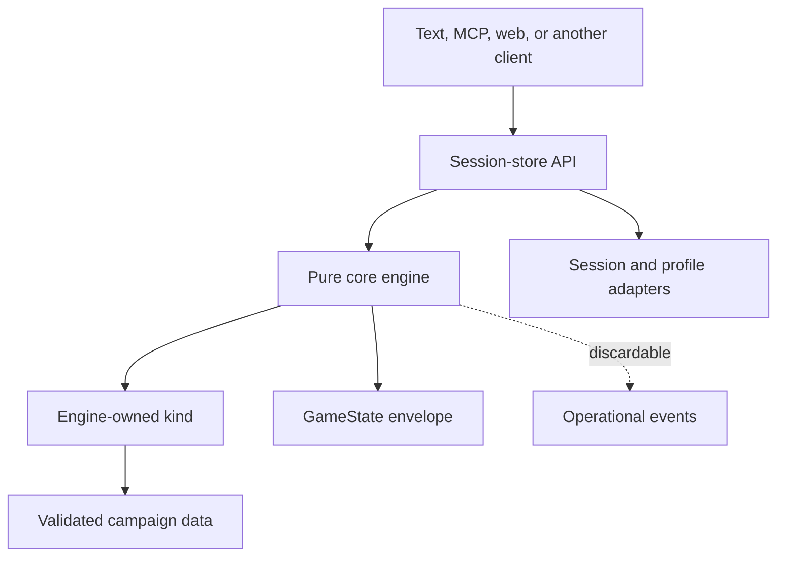

<!-- design-digest: 2f7d6f52a77504f80e7e09632ff73f7da81956d7c5e41fef23a720d287b34e3b -->

> Generated from `design/` by `/make-human-docs`. Do not edit by hand — edit the
> design docs and regenerate. `/reconcile` reports when this has gone stale.

The five agent-kit documents under `design/` are the canonical source. The detailed pages under
`docs/docs/engine/` are generated from marked blocks in those files and must not be edited
directly.

# Developer Guide

SubZeroDev.GameEngine is a deterministic narrative-game engine for TypeScript and Node. It
separates game-independent execution from game-category rules and campaign data, then exposes
every game through one session API. A text client and an MCP client are siblings over that API;
neither owns rules or authoritative state.

Use this guide when integrating the package, implementing a client or campaign, or extending an
engine-owned kind. The exact public types, signatures, error tables, persisted schemas, and
assertable invariants are in the
[generated contract](https://github.com/The-Running-Dev/SubZeroDev.GameEngine/blob/main/design/20-contract.md).

## What exists today

- The core engine, content builder, validation, session/profile stores, save migration,
  observability, deterministic harness, and cross-version replay are implemented.
- `story-graph` is complete through content, projection, text client, and MCP. The Bulgaria
  Bureaucracy arc and four additional arcs provide real fixtures.
- `simulation` has state, content definitions, weekly resolution, validation, a registered kind,
  and Stable Life winning/losing replay fixtures. Its projection and text/MCP parity are not yet
  complete, so treat it as an engine/replay integration rather than a player-facing client path.
- `world-graph` has a settled core seam, runtime-state closure, campaign-content contract,
  stream support, and a published consumer package boundary. The contract specifies a
  source-to-runtime build step with a canonical map catalog and typed definitions for terrain,
  scenery, buildings, products, agents, scenarios, rules, and achievements. Implementing that
  build step begins in W45; it is not a usable registered kind yet.
- Content packs and privacy-safe session capture are specified but not implemented. Capture is
  intentionally gated on the hosting layer.

## The mental model



The split is strict:

- The **core** owns the envelope, seeded streams, canonical serialization, session-independent
  execution, projection orchestration, saves, validation vocabulary, and shared scene/action
  shapes.
- A **kind** owns one category's turn model, kind state, action meanings, scene, projection,
  validation, event names, reason codes, migration, and terminal identity.
- A **campaign** is immutable validated data for one kind.
- The **session store** owns persisted state and command ordering. The engine itself retains no
  session.
- A **client** presents projected DTOs and submits declared inputs. If it needs to calculate an
  outcome, inspect raw state, or emulate a missing store operation, the boundary has been broken.

## Install and consume the package

The published package is `@the-running-dev/game-engine`. Its root export is intentionally
explicit: consumers receive the supported engine, builder, session, observability, localization,
and kind surfaces without reaching into internal paths.

Create one composition root for the process:

1. Build and validate a content registry.
2. Register the implemented kinds required by those campaigns.
3. Create the pure engine with the registry, kinds, and optional deterministic id/event ports.
4. Create the session service with the engine and concrete session/profile persistence.
5. Give clients only the session service.

The engine package performs no filesystem or network I/O while resolving play. Parsing JSON or
YAML, reading campaign files, database access, clocks, hosting, and process lifetime belong to
outer adapters.

## Build content before creating the engine

Authors may write player-facing text inline as keyed authored text. The pure content builder:

1. validates the kind's source schema;
2. lifts text into the shared string table;
3. rejects one key paired with conflicting text;
4. converts the source into runtime content that carries localization keys;
5. runs kind validation;
6. merges protected core, kind, and campaign strings;
7. freezes campaigns and strings.

Do not hand the engine partially validated or mutable content. Registry construction is the
failure boundary: a Tier 1 error means there is no registry and therefore no playable engine.

### Validation tiers

- **Tier 1, hard failure:** duplicate or invalid ids, dangling references, undeclared variables,
  mistyped effects, missing strings, invalid weights, forbidden namespace writes, and other
  static contract violations.
- **Tier 2, warning:** unreachable content, suspicious cycles, non-interactive story campaigns,
  and similar structures that may be deliberate.
- **Tier 3, simulation/replay:** unwinnable states, never-satisfiable actions, and behavior that
  cannot be decided by reading definitions alone.

AI-authored content takes this same path. AI may draft campaign data; it does not author or load
executable kinds.

## Use the session API, not raw engine state

The session service is the application boundary. It provides campaign listing, creation,
resume, scene/view queries, localization strings, action submission, save, and load. The exact
operation signatures are in the [contract](https://github.com/The-Running-Dev/SubZeroDev.GameEngine/blob/main/design/20-contract.md#public-signatures).

Starting a session takes a campaign, locale, optional explicit seed, and optional profile id.
When no seed is supplied, the session boundary generates and persists one. The returned handle
contains a `sessionId` and scene, never the envelope.

Submitting an action follows one atomic path:

```mermaid
sequenceDiagram
  participant C as Client
  participant S as Session service
  participant E as Pure engine
  participant K as Kind
  participant P as Persistence

  C->>S: submit(sessionId, actionId, declared params)
  S->>P: load complete serialized state
  S->>E: submitAction(state, action)
  E->>K: advance(kindState, action, scoped context)
  K-->>E: new kind state or structured rejection
  alt accepted
    E-->>S: new envelope + changes/messages
    S->>P: atomically persist envelope
    S-->>C: projected scene/result
  else rejected
    E-->>S: unchanged state + error
    S-->>C: error; no log or state write
  end
```

Different sessions may resolve concurrently. Commands for the same `sessionId` must be
serialized by the service/store so the second command reads the first command's committed state.
A query returns a projection of one complete stored revision, never a half-written result.

### Profiles are optional mirrors

Pass a `profileId` when achievements should survive a session. After a successful action, the
session service idempotently mirrors new achievements to the profile store. Resolution never
reads the profile.

- No profile id means no profile read or write.
- A missing or corrupt profile behaves as empty and produces a warning.
- A failed profile write warns but does not roll back the completed game action.
- Do not put profile identity or profile contents into `GameState`.

Arbitrary kind-owned profile data is not currently supported. In particular, profile-scoped
simulation event chains remain outside the executable contract.

## Projection is mandatory

Clients receive a generic `Scene` and `PlayerView` plus a kind-projected view. They never receive:

- the seed or action log;
- raw `kindState`;
- non-visible story variables or visit counts;
- hidden choices;
- unrevealed simulation/world opportunities or entity internals;
- achievement conditions or other future-state hints.

Do not add a trusted-client escape hatch. The projection is what makes hidden information safe
across text, MCP, web, and AI audiences. If a new client needs more information, decide whether it
is genuinely player-visible and extend the relevant kind projection deliberately.

Client code switches on stable reason codes and renders localization keys. It never parses an
English error sentence. A missing localization key is a registry-build defect, not a client
fallback opportunity.

## Determinism rules that will bite you

The replay input is campaign identity, seed, and successful submitted actions. Preserve that
model by following these rules in every resolution path:

- Use only the scoped RNG supplied by the kind context or a stream derived from it.
- Never call ambient randomness, the wall clock, filesystem, network, or banned non-bit-stable
  mathematics.
- Do not persist an RNG cursor. Derive a fresh handle from seed and stable stream id.
- Do not let a client supply time or money costs that the engine can derive.
- Sort dictionary keys before any state-affecting traversal.
- Define explicit tie-breaks for every unordered candidate set.
- Keep money in integer cents and simulation rates in integer basis points.
- Keep wall-clock metadata outside the game envelope.
- Add new action parameters to the declared schema before allowing them to affect behavior.

The stream key matters as much as the generator. Per-action draws use the successful action
sequence. World-level autonomous draws use simulated tick and system. Agent draws use the
agent's own stored draw counter, not the number of client submissions that happened first.

The same-build harness proves byte identity, property-seed reproducibility, emitter independence,
and event-stream reproducibility. It cannot by itself detect a deterministic behavior change;
that is the cross-version replay oracle's job.

## Story-graph campaigns

Use `story-graph` for authored branching narrative whose unit of play is one choice.

A campaign declares:

- bool, bounded int, and enum variables;
- choice, automatic, random, and ending nodes;
- choices with optional visibility and availability conditions;
- typed consequences over declared variables;
- conditional achievements;
- localization keys and authored text.

There are two different gates:

- `showWhen` removes a choice completely. Submitting its id returns the same result as submitting
  an unknown id, so clients cannot probe secret paths.
- `requirements` leaves the choice visible but unavailable and supplies a player-facing reason.

After every transition, the kind enters the destination, increments its visit count and turn,
applies achievement checks, and settles through automatic/random nodes until it reaches another
choice or ending. Random settlement uses the scoped seeded stream. A bounded settle guard turns a
pass-through cycle into a defect rather than an infinite loop.

Only variables declared visible appear in the player view or text interpolation. Relationships,
money, and campaign-specific clocks are ordinary typed variables; the kind does not impose the
simulation model on a branching story.

## Simulation campaigns

Use `simulation` for a weekly life simulation whose unit of play is a complete week. The player
builds an immutable plan with logged `plan.add`, `plan.remove`, and `plan.clear` actions, then
submits `end_week` to resolve it.

The week pipeline is contract behavior. Start-of-week time handling is split around effect expiry;
end-of-week systems run once in declared order. Income and expenses run before housing so current
wages can fund rent, while finance reconciliation runs after housing so arrears and eviction see
the rent decision from that week.

Important constraints:

- Plan time and money totals derive from planned actions; they are not serialized fields.
- Action costs come from content/engine rules, never caller input.
- The `custom` action is an adapter translation placeholder and has no resolver. Translate it to
  a concrete supported action before submission.
- Opportunities explicitly distinguish acceptance, decline, expiry, and revocation.
- Scheduled events fire once committed; cancellation requires an explicit shared chain id.
- Hidden exact economy values may project as bands, not raw optimization inputs.

The Stable Life fixtures prove winning and losing engine/replay paths. Do not advertise full text
or MCP simulation play until projection/API parity lands. Do not rely on an answer for a week that
simultaneously reaches its limit and another terminal condition; that precedence is explicitly
unsettled and excluded from supported scenarios.

## World-graph integration status

`world-graph` is the spatial kind contract for Sun Trap. Its load-bearing rule is batch
invariance: advancing N ticks in one call must reach the same kind state as every ordered
partition totaling N ticks.

The core already supplies `KindContext.derive`, tick streams, agent streams, and the package
consumer boundary. The runtime-state and campaign-content **contract** is settled: it specifies
that a scenario selects a map from the campaign-owned catalog and that a pure builder validates
and materializes typed definitions before play begins. W45 must implement that pipeline. The
20-system pipeline, pathfinding/queue semantics, reducers, projection, scenario fixture, and
release fixtures remain planned. Until W44–W49 land, do not register a placeholder world kind or
infer resolution behavior from the game repository.

## Saves and migrations

A save wraps canonical serialized `GameState` with independently versioned save, serialization,
engine, kind, and campaign metadata plus a checksum and replay-compatibility flag.

Loading follows this order:

1. Validate the wrapper, checksum, serialization version, and state shape.
2. If the kind version changed, run the engine-owned kind-state migration.
3. If the campaign version changed, run the campaign migration against the migrated shape.
4. Validate the result.
5. Replace the session only after every step succeeds.

Missing or failed migration is loud and leaves the old record intact. Engine-version mismatch by
itself is provenance, not a reason to reject a load. Any successful migration permanently marks
the save lineage not replay-compatible because the old action log may no longer regenerate its
current state.

Published ids are stable. Renaming a node, definition, reason, or other persisted id is migration,
not cleanup.

## Replay and incident diagnosis

Use two complementary checks:

- The **determinism harness** reruns one build and compares canonical bytes and events.
- The **replay oracle** runs committed inputs across versions and compares only stable outcomes:
  submission decisions/reasons, achievements, and kind terminal identity.

Fixtures record submitted actions and declared params, not internal action-log entries or state.
Results are indexed by submission position because rejected submissions do not advance engine
sequence numbers.

Do not add prose, timestamps, balance values, or serialization bytes to a cross-version outcome.
Those legitimately change without changing what happened to the player.

A production incident should become a minimal replay fixture when privacy permits. The specified
capture flow excludes identity, timing, raw state, and undeclared parameters; capture happens only
for an explicit report or error event. Promotion into the committed corpus is reviewed and never
automatic. That hosting integration is not implemented yet.

## Observability without behavioral influence

The engine has two distinct outputs:

- `StateChange` is a localized domain audit record that the player may see.
- `EngineEvent` is operational telemetry for developers and content authors.

Operational events are clock-free inside resolution and use stable names, sequence, ordinal, and
sanitized scalar data. The session boundary may add timestamp, session id, and trace id afterward.
Kinds may emit only names they declare under `kind.<kindId>.*`.

An emitter returns nothing. Sink exceptions are isolated. Removing all events must leave the
serialized game byte-identical. Never include unresolved caller action ids, free text, identity,
or undeclared params in event data.

## Adding extension points

The practical test for a host port is: can it change canonical serialized game state? If yes, it
does not belong as a host-supplied port.

Existing host seams cover:

- deterministic game/session ids and seeds;
- session and profile persistence;
- operational event sinks;
- boundary clocks used only for metadata;
- experiment selection before content resolution.

Kinds, reducers, migrations, condition meaning, content validation, and deterministic tie-breaks
remain engine-owned. A new theme, scenario, culture, or body of content is not a new kind. Add a
kind only when turn model, runtime state, projection, and determinism contract diverge materially.

## Failure handling checklist

- Return stable structured errors, never string-matchable exceptions.
- Reject content before freezing the registry; expose no partial registry.
- On rejected game actions, persist nothing and append no action-log entry.
- On session write failure, do not acknowledge success; retry only after store recovery.
- On profile failure, preserve the successful game result and return a warning.
- On migration failure, retain the previous session/save untouched.
- On sink failure, preserve both returned and serialized game results.
- On unknown or hidden action, reveal no information beyond `unknown_action`.
- On unsupported deferred behavior, reject/exclude it rather than selecting plausible semantics.

## Verification before handing off a change

Run the checks appropriate to what changed:

```powershell
./build/Test-Documentation.ps1
Set-Location src/engine
npm run typecheck
npm run lint
npm test
Set-Location ../..
git diff --check
git status --short --branch
```

For documentation routes and heading anchors, also run the production Docusaurus build when
Docker and the generated `docs.ps1` are available. The development server is not the route/link
gate.

For engine behavior, add or update the narrow unit test, a same-build deterministic fixture when
serialization should remain stable, and a release replay fixture when the behavior is part of a
published campaign's stable outcome.
